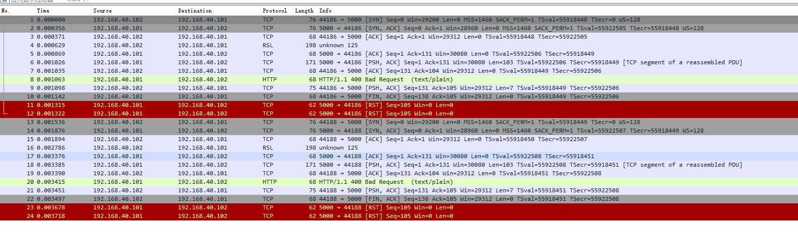
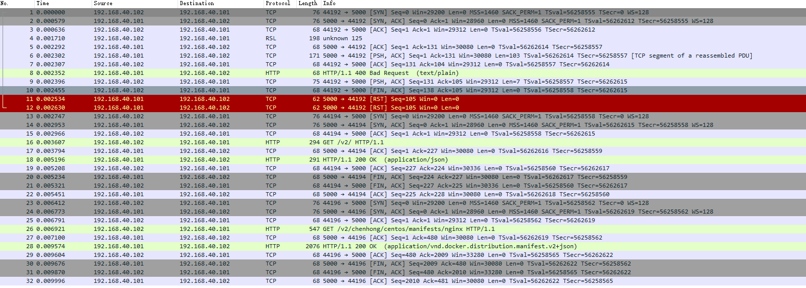

# 下载镜像

注：本文档依据作者的历史文档修改而来，并没重新做。

我们平常下载镜像经常会涉及到http和https的问题，以及https的证书是否受信的问题，针对此场景做一个测试。

## 直接下载镜像

客户端未做任何修改 ，直接`pull`镜像的抓包



```
#抓包解释
编号1-3   tcp的3次握手
编号4     由于提供的是http接口的镜像，这里在https握手的时候失败
编号1-12  第一次失败
编号13-24 第二次重试失败
```


## 规避证书问题

客户端有修改，配置了  `Insecure Registries`参数，再次`pull`镜像



```
#抓包解释
编号1-3      tcp3次握手
编号4        由于提供的是http接口的镜像，这里在https握手的时候失败
编号13-15    第二次tcp3次握手
编号16以后    发起http请求，后续正常回包
```

## 结论

结论`docker `第一次发起的请求，怎么都是`https`的请求，如果失败，则根据配置第二次发起`http`或者继续发起重试`https`请求