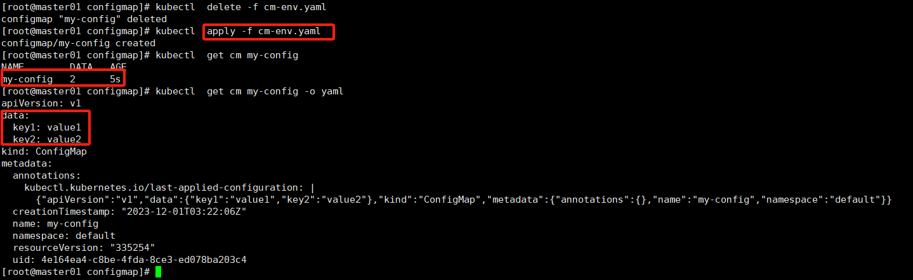
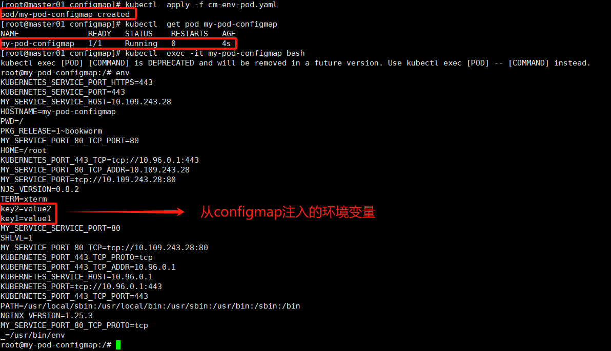
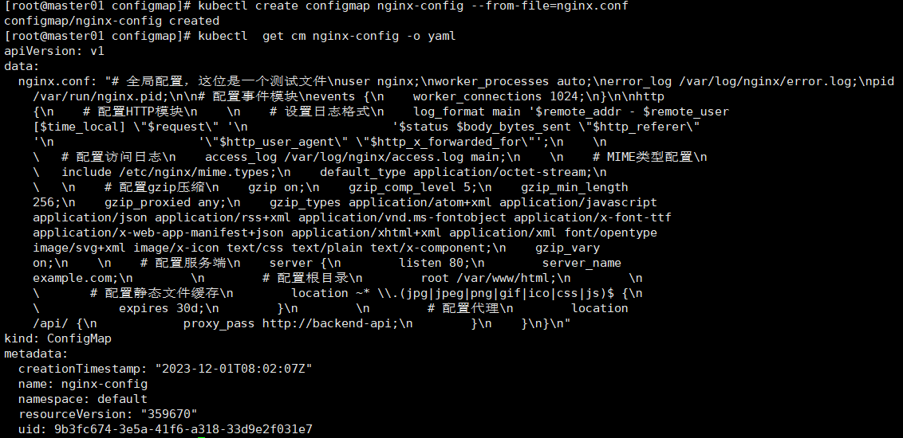
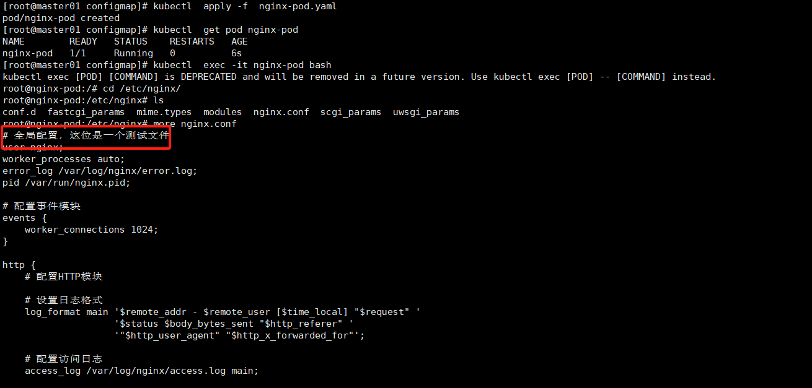

# Configmap

## 基本介绍

ConfigMap是Kubernetes中一种用于存储非敏感配置数据的对象。它可以将配置数据（如环境变量、命令行参数、配置文件等）与Pod或其他资源对象进行解耦，并且可以在运行时进行动态更新。

ConfigMap是一个存储键值对（key-value pairs）的对象，其中每个键值对都代表一个配置项。它可以通过以下几种方式创建和使用：

1. **命令行工具创建**：使用kubectl命令行工具可以直接创建ConfigMap，通过命令行参数或文件指定配置项。
2. **YAML文件定义**：可以通过编写YAML文件来定义ConfigMap，然后使用kubectl apply命令将其部署到集群中。
3. **从文件或目录加载**：可以将一个或多个文件或整个目录的内容作为一个ConfigMap进行加载，并将其挂载到Pod中的特定路径。这样，Pod就可以通过访问这些文件来获取配置数据。
4. **环境变量注入**：可以将ConfigMap的键值对作为环境变量注入到Pod中，以便应用程序可以通过环境变量访问配置数据。

ConfigMap可以被多个Pod共享，并且可以在运行时进行更新。当ConfigMap的值发生变化时，与该ConfigMap关联的所有Pod都会自动更新配置。这使得在不重新启动Pod的情况下，可以动态地修改和管理配置数据。

ConfigMap是Kubernetes中一种非常有用的资源对象，它提供了一种简单而灵活的方式来管理应用程序的配置数据。希望这个介绍对你有帮助。如果还有其他问题，请随时提问。

## 范例

当创建ConfigMap时，可以使用以下示例来了解如何定义和使用它：

1. 使用kubectl命令行工具创建ConfigMap：

```bash
kubectl create configmap my-config --from-literal=key1=value1 --from-literal=key2=value2
```

这个命令将创建一个名为`my-config`的ConfigMap，并添加两个键值对`key1=value1`和`key2=value2`。

1. 使用YAML文件定义ConfigMap：

```yaml
apiVersion: v1
kind: ConfigMap
metadata:
  name: my-config
data:
  key1: value1
  key2: value2
```

将上述内容保存为`configmap.yaml`文件，并使用以下命令将其部署到集群中：

```bash
kubectl apply -f configmap.yaml
```

1. 从文件加载ConfigMap：

假设有一个名为`my-config-files`的目录，其中包含名为`key1.txt`和`key2.txt`的两个文件，内容分别为`value1`和`value2`。可以使用以下命令将这个目录加载为一个ConfigMap：

```bash
kubectl create configmap my-config-files --from-file=my-config-files/
```

这会将目录`my-config-files`中的所有文件作为ConfigMap的数据。

## 最佳实践

### 1.作为环境变量

#### 1.1  注入集群

按照上面的把这个Configmap注入到Kubernetes集群当中



#### 1.2 引用Configmap

```
apiVersion: v1
kind: Pod
metadata:
  name: my-pod-configmap
spec:
  containers:
    - name: my-container-cm
      image: nginx
      envFrom:
        - configMapRef:
            name: my-config
```



### 2.作为文件挂载

**作者优化说：一般而言如果数量很少用环境变量注入是合适的，如果数据很多，则适合用文件注入，环境变量太多也会影响性能的，常用的文件比如nginx/java等应用程序的配置都是通过Configmap方式挂载到磁盘里面使用。**

#### 2.1 创建一个nignx的配置文件

##### 2.1.1 准备一个nginx的配置文件

```
# 全局配置，这位是一个测试文件
user nginx;
worker_processes auto;
error_log /var/log/nginx/error.log;
pid /var/run/nginx.pid;
# 配置事件模块
events {
    worker_connections 1024;
}
http {
    # 配置HTTP模块
    # 设置日志格式
    log_format main '$remote_addr - $remote_user [$time_local] "$request" '
                    '$status $body_bytes_sent "$http_referer" '
                    '"$http_user_agent" "$http_x_forwarded_for"';
    # 配置访问日志
    access_log /var/log/nginx/access.log main;
    # MIME类型配置
    include /etc/nginx/mime.types;
    default_type application/octet-stream;
    # 配置gzip压缩
    gzip on;
    gzip_comp_level 5;
    gzip_min_length 256;
    gzip_proxied any;
    gzip_types application/atom+xml application/javascript application/json application/rss+xml application/vnd.ms-fontobject application/x-font-ttf application/x-web-app-manifest+json application/xhtml+xml application/xml font/opentype image/svg+xml image/x-icon text/css text/plain text/x-component;
    gzip_vary on;
    # 配置服务端
    server {
        listen 80;
        server_name example.com;  
        # 配置根目录
        root /var/www/html;
        # 配置静态文件缓存
        location ~* \.(jpg|jpeg|png|gif|ico|css|js)$ {
            expires 30d;
        }
        # 配置代理
        location /api/ {
            proxy_pass http://127.0.0.1:12080;
        }
    }
}
```

##### 2.1.2 注入Kubernetes集群




#### 2.2 pod引用该配置文件

```
apiVersion: v1
kind: Pod
metadata:
  name: nginx-pod
spec:
  containers:
    - name: nginx-container
      image: nginx
      volumeMounts:
        - name: nginx-config-volume
          mountPath: /etc/nginx/nginx.conf
          subPath: nginx.conf
  volumes:
    - name: nginx-config-volume
      configMap:
        name: nginx-config
```



**作者有话说：**

**Configmap作为文件挂载到容器里面主要应用到程序的配置文件，但是这里要注意2个问题：**

**1.Configmap如果更新会自动更新到挂载的文件里面，但是业务是否会读取到最新的配置文件，取决于业务是否有感知配置文件及热加载的能力。**

**2.如果做为配置文件挂载到容器里面，如果配置文件错误可能导致业务容器无法拉起的问题。**