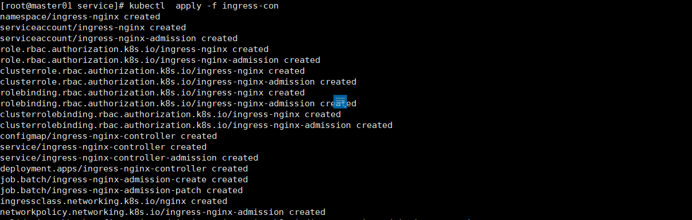
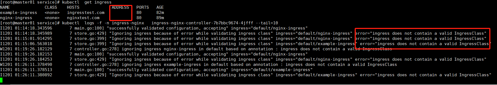
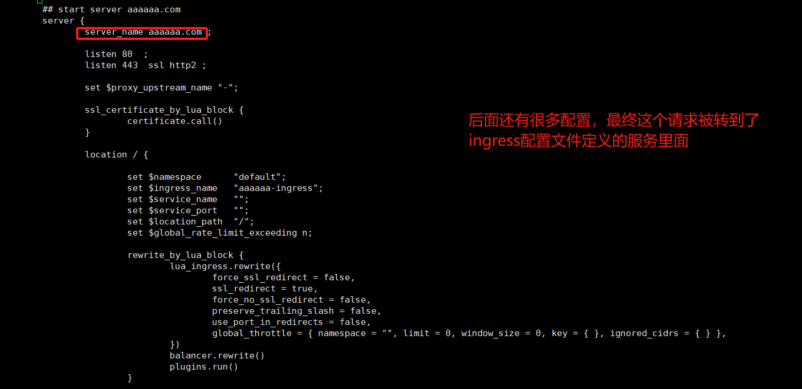
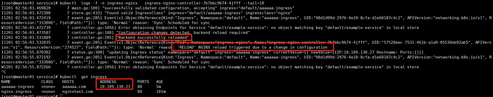

# Ingress

## 基本介绍

在Kubernetes中，Ingress是一个API对象，用于管理对集群内服务的外部访问，通常针对HTTP和HTTPS流量。Ingress允许您定义路由流量的规则，无需创建大量的LoadBalancer或将每个服务暴露在节点上。

以下是Ingress工作的概述和涉及的关键组件：

### Ingress资源

Ingress资源包含了一套规则，这些规则定义了流量应如何路由到Kubernetes集群内的服务。这些规则在Ingress的YAML定义文件中指定。

### Ingress控制器

Ingress控制器负责实现Ingress资源中定义的规则。它充当反向代理和流量入口点，根据请求将流量路由到适当的后端服务。常见的Ingress控制器包括Nginx、Traefik、HAProxy，以及特定于云提供商的控制器，如GKE的Ingress、AWS ALB Ingress控制器和Azure的Application Gateway Ingress控制器。

以下是Kubernetes Ingress资源的一个简单示例YAML定义：

```yaml
apiVersion: networking.k8s.io/v1
kind: Ingress
metadata:
  name: example-ingress
  annotations:
    nginx.ingress.kubernetes.io/rewrite-target: /
spec:
  rules:
  - host: myapp.example.com
    http:
      paths:
      - path: /myapp
        pathType: Prefix
        backend:
          service:
            name: myapp-service
            port:
              number: 80
```

在上面的例子中，所有发送到`myapp.example.com/myapp`的流量都将被路由到名为`myapp-service`的Kubernetes服务，该服务的端口为80。

## 安装Ingress

默认kubeadm的创建的集群是没有Ingress控制器的，要在Kubernetes集群中安装Ingress控制器，你需要根据你选择的Ingress控制器类型和你的环境执行一系列步骤。以安装最常见的Nginx Ingress控制器为例：

**作者有话说：如果你安装最新版本的集群，哪么直接按照下面的安装是没问题的，如果你安装的历史版本，需要考虑下兼容性问题。**

### 安装Nginx Ingress控制器

#### 使用Helm安装

如果你在集群中使用了Helm，这是一种流行的Kubernetes包管理工具，你可以使用它来安装Nginx Ingress控制器。

首先，添加Nginx Ingress控制器的Helm仓库：

```shell
helm repo add ingress-nginx https://kubernetes.github.io/ingress-nginx
helm repo update
```

然后，安装Nginx Ingress控制器：

```shell
helm install nginx-ingress ingress-nginx/ingress-nginx --namespace ingress-nginx --create-namespace
```

你可以通过添加更多的自定义值来定制安装，例如在上面的命令中使用`--set`参数或者使用`-f`参数指定一个值文件。

#### 使用Kubernetes清单安装

如果你没有使用Helm，你也可以直接用Kubernetes清单来安装Nginx Ingress控制器。

```shell
kubectl apply -f https://raw.githubusercontent.com/kubernetes/ingress-nginx/main/deploy/static/provider/cloud/deploy.yaml
```

请注意，这个命令是针对在云提供商上运行的Kubernetes集群。如果你在裸机上运行Kubernetes，可能需要使用不同的清单。

#### 自定义安装

对于特定的需求和高级配置，你可能需要创建自定义的Ingress控制器部署配置。这通常涉及编辑YAML文件以指定资源限制、安全性参数、网络策略等。

### 验证安装

安装完成后，你可以运行以下命令来检查Nginx Ingress控制器的Pod是否正在运行：

```shell
kubectl get pods --namespace=ingress-nginx
```

你应该看到一个或多个运行中的Pod，具体取决于你的部署配置。

### 注意

以上步骤适用于安装Nginx Ingress控制器，但其他类型的Ingress控制器（如Traefik、HAProxy等）将会有它们自己的安装步骤。确保参考你选择的Ingress控制器的官方文档以获取正确的安装说明。此外，在云平台上，通常有平台特定的Ingress控制器选项，它们可能会更加集成到该平台的服务中。



可以看到他会创建相当多的资源出来,其他资源问题都不大，核心的问题是这个服务，由于ingress 是7层协议，正常7层协议需要使用80和443端口，需要引入第三方LoadBalancer,一般的测试环境是不具备这个条件的，所以需要进行改造。临时方案是改造成为NodePort，或者改造Deployment改造成Hostwork。


## 使用ingress

**作者有话说：不同版本的Kubernetes或者说不同版本的Ingress对配置文件的细节要求是不一样的，比如如下2个ingress规则在当前测试环境：Kubernetes：v1.23.12，Ingress版本：v1.6.4是不可用的，ingress的日志会有如下提示。**



### https协议的ingress

````
apiVersion: networking.k8s.io/v1
kind: Ingress
metadata:
  name: example-ingress
spec:
  rules:
  - http:
      paths:
      - path: /
        pathType: Prefix
        backend:
          service:
            name: example-service
            port:
              number: 80
  tls:
  - hosts:
    - example.com
    secretName: example-tls-secret
````

http协议的ingress

```
apiVersion: networking.k8s.io/v1
kind: Ingress
metadata:
  name: nginx-ingress
spec:
  rules:
  - host: nginxtest.com
    http:
      paths:
      - path: /
        pathType: Prefix
        backend:
          service:
            name: my-service
            port:
              number: 80
```

http和https的ingress规则只是多了字段用于放置证书，证书是通过secret配置的。

### 本版本可用的ingress规则

```
apiVersion: networking.k8s.io/v1
kind: Ingress
metadata:
  name: aaaaaa-ingress
  annotations:
    kubernetes.io/ingress.class: nginx                  #上面的提示就是说缺少这个，目前的高版本已经支持一个集群里面配置都个ingress控制器
    nginx.ingress.kubernetes.io/rewrite-target: /
spec:
  rules:
  - host: aaaaaa.com
  - http:
      paths:
      - path: /
        pathType: Prefix
        backend:
          service:
            name: example-service
            port:
              number: 80
```

ingress的nginx配置文件会生成对应的server配置



ingress的日志也显示正常，ingress也分配到了ip地址，本测试由于后端服务是不存在的，所以日志日志还是有错误，但是正常的配置热加载到nginx里面，并且会自动reload来生效nginx。



此版本的nginx日志是记录在标准输出和标准错误输出，早期的版本也有直接输出到容器里面的文件里面。