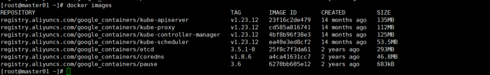
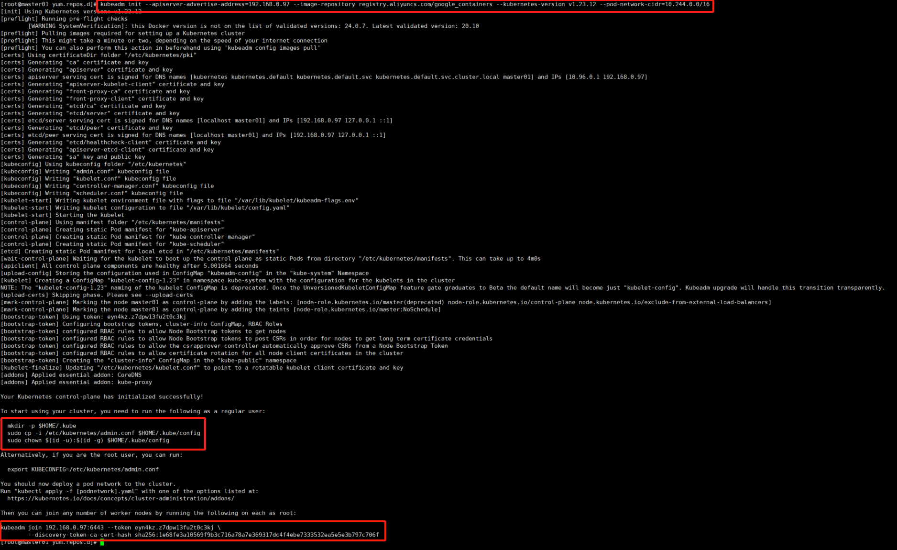
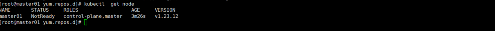
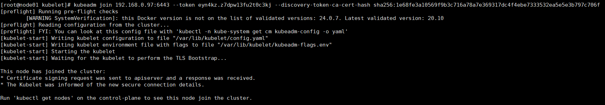
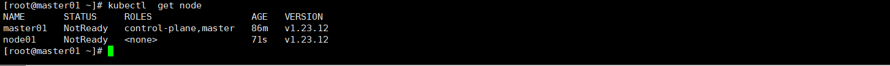
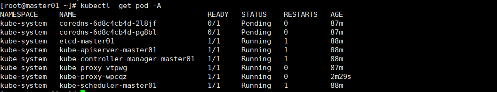
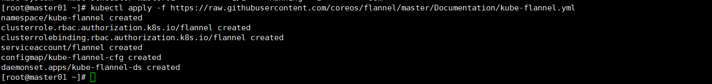
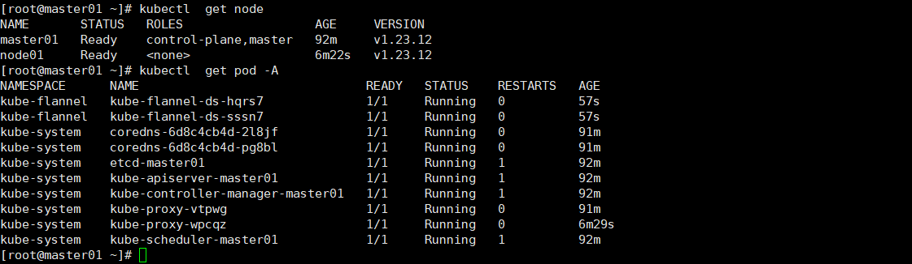

# Kubernetes的安装

Kubernetes提供了多种安装方式，可以根据你的需求和实际情况选择合适的方式。以下是几种常见的安装方式：

1. kubeadm安装方式：
   - 使用kubeadm工具进行快速安装和配置Kubernetes集群。
   - 适用于测试和开发环境，以及小型生产环境。
   - 需要手动安装和配置一些必要的组件和插件，如网络插件。
   - 可以通过kubeadm init和kubeadm join命令初始化和加入节点。
2. kops安装方式：
   - 使用kops工具在云平台上（如AWS、GCP）快速创建和管理Kubernetes集群。
   - 提供自动化的集群生命周期管理功能，如创建、更新和删除集群。
   - 需要进行一些配置和准备工作，如设置DNS、创建SSH密钥等。
   - 可以通过kops create cluster和kops update cluster等命令来创建和更新集群。
3. kubespray安装方式：
   - 使用kubespray（之前称为kube-ansible）工具通过Ansible脚本在裸机或虚拟机上部署Kubernetes集群。
   - 支持多种操作系统和发行版，如Ubuntu、CentOS等。
   - 需要一些准备工作，如设置SSH密钥、配置主机清单等。
   - 可以通过运行Ansible脚本来自动安装和配置集群。
4. Managed Kubernetes服务：
   - 公有云提供商如AWS（Amazon EKS）、Azure（Azure Kubernetes Service）和Google Cloud Platform（Google Kubernetes Engine）等提供托管的Kubernetes服务。
   - 可以直接使用云平台的控制台或API来创建和管理Kubernetes集群。
   - 提供高可用性、自动缩放和备份等功能，提升了管理的便捷性。
   - 需要根据云平台的文档和指导进行操作。

这些只是几种常见的安装方式，还有其他的安装方式和工具可供选择，如Minikube、MicroK8s等。选择适合你的环境和需求的安装方式，可以根据实际情况进行评估和决策。

## Kubeadm安装部署

生产集群都是以至少以3台机器准来部署高可用集群，如果是测试环境则1台即可，本文档则以1+1来实现配置。

| IP地址       | 角色   | 主机名   |
| ------------ | ------ | -------- |
| 192.168.0.97 | master | master01 |
| 192.168.0.67 | node   | node01   |

### 准备工作

#### 1.操作系统

如果没有特殊的要求，可直接用Centos,本次操作也是Centos7.6，也不用单独升级内核，由于是普通测试集群，所以不考虑那些。

#### 2.初始化

```
#关闭防火墙
systemctl stop firewalld
systemctl disable firewalld
#修改主机名，可根据需要自己规划名字
hostnamectl set-hostname master01
hostnamectl set-hostname node01
#关闭swap，并取消开启启动（如果没有可忽略）
swapoff -a
sed -ri 's/.*swap.*/#&/' /etc/fstab
#关闭selinux
setenforce 0
sed -i 's/enforcing/disabled/' /etc/selinux/config
#修改hosts,注意替换自己的ip地址
echo "192.168.0.97 master01" >>/etc/hosts
echo "192.168.0.67 node01" >>/etc/hosts
#调整内核参数
echo "net.bridge.bridge-nf-call-ip6tables=1" >> /etc/sysctl.d/kubernetes.conf 
echo "net.bridge.bridge-nf-call-iptables=1" >> /etc/sysctl.d/kubernetes.conf 
echo "net.ipv6.conf.all.disable_ipv6=1" >> /etc/sysctl.d/kubernetes.conf 
echo "net.ipv4.ip_forward=1" >> /etc/sysctl.d/kubernetes.conf 
sysctl --system
#重启
reboot
```


### 部署

#### 1.安装docker

```
wget https://mirrors.aliyun.com/docker-ce/linux/centos/docker-ce.repo -0 /etc/yum.repos.d/
yum install -y docker-ce
#为了和后面的Kubernetes版本保证最好的兼容性，所以这里最好的版本是20.10。
#本次部署并没有修改，是采用默认最新的Docker版本。
```

#### 2.配置docker

exec-opts 该参数是必选，其他可根据实际需要选填。

主要包括，修改docker主目录，修改默认仓库地址，修改仓库端口是为http，而非默认的https；修改docker的仓库证书不被信任及修改dockers日志的轮询规则。

```
{
  "data-root": "/new/docker/main/directory",                 // 修改 Docker 主目录
  "registry-mirrors": ["http://myregistry.example.com:5000"], // 修改默认仓库地址和端口（HTTP）
  "insecure-registries": ["myregistry.example.com:5000"],     // 添加不信任的仓库
  "exec-opts": ["native.cgroupdriver=systemd"]，              // 和kubelet保持一致，该选项必须
  "log-driver": "json-file",                                  // 设置日志驱动为 json-file
  "log-opts": {                                               // 设置日志轮询规则
    "max-size": "10m",                                        // 单个日志文件最大 10MB
    "max-file": "3"                                           // 仅保留最新的 3 个日志文件
  }
}
```

#### 4.安装Kubernetes基础软件

```
#配置源
cat > /etc/yum.repos.d/kubernetes.repo << EOF
[kubernetes]
name=Kubernetes
baseurl=https://mirrors.aliyun.com/kubernetes/yum/repos/kubernetes-el7-x86_64
enabled=1
gpgcheck=0
repo_gpgcheck=0
gpgkey=https://mirrors.aliyun.com/kubernetes/yum/doc/yum-key.gpg https://mirrors.aliyun.com/kubernetes/yum/doc/rpm-package-key.gpg
EOF
#安装kubeadm，kubelet，kubectl,这里选择你的是最后一个支持Docker运行时的版本，如果不加版本号则是最新版本。
yum install -y kubeadm-1.23.12 kubelet-1.23.12 kubectl-1.23.12
```

#### 4.启动Docker，Kubelet

```
systemctl start docker kubelet
systemctl enable docker kubelet
```

#### 5.部署Master

默认Kubernetes所需要的镜像是是在国外的，所以如果不具有科学上网的情况下，有2种方法来实现：1.提前从其他地方将下载好的镜像，导入到本地。2.使用阿里云的镜像源地址

```
kubeadm init \
--apiserver-advertise-address=192.168.0.97 \
--image-repository registry.aliyuncs.com/google_containers \
--kubernetes-version v1.23.12 \
--pod-network-cidr=10.244.0.0/16
#此处版本注意和上面的版本保持一致。
```

这个过程中会先下载镜像，完整的镜像如下图



安装的过程，这个图也是修正了几次才成功的，红框第一个是创建集群语句，第二个是配置Kubectl命令的配置文件，第三个是Node节点加入集群的语句。



#### 6.配置kubectl配置文件

```
  mkdir -p $HOME/.kube
  sudo cp -i /etc/kubernetes/admin.conf $HOME/.kube/config
  sudo chown $(id -u):$(id -g) $HOME/.kube/config
```

#### 7. 确认集群安装成功



#### 8.添加Node

用刚才创建集群生产的语句，如果忘记或者过了一段时间token过期，则先重新创建。

```
#创建新token
kubeadm token create --print-join-command
```

```
#加入集群
kubeadm join 192.168.0.97:6443 --token eyn4kz.z7dpw13fu2t0c3kj \
	--discovery-token-ca-cert-hash sha256:1e68fe3a10569f9b3c716a78a7e369317dc4f4ebe7333532ea5e5e3b797c706f 
```



#### 9.检查Node节点

```
kubectl get node
kubectl get pod -A
```

由于目前还没网络插件，所以节点都是NotReady状态。由于没有Ready的节点，所以coredns一直处于Pending（等待调度）状态。





#### 10.安装网络插件

```
kubectl apply -f https://raw.githubusercontent.com/coreos/flannel/master/Documentation/kube-flannel.yml
```



插件会创建集群角色，集群角色绑定等资源，稍等一段时间再次查看集群状态和pod状态。



至此整个Kubernetes集群搭建就算完成，剩下的就是使用。
