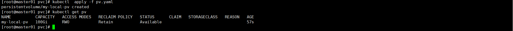
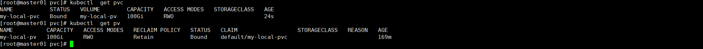
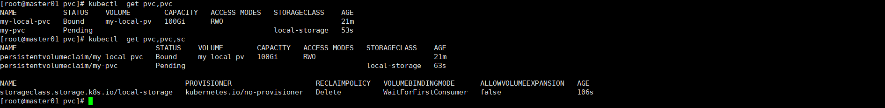
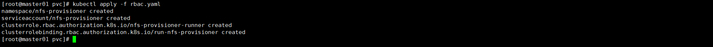
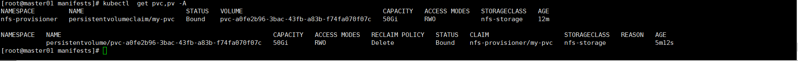
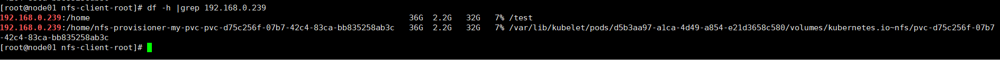
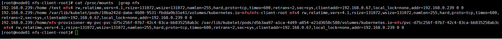

[toc]

# PV&PVC&SC

## Kubernetes存储

当涉及到持久化存储方式的综合时，以下是常见的持久化存储类型：

1. **主机路径卷（HostPath）**：将主机文件系统中的目录或文件挂载到容器中。这种方式可以提供容器之间的文件共享，但在集群中迁移时会受到限制。实际就是和Docker的`-v`是一样的效果。
2. **网络存储卷（Network Storage）**：通过网络协议（例如 NFS、iSCSI）将外部存储系统挂载到容器中。这种方式可以在集群中的多个节点之间共享数据，并提供持久性和可扩展性。
3. **云提供商的存储选项（Cloud Provider Storage Options）**：大多数云提供商都提供了特定的存储选项，如 Amazon EBS（Elastic Block Store）和 Azure Disk。这些选项可以方便地在云平台上创建和管理持久卷。
4. **容器存储接口（CSI）**：容器存储接口是一种标准化的插件架构，用于连接容器运行时和各种存储系统。CSI 允许用户在 Kubernetes 中使用多种不同的存储后端，并提供了更大的灵活性和可扩展性。
5. **动态卷配置（Dynamic Volume Provisioning）**：通过存储类（StorageClass）动态创建持久卷的机制。动态卷配置使得在集群中根据需要动态创建和销毁持久卷变得更加容易，而无需手动进行预配和管理。
6. **空目录卷（EmptyDir）**：将一个空目录挂载到容器中，适用于需要在容器之间共享临时数据的情况。

## 基本介绍

### PV

在Kubernetes（简称K8s）中，PV是PersistentVolume（持久卷）的缩写。PV是一种抽象概念，它表示集群中的一块存储资源，可以被Pod使用。

PV的创建和管理是由集群管理员来完成的。管理员可以在集群中定义PV的属性，如容量、访问模式（ReadWriteOnce、ReadOnlyMany、ReadWriteMany）和存储类别等。PV可以与具体的存储提供商进行绑定，如本地存储、云存储或网络存储等。

一旦PV被创建并绑定到某个存储提供商，它就可以被动态地分配给Pod进行使用。Pod可以通过声明式的方式（使用PVC，即PersistentVolumeClaim）请求PV资源，并将其挂载到容器中。

总结起来，PV是Kubernetes中的持久存储资源，可以被Pod动态分配和使用。它提供了一种抽象的方式来管理集群中的存储，并与具体的存储提供商进行集成。

### PVC

在Kubernetes（简称K8s）中，PVC是PersistentVolumeClaim（持久卷声明）的缩写。PVC用于声明对PV（PersistentVolume）的需求，即请求集群中的持久存储资源。

PVC的创建和管理是由应用开发者或管理员来完成的。通过创建PVC，应用可以申请满足其存储需求的PV资源。PVC定义了一些属性，如容量、访问模式和存储类别等。在PVC中，应用可以指定所需的存储资源的大小和访问模式。

一旦PVC被创建，Kubernetes控制器会根据PVC的需求自动匹配和绑定可用的PV资源。当PVC与PV绑定后，应用可以将PVC挂载到Pod中，并在容器内使用该存储资源。

使用PVC可以使应用与底层存储的具体细节解耦，从而提高可移植性和灵活性。应用开发者可以专注于定义所需的存储资源，而不需要关心具体的存储提供商和实现细节。

总结起来，PVC是Kubernetes中用于声明对PV的需求的机制。它使应用能够方便地申请和使用持久存储资源，而不需要关心底层存储的具体实现。

***作者有话说：简单来说就是集群的管理员创建了很多PV,然后用集群使用者来通过PVC来申请这些资源。这个弊端就是必须预先创建，如果没有预先创建，或者预先创建的PV被用光了，则无法在申请到资源，对于自动化运维来说，这是不可接受的，所以StorageClass就产生了。***

### SC

在Kubernetes中，SC（StorageClass）是用于定义动态存储的一种资源类型。SC充当了存储供应商和应用之间的中间层，它定义了存储的属性和行为，供应商可以根据这些属性和行为来提供符合需求的存储。

SC的作用是为PVC提供动态存储分配。当应用创建PVC时，可以通过指定SC来请求动态分配的存储资源。SC定义了一些属性，如存储的类型、访问模式、保留策略等。存储供应商可以根据这些属性来提供符合需求的存储。

SC与PVC之间存在一对多的关系。一个SC可以被多个PVC引用，而每个PVC只能引用一个SC。当PVC使用SC时，Kubernetes控制器会根据SC的属性，自动匹配和绑定可用的PV资源。

通过使用SC，应用开发者和管理员可以更加灵活地管理存储资源。它可以使应用与底层存储的具体细节解耦，从而提供了存储资源的可移植性和灵活性。

总结起来，SC是Kubernetes中用于定义动态存储的资源类型。它充当了存储供应商和应用之间的中间层，定义了存储的属性和行为。通过使用SC，应用可以请求动态分配的存储资源，实现更加灵活和可移植的存储管理。

## 范例
### PV

```
apiVersion: v1
kind: PersistentVolume
metadata:
  name: my-local-pv
spec:
  capacity:
    storage: 100Gi
  volumeMode: Filesystem
  accessModes:
    - ReadWriteOnce
  persistentVolumeReclaimPolicy: Retain
  storageClassName: ""
  nodeAffinity:
    required:
      nodeSelectorTerms:
        - matchExpressions:
            - key: kubernetes.io/hostname
              operator: In
              values:
                - node01
  local:
    path: /data/pv_disk
```

这个YAML文件是用来定义一个持久卷（PersistentVolume，PV）的配置。下面对其中的字段进行解释：

- `apiVersion: v1`：指定使用的Kubernetes API版本为v1。
- `kind: PersistentVolume`：指定资源类型为PersistentVolume，表示要创建一个PV对象。
- `metadata`：用于定义PV的元数据，比如名称（name）等。
- `spec`：用于定义PV的规范。
- `capacity`：指定PV的容量，这里设置为100Gi（100GB）。
- `volumeMode`：指定PV的卷模式，这里设置为Filesystem，表示将PV作为文件系统使用。
- `accessModes`：指定PV的访问模式，这里设置为ReadWriteOnce，表示PV可以被一个节点以读写方式挂载。
- `persistentVolumeReclaimPolicy`：指定PV的回收策略，这里设置为Retain，表示在PV释放后保留其数据，不进行自动清理。
- `storageClassName`：指定存储类名称，这里设置为空字符串，表示不使用存储类。
- `nodeAffinity`：定义节点亲和性，用于指定PV应该绑定到哪些节点上。在这个示例中，`kubernetes.io/hostname`标签被用来匹配节点的主机名，`<node-name>`需要被替换为具体的节点名称。
- `local`：指定PV使用的本地磁盘的路径，这里设置为`/path/to/local/disk`。

这个YAML文件定义了一个使用本地磁盘的PV，容量为100GB，挂载模式为读写方式，回收策略为保留数据，不使用存储类，并且需要绑定到具有指定主机名标签的节点上。



### PVC

```
apiVersion: v1
kind: PersistentVolumeClaim
metadata:
  name: my-local-pvc
spec:
  accessModes:
    - ReadWriteOnce
  resources:
    requests:
      storage: 100Gi
  storageClassName: ""
  volumeName: my-local-pv
```

在这个YAML文件中，我们创建了一个名为`my-local-pvc`的PVC，它请求100GB的存储容量，并使用`ReadWriteOnce`的访问模式。`storageClassName`字段为空字符串，表示不使用特定的存储类。通过设置`volumeName`字段为`my-local-pv`，我们将这个PVC与先前定义的`my-local-pv` PV绑定。

请确保`my-local-pv`是先前定义的PV的名称，以确保PVC与正确的PV绑定。当创建这个PVC时，Kubernetes将会使用指定的PV来满足PVC的存储需求。



当pvc和pvc绑定以后，pv的状态和会从Available变成Bound

### PVC应用

```
apiVersion: apps/v1
kind: Deployment
metadata:
  name: my-app
spec:
  replicas: 1
  selector:
    matchLabels:
      app: my-app
  template:
    metadata:
      labels:
        app: my-app
    spec:
      containers:
        - name: my-app
          image: nginx
          volumeMounts:
            - name: data
              mountPath: /data
      volumes:
        - name: data
          persistentVolumeClaim:
            claimName: my-pvc
```

***作者有话说：实际上这种应用方式，在真实环境是很这样使用，因为没什么价值，还需要提前创建。和实际在deploy里面直接挂在HostPath效果是一样的，不过用于理解PV&PVC是有意义的，因为测试用的是本地目录。***

### SC

```
apiVersion: storage.k8s.io/v1
kind: StorageClass
metadata:
  name: nfs-storage
provisioner: kubernetes.io/nfs
mountOptions:
  - vers=4.1
  - hard
  - nfsvers=4.1
  - rsize=1048576
  - wsize=1048576
  - timeo=600
  - retrans=2
parameters:
  nfsServer: <NFS_SERVER_IP>
  path: <NFS_SHARE_PATH>
```

在这个示例中，我们创建了一个名为 `nfs-storage` 的存储类，并指定了 `kubernetes.io/nfs` 作为它的提供者（provisioner）。

`mountOptions` 字段中，我们指定了一些 NFS 挂载选项，例如 `vers=4.1` 表示使用 NFS 4.1 协议，`hard` 表示使用硬挂载，`rsize` 和 `wsize` 分别表示读取和写入的块大小，`timeo` 表示超时时间，`retrans` 表示重传次数。

在 `parameters` 字段中，我们指定了 NFS 服务器的 IP 地址（`nfsServer`）和共享路径（`path`）的值。你需要将 `<NFS_SERVER_IP>` 和 `<NFS_SHARE_PATH>` 替换为实际的 NFS 服务器 IP 地址和共享路径。

`volumeBindingMode`字段设置为`WaitForFirstConsumer`，表示在有第一个消费者（例如Pod）请求使用这个存储类时，才会绑定本地盘。

```
apiVersion: v1
kind: PersistentVolumeClaim
metadata:
  name: my-pvc
spec:
  storageClassName: nfs-storage
  accessModes:
    - ReadWriteOnce
  resources:
    requests:
      storage: 5Gi
```

我们直接创建了一个PVC，去申请磁盘，就不用额外去创建PV.



***作者有话说：上面是一个错误的示范，只是把逻辑关系理出来了，集群管理员定义好了sc，业务方根据需求创建pvc及pod，然后最终就可以实现申请自定义存储资源。***

### NFC

真正的nfs使用，要实现上面的逻辑还需要更多的操作。

#### RBAC

```
apiVersion: v1
kind: Namespace
metadata:
  name: nfs-provisioner
---
apiVersion: v1
kind: ServiceAccount
metadata:
  name: nfs-provisioner
  namespace: nfs-provisioner
---
apiVersion: rbac.authorization.k8s.io/v1
kind: ClusterRole
metadata:
  name: nfs-provisioner-runner
rules:
  - apiGroups: [""]
    resources: ["persistentvolumes"]
    verbs: ["get", "list", "watch", "create", "delete"]
  - apiGroups: [""]
    resources: ["persistentvolumeclaims"]
    verbs: ["get", "list", "watch", "update"]
  - apiGroups: [""]
    resources: ["endpoints"]
    verbs: ["get", "list", "watch", "create", "delete"]
  - apiGroups: ["storage.k8s.io"]
    resources: ["storageclasses"]
    verbs: ["get", "list", "watch"]
  - apiGroups: [""]
    resources: ["events"]
    verbs: ["get", "list", "watch"]

---
apiVersion: rbac.authorization.k8s.io/v1
kind: ClusterRoleBinding
metadata:
  name: run-nfs-provisioner
roleRef:
  apiGroup: rbac.authorization.k8s.io
  kind: ClusterRole
  name: nfs-provisioner-runner
subjects:
  - kind: ServiceAccount
    name: nfs-provisioner
    namespace: nfs-provisioner
```



创建一个命名空间

创建一个ServiceAccount供pod使用

创建一个ClusterRole和ClusterRoleBinding，并把他权限加给创建的ServiceAccount

#### 控制器&SC

```
apiVersion: apps/v1
kind: Deployment
metadata:
  name: nfs-provisioner
  namespace: nfs-provisioner
spec:
  replicas: 1
  selector:
    matchLabels:
      app: nfs-provisioner
  template:
    metadata:
      labels:
        app: nfs-provisioner
    spec:
      serviceAccountName: nfs-provisioner
      containers:
        - name: nfs-provisioner
          image: quay.io/external_storage/nfs-client-provisioner:latest
          env:
            - name: PROVISIONER_NAME
              value: my-nfs-provisioner
            - name: NFS_SERVER
              value: <NFS服务器IP地址>
            - name: NFS_PATH
              value: /<共享路径>
```

创建一个nfs控制器的pod，引用了刚才的serviceAccount，使得这个pod具备操作pv及pvc和sc的相关权限

```
apiVersion: storage.k8s.io/v1
kind: StorageClass
metadata:
  name: nfs-storage
provisioner: my-nfs-provisioner
```

创建一个sc，使用刚才的创建的pod，通过它来完成相关资源的创建删除回收。

#### PV

```
apiVersion: v1
kind: PersistentVolumeClaim
metadata:
  name: my-pvc
  namespace: nfs-provisioner
spec:
  accessModes:
    - ReadWriteOnce
  resources:
    requests:
      storage: 50Gi
  storageClassName: nfs-storage
```

坑1：

如果按照这个流程pvc会处于pending状态，nfs-provisioner这个控制器的日志会显示错误

```
Unexpected error getting claim reference to claim "nfs-provisioner/my-pvc": selfLink was empty, can't make reference
```

bug说明

https://github.com/kubernetes-sigs/nfs-subdir-external-provisioner/issues/25

修改方法按照文件在`/etc/kubernetes/manifests/kube-apiserver.yaml`添加一行`\- --feature-gates=RemoveSelfLink=false`注意格式。



坑2：按照刚才的配置，如果我申请pvc没有指定正确的命名空间，则无法创建成功，如果有多个命名空间则需要重新调整RABC的配置，可以下去自己研究。

坑3：nfs-provisioner 这个pod所在的节点也需要nfs的客户端，并且还需要把nfs的目录挂载到这个容器里面，因为在创建pv的时候，他就会去你nfs客户端创建一个目录，当你业务需要挂载这个pv的时候，就挂载对应的目录，这样可以实现各个pv相互独立。

```
#刚才deploy缺少的配置，请补充到刚才的deploy上面。
          volumeMounts:
            - name: nfs-client-root
              mountPath: /persistentvolumes
      volumes:
        - name: nfs-client-root
          nfs:
            server: ${NFS_ADDRESS}  #---NFS服务器地址
            path: ${NFS_DIR} #---NFS服务器目录
```


#### POD使用

```
这里就不做演示了，可以引用上面错误的那个pod配置都是可以的，但是这里有几个点要注意
```

1.被调度的pod的节点，需要预先安装nfs客户端，如果不安装是无法使用的

```
yum install nfs-utils -y
```

2.如果本地目录挂载失败

```
Mounting arguments: -t nfs 192.168.0.239:/home/nfs-provisioner-my-pvc-pvc-a0fe2b96-3bac-43fb-a83b-f74fa070f07c /var/lib/kubelet/pods/6b4f2a6d-ee7c-4bd7-b9df-8f29786050f7/volumes/kubernetes.io~nfs/pvc-a0fe2b96-3bac-43fb-a83b-f74fa070f07c
Output: mount.nfs: mounting 192.168.0.239:/home/nfs-provisioner-my-pvc-pvc-a0fe2b96-3bac-43fb-a83b-f74fa070f07c failed, reason given by server: No such file or directory
```

就触发了上面的坑3，按照上面的方式修复以后，重新创建pvc即可。

### 直接挂载NFS

上面的方法可以让我们更方便的理解PV,PVC,SC的相关逻辑概念，但是如果是中小型应用可能用不上，而且还无法多个pod共享一个nfs的目录下的内容。所以这里还是要看需求，通过需求决定用什么方法。

直接挂载方法就是坑3里面那个方法，直接在deploy 定义挂在目录和挂载nfs的信息

这2个方法实际上落到实际节点上是有点区别的

如果是直接在pod里面挂载nfs，那么在df -h |grep nfs服务器地址 是看不到，因为他是在容器里面挂载的

如果是通过pvc挂载的，可以理解他会先手工把这个目录挂在到宿主机，那么在df -h |grep 服务器地址 是可以看到的，然后完成这一步以后呢，在把挂载到本地的目录映射到pod里面（类似于通过HostPath方式）。




1.纯手工通过nfs命令挂载的

2.就是通过容器直接挂载

3.通过pvc挂载的

