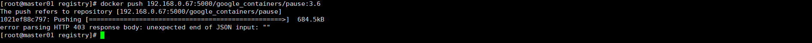

# Registry 仓库

Registry本来应该放置到Docker目录下的，但是由于涉及对对接后端对象存储，所以就放置到k8s下了，本实例需要提前准备后端对象存储，操作是基于ceph搭建的rgw来实现的，可以上传，但是上传中有错误，暂时不知道什么原因。

1. 准备镜像

2. 编写控制器

   ```
   #本来打算后端存储使用ceph的，但是由于使用的ceph版本较低，并并支持设置region字段，而registry必须要对应的字段，还有名字上的要求，故无法适配，所以这里更换为paas产品的对象存储
   ```

   ```
   apiVersion: v1
   kind: Secret
   metadata:
     name: ceph-secret
   type: Opaque
   data:
     accessKey: xxxx
     secretKey: xxxx
   
   ```

   ```
   apiVersion: apps/v1
   kind: Deployment
   metadata:
     name: registry
   spec:
     replicas: 1
     selector:
       matchLabels:
         app: registry
     template:
       metadata:
         labels:
           app: registry
       spec:
         hostNetwork: true
         containers:
         - name: registry
           image: registry:latest
           ports:
           - containerPort: 5000
             protocol: TCP
           env:
           - name: REGISTRY_STORAGE
             value: s3
           - name: REGISTRY_STORAGE_S3_REGION
             value: us 
           - name: REGISTRY_STORAGE_S3_SECURE
             value: "false"
           #- name: REGISTRY_STORAGE_S3_ENDPOINT
           #如果用这个字段，他会连接aws的s3，并不会连接到下面的地址，可以通过容器的网络连接来排查
           #正确是  - name: REGISTRY_STORAGE_S3_REGIONENDPOINT
           - name: REGISTRY_STORAGE_S3_REGIONENDPOINT
             value: http://192.168.0.55:7480
             #这里要加上http，否则默认是走https协议
           - name: REGISTRY_STORAGE_S3_BUCKET
             value: dockerimage
           - name: REGISTRY_STORAGE_S3_ACCESSKEY
             valueFrom:
               secretKeyRef:
                 name: ceph-secret
                 key: accessKey
           - name: REGISTRY_STORAGE_S3_SECRETKEY
             valueFrom:
               secretKeyRef:
                 name: ceph-secret
                 key: secretKey
   ```
   
   **错误如下，而且是每次上传都是重新上传。**
   
   


