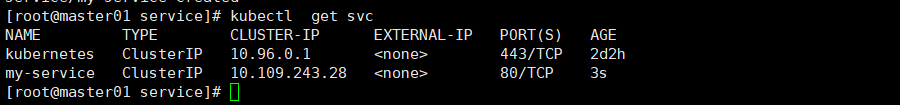
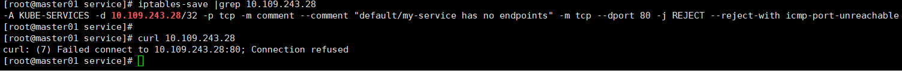
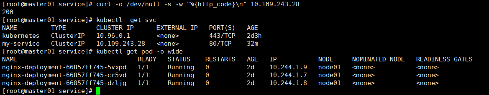
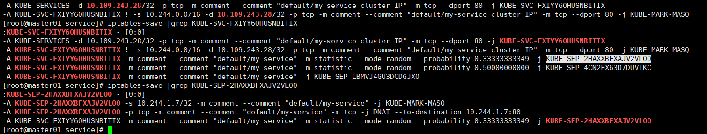
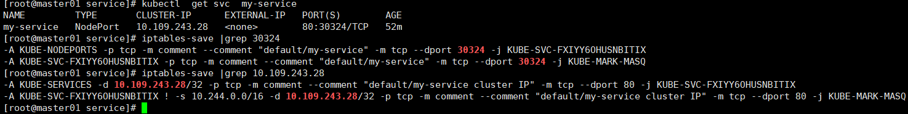

[toc]

# Service

## Service基本概念

在Kubernetes (k8s) 中，Service是一个抽象概念，它定义了一种访问和暴露一组运行在Pods中的应用的方法。Service使得外部访问Pods变得容易，并且为内部集群通信提供了一种稳定的方式，因为Pods可能会被杀死和动态创建。

Service有几种类型，每种类型提供不同的网络特性：

1. **ClusterIP**：这是默认的Service类型，它为Service在集群内部提供一个内部的IP地址，这样集群中的其他组件就可以访问它。这个IP地址是集群内部的，外部网络无法访问它。
2. **NodePort**：这种类型的Service在ClusterIP的基础上，为Service在每个节点的IP上提供一个静态端口（NodePort）。这样，Service可以通过`<NodeIP>:<NodePort>`的方式从集群外部访问。NodePort通常在30000-32767之间的范围内分配。
3. **LoadBalancer**：这种Service类型在NodePort的基础上，还会请求云提供商的负载均衡器。这个负载均衡器会将外部的流量分发到集群中的Pods。这是让Service能够从互联网上可达的常用方式。
4. **ExternalName**：这种类型的Service没有选择器和端口定义，它允许通过Kubernetes服务定义来返回一个固定的CNAME记录，通常用于服务发现。

Service通过选择器（Selector）与Pods建立连接，选择器定义了Service要管理的Pods的标签。当一个Service被定义后，它会自动创建一个端点（Endpoints）对象来表示后端的Pods IP地址。

例如，假设你有一组标记为`app=myapp`的Pods，你可以创建一个Service来选择这些Pods，并为它们提供一个单一的访问点。

```yaml
apiVersion: v1
kind: Service
metadata:
  name: my-service
spec:
  selector:
    app: myapp
  ports:
    - protocol: TCP
      port: 80
      targetPort: 9376
```

在这个例子中，Service将监听端口80，并将流量转发到标记为`app=myapp`的Pods的9376端口。

Service的存在确保即使后端Pods发生变化，前端客户端也无需知道这些变化，可以继续通过Service访问应用。这对于实现无缝的扩展和动态管理很重要。



但是由于这个规则并没有对于的后端（也就是没对于的pod和对应），这个地址也是无法访问的（从iptabels上看也可以看到，他并没有往后走）。



## 范例

以下是一个Kubernetes部署（Deployment）和服务（Service）的YAML配置示例，这两者通过匹配的标签（labels）和选择器（selector）连接在一起。

首先是Deployment的配置：

```yaml
apiVersion: apps/v1
kind: Deployment
metadata:
  name: my-app-deployment
  labels:
    app: myapp
spec:
  replicas: 3
  selector:
    matchLabels:
      app: myapp
  template:
    metadata:
      labels:
        app: myapp
    spec:
      containers:
      - name: myapp-container
        image: myapp:1.0.0
        ports:
        - containerPort: 80
```

在这个Deployment中，我们有：

- 一个名叫`my-app-deployment`的Deployment。
- `app: myapp`标签，用来标识属于这个Deployment的资源。
- 三个Pod的副本数（replicas）。
- 一个选择器（selector）用来匹配标签`app: myapp`，确保Deployment管理带有此标签的Pods。
- 一个Pod模板（template）指定了Pods的配置，包括使用`myapp:1.0.0`镜像的容器，该容器监听端口80。

接下来是与之匹配的Service的配置：

```yaml
apiVersion: v1
kind: Service
metadata:
  name: my-app-service
spec:
  selector:
    app: myapp
  ports:
  - protocol: TCP
    port: 80
    targetPort: 80
  type: ClusterIP
```

在这个Service配置中，我们有：

- 一个名叫`my-app-service`的Service。
- 一个选择器（selector），它与Deployment中Pods的标签`app: myapp`匹配，表示Service要管理的Pods。
- 一个端口配置，指示Service在TCP协议下监听端口80，并将流量转发到Pods的端口80（targetPort）。
- `type: ClusterIP`表示这是一个仅在集群内部可访问的Service。

这样配置好之后，任何时候只要有满足`app: myapp`标签的Pods运行，`my-app-service`就会将流量路由到这些Pods上，无论这些Pods在何时何地启动。

## 流量如何到Pod

这里直接访问service就已经正常返回200，可是具体怎么走的，怎么来实现的负载均衡呢？



我们可以通过iptables来解释



### 1.命中服务

```
-A KUBE-SERVICES -d 10.109.243.28/32 -p tcp -m comment --comment "default/my-service cluster IP" -m tcp --dport 80 -j KUBE-SVC-FXIYY6OHUSNBITIX
-A KUBE-SVC-FXIYY6OHUSNBITIX ! -s 10.244.0.0/16 -d 10.109.243.28/32 -p tcp -m comment --comment "default/my-service cluster IP" -m tcp --dport 80 -j KUBE-MARK-MASQ

```

这两行是 Kubernetes 在 `iptables` 中为服务设置的规则，它们用于处理到达服务的集群IP的网络流量。这些规则是由 `kube-proxy` 组件根据服务定义自动生成的。让我们逐个解释这些规则：

**第一条规则：**

```
-A KUBE-SERVICES -d 10.109.243.28/32 -p tcp -m comment --comment "default/my-service cluster IP" -m tcp --dport 80 -j KUBE-SVC-FXIYY6OHUSNBITIX
```

- `-A KUBE-SERVICES`: 这表示将规则附加（Append）到 `KUBE-SERVICES` 链。
- `-d 10.109.243.28/32`: 指定目的 IP 地址为 10.109.243.28，`/32` 表示只有这个特定的 IP 地址适用于此规则。
- `-p tcp`: 指明这个规则仅适用于 TCP 协议。
- `-m comment --comment "default/my-service cluster IP"`: 为规则添加注释，注释内容是 "default/my-service cluster IP"，通常用于说明规则的用途，这里表示这是针对命名空间为 `default` 下名为 `my-service` 的服务的集群 IP 地址。
- `-m tcp --dport 80`: 使用 tcp 模块匹配目的端口号为 80 的流量。
- `-j KUBE-SVC-FXIYY6OHUSNBITIX`: 如果匹配，跳转到另一个名为 `KUBE-SVC-FXIYY6OHUSNBITIX` 的链，这通常是服务专用的链，其中包含了后端 Pod 的负载均衡规则。

**第二条规则：**

```
-A KUBE-SVC-FXIYY6OHUSNBITIX ! -s 10.244.0.0/16 -d 10.109.243.28/32 -p tcp -m comment --comment "default/my-service cluster IP" -m tcp --dport 80 -j KUBE-MARK-MASQ
```

- `-A KUBE-SVC-FXIYY6OHUSNBITIX`: 附加规则到 `KUBE-SVC-FXIYY6OHUSNBITIX` 链。
- `! -s 10.244.0.0/16`: 表示源 IP 地址不在 10.244.0.0/16 这个子网内的流量。Kubernetes 通常使用这样的子网作为 Pod 的网络。这条规则是用来标记那些不是从集群内部来的流量，因为 Pod 间通信通常不需要进行网络地址转换（NAT）。
- `-d 10.109.243.28/32`: 同上，目的 IP 地址是服务的集群 IP。
- `-p tcp`: 同上，指定 TCP 协议。
- `-m comment`: 同上，提供规则的注释。
- `-m tcp --dport 80`: 同上，匹配目的端口 80。
- `-j KUBE-MARK-MASQ`: 如果匹配，则跳转到 `KUBE-MARK-MASQ` 链，这个链会标记流量，使得在离开节点时进行 IP 伪装（即 MASQUERADE，一种源 NAT），确保响应可以返回到原始的请求者。这是必要的，因为原始请求者可能不知道集群内部的 Pod IP。

简而言之，这些规则是 Kubernetes 服务网络功能的一部分，确保集群内部和外部的流量都可以正确地路由到服务后端的 Pod。

**通俗的来说，就是当集群内部访问 10.109.243.28:80的时候，会继续验证规则走向链KUBE-SVC-FXIYY6OHUSNBITIX**

### 2.命中算法规则

```
-A KUBE-SERVICES -d 10.109.243.28/32 -p tcp -m comment --comment "default/my-service cluster IP" -m tcp --dport 80 -j KUBE-SVC-FXIYY6OHUSNBITIX
-A KUBE-SVC-FXIYY6OHUSNBITIX ! -s 10.244.0.0/16 -d 10.109.243.28/32 -p tcp -m comment --comment "default/my-service cluster IP" -m tcp --dport 80 -j KUBE-MARK-MASQ
-A KUBE-SVC-FXIYY6OHUSNBITIX -m comment --comment "default/my-service" -m statistic --mode random --probability 0.33333333349 -j KUBE-SEP-2HAXXBFXAJV2VLOO
-A KUBE-SVC-FXIYY6OHUSNBITIX -m comment --comment "default/my-service" -m statistic --mode random --probability 0.50000000000 -j KUBE-SEP-4CN2FX63D7DUVIKC
-A KUBE-SVC-FXIYY6OHUSNBITIX -m comment --comment "default/my-service" -j KUBE-SEP-LBMVJ4GU3DCDGJXO

```


这些规则是 Kubernetes iptables 规则的一部分，用来处理到达某个服务的集群 IP 地址的网络流量。具体来说，这些规则是针对 Kubernetes Service 的，它们确保流量被正确地路由到后端的 Pod。下面我们分别解释每一条规则：

**第一条规则：**

```
-A KUBE-SERVICES -d 10.109.243.28/32 -p tcp -m comment --comment "default/my-service cluster IP" -m tcp --dport 80 -j KUBE-SVC-FXIYY6OHUSNBITIX
```

- `-A KUBE-SERVICES`：将规则添加到 `KUBE-SERVICES` 链。
- `-d 10.109.243.28/32`：指定目的 IP 地址为服务的集群 IP。
- `-p tcp`：指定 TCP 协议。
- `-m comment --comment "default/my-service cluster IP"`：添加备注，说明这条规则是针对命名空间 `default` 中的 `my-service` 服务的集群 IP。
- `-m tcp --dport 80`：匹配目的端口为 80 的 TCP 流量。
- `-j KUBE-SVC-FXIYY6OHUSNBITIX`：将匹配的流量跳转到 `KUBE-SVC-FXIYY6OHUSNBITIX` 链，这通常是一个为该服务专门设置的链。

**第二条规则：**

```
-A KUBE-SVC-FXIYY6OHUSNBITIX ! -s 10.244.0.0/16 -d 10.109.243.28/32 -p tcp -m comment --comment "default/my-service cluster IP" -m tcp --dport 80 -j KUBE-MARK-MASQ
```

- `-A KUBE-SVC-FXIYY6OHUSNBITIX`：将规则添加到 `KUBE-SVC-FXIYY6OHUSNBITIX` 链。
- `! -s 10.244.0.0/16`：匹配不是来自 `10.244.0.0/16` 子网的来源 IP 地址的流量。这个 CIDR 通常是 Pod 网络的地址范围。
- `-j KUBE-MARK-MASQ`：对匹配的流量执行 `MASQUERADE` 操作，这是为了确保来自 Pod 外部的回复可以返回给正确的客户端。

**后续三条规则：**

接下来的三条规则是服务的负载均衡规则，用于将流量分发到后端的 Pod。这三条规则按顺序检查，每条规则有一定的概率跳转到对应的 `KUBE-SEP-XXXX` 链，这些是端点（endpoint）链，每个链对应一个 Pod。使用概率的方式实现了简单的负载均衡。

```
-A KUBE-SVC-FXIYY6OHUSNBITIX -m comment --comment "default/my-service" -m statistic --mode random --probability 0.33333333349 -j KUBE-SEP-2HAXXBFXAJV2VLOO
```

- 这条规则有大约 1/3 的概率把流量发送到第一个 Pod。

```
-A KUBE-SVC-FXIYY6OHUSNBITIX -m comment --comment "default/my-service" -m statistic --mode random --probability 0.50000000000 -j KUBE-SEP-4CN2FX63D7DUVIKC
```

- 如果第一个规则没有被选中，这条规则有 1/2 的概率把流量发送到第二个 Pod。

```
-A KUBE-SVC-FXIYY6OHUSNBITIX -m comment --comment "default/my-service" -j KUBE-SEP-LBMVJ4GU3DCDGJXO
```

- 最后一条规则是一个备用规则，如果前两个 Pod 都没有被选中，流量就会被发送到第三个 Pod。

这样的设置实现了简单的随机负载均衡，确保流量均匀地分配到不同的 Pod。

**通俗的来说，就是当集群内部访问 10.109.243.28:80的时候，根据iptables规则安装概率算法平均分配到3个pod上面**，**当然如果这个规则数量会随着pod的增加减少而自动变化。**

### 3.其中一条具体转发规则

```
-A KUBE-SEP-2HAXXBFXAJV2VLOO -s 10.244.1.7/32 -m comment --comment "default/my-service" -j KUBE-MARK-MASQ
-A KUBE-SEP-2HAXXBFXAJV2VLOO -p tcp -m comment --comment "default/my-service" -m tcp -j DNAT --to-destination 10.244.1.7:80
```

这两条 iptables 规则是 Kubernetes iptables 规则的一部分，它们定义了用于处理特定服务端点（Endpoints）的网络流量。在 Kubernetes 中，每个服务后端的 Pod 对应一个称为 Service Endpoint（服务端点）的实体。针对每个服务端点，Kubernetes 创建了一个 iptables 链（如 `KUBE-SEP-2HAXXBFXAJV2VLOO`），规则用于将流量重定向到对应的 Pod。下面是对这两条规则的解释：

**第一条规则：**

```
-A KUBE-SEP-2HAXXBFXAJV2VLOO -s 10.244.1.7/32 -m comment --comment "default/my-service" -j KUBE-MARK-MASQ
```

- `-A KUBE-SEP-2HAXXBFXAJV2VLOO`：将此规则添加到 `KUBE-SEP-2HAXXBFXAJV2VLOO` 链。
- `-s 10.244.1.7/32`：匹配源 IP 地址为 `10.244.1.7` 的流量。`/32` 表示单个 IP 地址的网络掩码。
- `-m comment --comment "default/my-service"`：添加备注，说明此规则是为命名空间 `default` 中的 `my-service` 服务的某个端点设置的。
- `-j KUBE-MARK-MASQ`：对匹配的流量执行 `MASQUERADE` 操作，这通常是为了处理源地址转换（SNAT），确保从 Pod 发送出去的流量能够正确地返回。在 Kubernetes 中，这通常用于跨节点的 Pod 通信或者当源地址和目的地址不在同一网络时。

**第二条规则：**

```
-A KUBE-SEP-2HAXXBFXAJV2VLOO -p tcp -m comment --comment "default/my-service" -m tcp -j DNAT --to-destination 10.244.1.7:80
```

- `-A KUBE-SEP-2HAXXBFXAJV2VLOO`：将此规则添加到 `KUBE-SEP-2HAXXBFXAJV2VLOO` 链。
- `-p tcp`：匹配 TCP 协议的流量。
- `-m comment --comment "default/my-service"`：添加备注，说明此规则是为命名空间 `default` 中的 `my-service` 服务的某个端点设置的。
- `-m tcp`：使用 TCP 协议的匹配模块。
- `-j DNAT --to-destination 10.244.1.7:80`：对匹配的流量执行目的地址转换（DNAT），将流量的目的地址更改为 `10.244.1.7`，目的端口更改为 `80`。这意味着流量将被重定向到运行在 Pod IP `10.244.1.7` 上的、监听端口 `80` 的服务。

简而言之，这些规则将流量重定向到特定的 Pod（在这个例子中是 IP 为 `10.244.1.7` 的 Pod），并且确保流量可以通过网络地址转换正确地路由。


如果是其他类型的Serivce 也只是在前面加一个规则，比如常用的Nodeport，也只是增加一个iptbles规则，把命中的规则往svc哪个规则走。



## 服务种类

### ClusterIP

默认服务类型，只允许集群内部访问，svc解析的出来的地址就是ClusterIP地址，不可ping，因为没有响应他的后端。只能通过ip+端口形式访问到后端的pod。

### NodePort

允许和集群同三层网络的局域网都能访问，可以理解为在ClusterIP基础上多了一层NodePort访问方式。

是所有node，包括master的ip都可以访问的，只要用了ip+nodeport的端口

***作者有话说：在Server里面有一个字段`externalTrafficPolicy`,有2个参数，一个是Cluster也是默认参数，另外是一个Local。刚才我们说过了，是所有node的ip+nodeport都可以访问到后端pod，但是如果这个集群有5000台机器，有几万个服务，怎么办？所以这里我们就可以选Local，就只有pod所在的节点的ip+nodeport才可以访问，而其他节点的ip+nodeport都是不允许访问的。***

### LoadBalancer

这个要看这个LoadBalancer是内网和外网，如果是内网则基本和NodePort一样，可以理解他在NodePort基础上在多了一层LB的访问方式，这个LB的后端根据不同的LB类型不一样，可能不一样，有的后端就是nodeip+nodeport。在超大规模的情况下，LB的后端肯定不能是所有的node，所以`externalTrafficPolicy`也就是有价值的。


作者有话说：以上3个服务类型，其实可以简单理解为一层包一层，在`iptables`里面每层比上一层多了一条访问规则，假设ClusterIP 只要1条规则及后续规则，那么NodePort就有2条规则，LoadBalancer就 有3条


### Headless Service

Headless Service也成无头服务。

这个是一个特殊的服务，常规的服务都是一个服务对应一个解析地址，但是Headless Service是没有普通的解析地址的，而是如果这个无头服务，有多少个pod，他就有多少条域名解析，主要应用于有状态的服务，常见的就是各种中间件。

比如有一个zookeeper集群，一共3个pod，控制器的名字叫，zookeeper-1 ，在middlewrae的命名空间，那么就会生成如下3条域名解析。

```
zookeeper-1.middleware.svc.cluster.local
zookeeper-2.middleware.svc.cluster.local
zookeeper-3.middleware.svc.cluster.local
#每个域名解析对应的ip地址就是pod的ip地址，而且这个不仅仅用于外部访问到zookeeper集群，更是zookeeper维护集群关系的地址。
```

```
apiVersion: v1
kind: Service
metadata:
  name: zookeeper-headless
  namespace: middleware
spec:
  clusterIP: None                             ##其实重点就在这里。
  selector:
    app: zookeeper
  ports:
    - name: client
      protocol: TCP
      port: 2181
      targetPort: 2181
```

