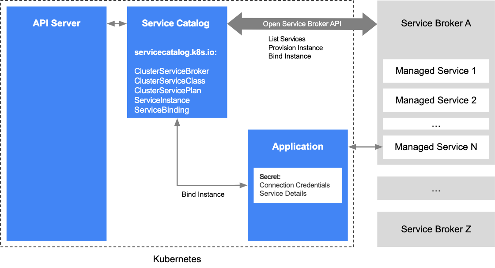

[toc]

# ServiceCatalog

## 什么是ServiceCatalog

ServiceCatalog 是一个 Kubernetes 的扩展机制，它提供了一种在集群中管理和使用外部服务的标准化方式。

ServiceCatalog 允许用户将外部服务和资源集成到 Kubernetes 集群中，并使用统一的方式进行管理和使用。

通过 ServiceCatalog，用户可以使用 Kubernetes API 和 YAML 文件定义和消费服务。这使得在 Kubernetes 集群中管理和与外部服务交互变得更加简单和一致。

ServiceCatalog 使用服务经纪人（service brokers）作为 Kubernetes 集群与外部服务提供商之间的中间件。服务经纪人充当了 Kubernetes 集群与外部服务提供商之间的桥梁，使得用户可以通过 Kubernetes API 在集群中进行服务的创建、管理和消费。这种方式使得用户可以无缝地与各种外部服务进行集成，例如数据库、消息队列或云提供商。

通过 ServiceCatalog，用户可以更加方便地管理外部服务的依赖关系，提高了应用程序的可移植性和灵活性。它简化了在 Kubernetes 集群中管理外部服务的流程，并提高了应用程序的敏捷性。

需要注意的是，ServiceCatalog 是一个扩展机制，它可能并不适用于所有的 Kubernetes 发行版或版本。其使用和可用性可能取决于您所使用的具体 Kubernetes 环境。


***作者有话说：通俗来说，就是应用可以通过编写yaml文件可以申请到自己需要的外部资源，包括，zk，kafka，mysql等资源。***

## 架构



## 基本概念

### ClusterServiceBroker

Cluster Service Broker（CSB）是一种用于 Kubernetes 集群的开源项目，它提供了一种在集群中自动部署、管理和操作服务的机制。CSB 可以被认为是一种服务目录，集成了各种服务、组件和功能，使开发人员和运维人员能够更轻松地在 Kubernetes 集群中部署和管理服务。

CSB 的主要功能和特点包括：

服务目录：CSB 提供了一个集中的服务目录，其中包含了各种可用的服务和功能。开发人员可以从目录中选择并部署所需的服务，而无需手动配置和管理。

自动部署和管理：CSB 具有自动部署和管理服务的能力。它可以根据用户的需求，自动在 Kubernetes 集群中部署所选的服务，并负责管理其整个生命周期。这包括自动创建、更新、扩展和删除服务实例。

集成和扩展：CSB 提供了与其他 Kubernetes 组件和工具的集成，并支持扩展功能。它可以与 Kubernetes Operator、Service Mesh、监控和日志系统等配套使用，以提供更全面的服务管理和运维能力。

多租户支持：CSB 支持多租户架构，使不同的团队或用户可以在同一个集群中独立管理和使用服务。每个租户可以有自己的服务目录和权限控制，以确保安全和隔离性。

可插拔性：CSB 允许用户自定义和扩展服务目录，以满足特定需求。用户可以添加自定义的服务模板、配置和操作，以便更好地适应其业务需求。

需要注意的是，CSB 是一个开源项目，可根据具体需求进行定制和部署。它可以提供一种简化的方式来部署和管理服务，但在使用过程中仍需要根据自身情况进行适配和配置。

***作者有话说：简单来说，一个Service Broker后端就会对应一个第三方的服务提供商。***

```
apiVersion: servicecatalog.k8s.io/v1beta1
kind: ClusterServiceBroker
metadata:
  name: sample-service-broker
spec:
  url: http://sample-service-broker.com                   #这里就会链接到第三方服务提供商
  authInfo:
    basic:
      secretRef:
        name: sample-service-broker-credentials
```


### ClusterServiceClass

ClusterServiceClass（CSC）是 Kubernetes 集群中的一个概念，用于描述和定义可用的服务。它是 Cluster Service Broker（CSB）中的一个重要组成部分。

CSC 是一种 Kubernetes 自定义资源（Custom Resource），用于定义一种服务的规范和属性。它是服务目录中的一个条目，描述了某个服务的元数据、规格和其他相关信息。每个 CSC 对应一个具体的服务，可以包含服务的名称、描述、标签、图标等信息。

CSC 的主要作用是：

服务描述和标准化：CSC 提供了一种标准化的方式来描述和定义服务。通过 CSC，开发人员和运维人员可以了解和比较不同服务的特性和功能。它可以提供服务的元数据，如服务名称、描述、版本、标签等，以帮助用户更好地理解和选择服务。

规范和约束：CSC 定义了服务的规范和约束。它指定了服务所需的参数、配置选项、依赖关系等。通过 CSC，用户可以了解服务的使用方式和要求，并按照规范来配置和部署服务。

可发现性：CSC 提供了一种机制，使服务能够在服务目录中被发现。它可以与 Cluster Service Broker（CSB）一起使用，将服务注册到目录中，并使用户能够浏览和选择可用的服务。

扩展性：CSC 支持扩展性，允许用户定义自定义的服务规范和属性。用户可以创建自己的 CSC，并根据特定需求定义自己的服务。

CSC 是一个抽象的概念，具体的实现和使用方式可能因不同的 CSB 实现而有所不同。在使用 CSC 时，需要参考所使用的 CSB 的文档和规范。

***作者有话说：通俗来说，一个Cluster Service Class就是Cluster Service Broker具体实现，每个Class资源就必须有一个Broker作为后端。***

```
apiVersion: servicecatalog.k8s.io/v1beta1
kind: ClusterServiceClass
metadata:
  name: sample-service-class
spec:
  externalName: sample-service
  externalID: sample-service-id
  clusterServiceBrokerName: sample-service-broker     ##比如这里就定义了他使用的  clusterServiceBroker
  bindingRetrievable: true
  plans:
  - name: basic
    description: Basic plan
    externalMetadata: {}
```


### ClusterServicePlan

ClusterServicePlan（CSP）是 Kubernetes 集群中的一个概念，用于描述和定义可用的服务计划。它是 Cluster Service Broker（CSB）中的一个重要组成部分。

CSP 是一种 Kubernetes 自定义资源（Custom Resource），用于定义一种服务的计划或套餐。它描述了服务的不同计划、定价和配置选项。每个 CSP 对应一个具体的服务计划，可以包含计划的名称、描述、价格、配置等信息。

CSP 的主要作用是：

服务计划定义：CSP 提供了一种方式来定义并描述服务的不同计划。通过 CSP，开发人员和运维人员可以了解和比较不同计划的特性和功能。它可以提供计划的元数据，如计划名称、描述、价格、配置选项等，以帮助用户更好地理解和选择适合的计划。

定价和配置选项：CSP 定义了每个服务计划的价格和可配置选项。它可以指定计划的定价模型、费用结构、计量单位等。通过 CSP，用户可以了解计划的成本和可配置的参数，以便根据需求选择合适的计划。

规范和约束：CSP 指定了每个计划的规范和约束。它可以定义计划所需的参数、配置选项、资源限制等。通过 CSP，用户可以了解计划的使用方式和要求，并按照规范来选择和配置计划。

可发现性：CSP 提供了一种机制，使服务计划能够在服务目录中被发现。它可以与 Cluster Service Broker（CSB）一起使用，将计划注册到目录中，并使用户能够浏览和选择可用的计划。

扩展性：CSP 支持扩展性，允许用户定义自定义的计划规范和属性。用户可以创建自己的 CSP，并根据特定需求定义自己的计划。

***作者有话说：通俗来说，这里其实是规格，比如在ServiceClass里面提供服务是mysql，那么这里就定义的mysql的规格，比如***

***普通版本：2C4G100G***

***高级版本：8C16100G***

***这里定义的规格实际和公有云/私有云在购买RDS的规格类似。***

```
apiVersion: servicecatalog.k8s.io/v1beta1
kind: ClusterServicePlan
metadata:
  name: sample-service-plan
spec:
  clusterServiceClassRef:
    name: sample-service-class                                 #每个ClusterServicePlan 都必须属于某一个clusterServiceClass
  externalMetadata: {}
  instanceCreateParameterSchema:
    "$schema": "http://json-schema.org/draft-04/schema#"
    type: object
    properties:
      size:
        type: string
        description: Size of the instance
    required:
      - size
  bulletins:
  - title: Important Note
    text: This plan has certain limitations
```


### ServiceInstance

ServiceInstance（服务实例）是 Kubernetes 集群中表示已创建的服务实例的一个概念。它是 Cluster Service Broker（CSB）中的一个关键组成部分。

ServiceInstance 是 Kubernetes 中的自定义资源（Custom Resource），用于表示已创建的服务实例。每个 ServiceInstance 对应一个具体的服务实例，可以包含实例的名称、状态、绑定信息等。

ServiceInstance 的主要作用是：

实例化服务：通过创建 ServiceInstance，可以在 Kubernetes 集群中实例化一个具体的服务。它会触发 CSB 或相关的服务经纪人（broker）创建和配置服务实例。

状态管理：ServiceInstance 记录了服务实例的状态信息。它可以指示服务实例的创建状态、运行状态和错误状态等。通过监视和管理 ServiceInstance 的状态，可以确保服务实例的正确创建和运行。

绑定和链接：ServiceInstance 可以与其他 Kubernetes 资源进行绑定，如 PersistentVolumeClaim（持久卷索取）和 Secret（密钥）。这允许服务实例与其他资源进行关联，以便实现数据的持久化、访问控制等功能。

生命周期管理：ServiceInstance 提供了服务实例的生命周期管理功能。它可以用于创建、更新、删除服务实例，并处理相应的生命周期事件。

***作者有话说：简单来说，一个ServiceInstance其实就是一个真正的支撑实例，还是以刚才的mysql为例，那么他这个就是一个mysql数据库，有数据库ip，端口等信息。换到公有云/私有云他就是一个RDS实例***

```
apiVersion: servicecatalog.k8s.io/v1beta1
kind: ServiceInstance
metadata:
  name: sample-service-instance
spec:
  clusterServiceClassRef:
    name: sample-service-class           #定义了他属于什么Classs
  clusterServicePlanRef:
    name: sample-service-plan            #定义了他属于什么Plan
  parameters:
    size: small
```


### ServiceBinding

ServiceBinding（服务绑定）是 Kubernetes 集群中表示服务实例与应用程序之间绑定关系的一个概念。它是 Cluster Service Broker（CSB）中的一个关键组成部分。

ServiceBinding 是 Kubernetes 中的自定义资源（Custom Resource），用于表示服务实例与应用程序之间的绑定关系。每个 ServiceBinding 对应一个具体的绑定实例，可以包含绑定的名称、状态、绑定信息等。

ServiceBinding 的主要作用是：

绑定服务：通过创建 ServiceBinding，可以将服务实例与应用程序进行绑定。它会触发 CSB 或相关的服务经纪人（broker）进行绑定操作，以确保应用程序能够访问和使用相应的服务。

绑定信息：ServiceBinding 记录了服务与应用程序之间的绑定信息。它可以包含用于访问服务的凭据、URL、配置参数等。通过 ServiceBinding，应用程序可以获取所需的绑定信息，以便正确地使用服务。

生命周期管理：ServiceBinding 提供了绑定关系的生命周期管理功能。它可以用于创建、更新、删除绑定关系，并处理相应的生命周期事件。

访问控制：ServiceBinding 可以与 Kubernetes 的访问控制机制（如 Secret）结合使用，以确保绑定信息的安全性。这可以通过限制对 ServiceBinding 的访问权限或对绑定信息进行加密等方式来实现。

***作者有话说：简单来说这个就是刚才的RDS下的某一个或者多个库的使用权限。***

```
apiVersion: servicecatalog.k8s.io/v1beta1
kind: ServiceBinding
metadata:
  name: sample-service-binding
spec:
  instanceRef:
    name: sample-service-instance                      #定义了他办的的si是谁
  secretName: sample-service-binding-secret            #这个secret就记录了这个数据库的详细信息
```

## 总结


| 概念                 | 说明                  | 举例                                                  |
| -------------------- | --------------------- | ----------------------------------------------------- |
| ClusterServiceBroker | 管理服务实例的API     | http://redis-broker.service-brokers.svc:8080          |
| ClusterServiceClass  | 第三方服务的类型      | redis、kafka、zookeeper等                             |
| ClusterServicePlan   | 第三方服务的套餐规格  | redis两种plan：standard（4G内存）、advanced（8G内存） |
| ServiceInstance      | 服务实例配置          | 一个具体的redis主从                                   |
| ServiceBinding       | 服务绑定给哪个App使用 | 某个应用的在使用这个redis主从                         |

虽然Service Catalog已经停止维护服务，但是里面涉及到的概念比如ServiceInstance，ServiceBinding还是在很多地方得到了延续。
