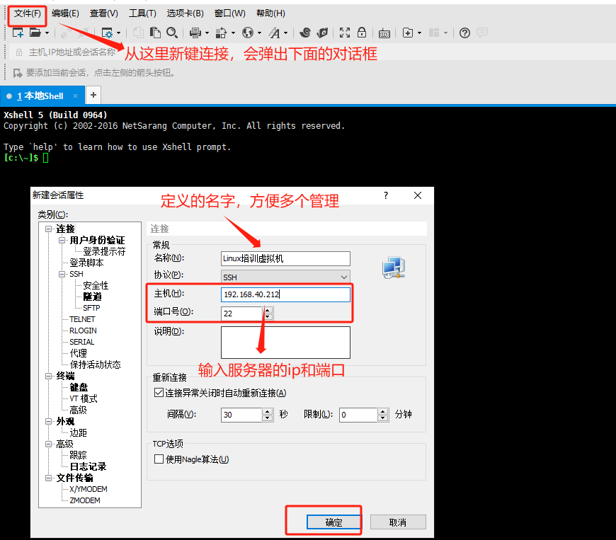
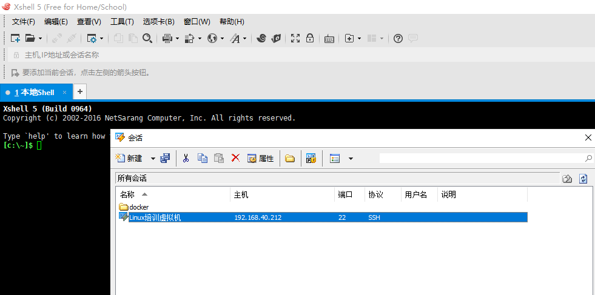
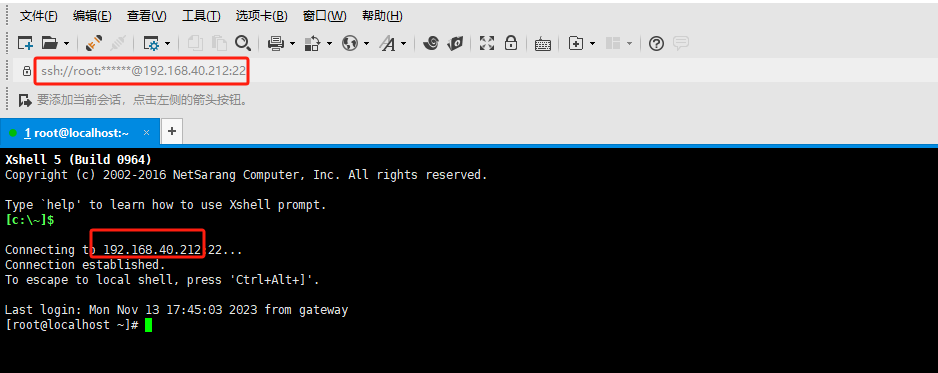

# LinuxSSH连接

## 1.SSH协议介绍

SSH，全称Secure Shell，是一种网络协议，用于安全地在不安全的网络上执行命令并传输数据。SSH在计算机世界中广泛使用，特别是在进行远程系统管理和安全文件传输方面。

SSH提供了一种安全的通道，用于两个在不安全的网络（如互联网）上的系统之间的通信。它使用公钥加密来验证远程计算机和允许远程计算机验证用户。

SSH主要提供以下功能：

1. 安全远程命令执行：SSH提供了一种在远程服务器上执行命令的安全方式。
2. 安全文件传输：SSH包含两个重要的文件传输协议，SCP和SFTP。它们都可以在不安全的网络上安全地复制文件。
3. 端口转发和隧道：SSH可以安全地隧道各种网络协议，并为本地和远程的应用程序提供端口转发。
4. 身份和安全：SSH使用公钥加密和其他加密技术来提供数据完整性、加密和验证。

SSH的默认端口是22，但可以在服务器配置中更改。

SSH协议有两个主要版本，SSH1和SSH2。SSH2包含了对SSH1的许多改进，并且解决了SSH1中的许多安全问题。因此，SSH2是首选的SSH协议版本。

SSH的一个重要组成部分是SSH密钥对，它包括一个公钥和一个私钥。公钥存储在远程服务器上，私钥保留在本地计算机上。当尝试通过SSH连接到服务器时，服务器会使用存储的公钥来加密一个消息，然后发送到客户端。客户端使用其私钥解密消息并发送回服务器，从而验证其身份。这种方式提供了一种强大的身份验证方法，而无需传输密码。

在Linux实际运维当中，ssh分服务端（SSHD）和客户端（ssh），服务端其实一般代表的就是别人可以通过ssh连接到服务器，而客户端则代表我们可以通过ssh协议连接其他服务器，而不用借助其他辅助工具，比如下面这些常见的ssh软件（类UNIX系统都会自带）

## 2.常见的SSH软件

总结一下，常见的SSH软件主要包括以下几种：

1. OpenSSH：它是SSH协议的开源实现，包含了一个SSH客户端和服务器。适用于各种操作系统，包括Linux、Unix、Windows等。
2. PuTTY：一个免费的、开源的SSH和telnet客户端，主要用于Windows系统。
3. SecureCRT：一款商业的SSH客户端，提供了图形界面和一些高级功能，如多标签、脚本支持、会话管理等。
4. Bitvise SSH Client：又是一款商业SSH客户端，主要用于Windows系统。支持SFTP、端口转发、动态SOCKS代理等。
5. MobaXterm：一个增强版的SSH客户端，集成了很多功能，如多标签、SFTP、X11转发、内置的Unix命令等，主要用于Windows系统。
6. Termius：一个跨平台的SSH客户端，适用于Windows、Mac、Linux、iOS和Android。提供了图形界面，支持多标签、端口转发、SFTP等。
7. Xshell：商业软件，支持SSH1, SSH2以及Microsoft Windows平台的TELNET协议。提供完整的终端模拟、动态端口转发、自动登录和脚本功能等。Xshell是商业软件，但对于学术和家庭用户，提供了免费的个人版。

以上只是常见的SSH软件，实际上还有很多其他的SSH客户端和服务器软件，用户可以根据自己的需要选择合适的工具。

## 3.其他连接方式

### 3.1 Win服务器连接方式

在服务器领域不仅有Linux，也有WIN的服务器，Linux通用的是是ssh（默认端口22），而win是一个RDP的协议（默认端口3389）

RDP（Remote Desktop Protocol）是微软公司开发的一种远程桌面协议。通过RDP协议，用户可以在本地计算机上创建和管理远程计算机的会话，就像直接在远程计算机前操作一样。

RDP协议的主要特点和功能包括：

1. 多会话支持：每个用户连接到远程计算机都会创建一个新的会话，这些会话是独立的，不会相互影响。
2. 高效的图像传输：RDP协议可以有效地压缩和缓存图像数据，通过网络传输效率高。
3. 设备重定向：用户在本地计算机上的操作可以被重定向到远程计算机，例如，本地打印机的打印任务可以被重定向到远程计算机的打印机。
4. 安全性：RDP协议支持多种安全机制，包括SSL/TLS加密，Network Level Authentication等。
5. 音频和视频流：RDP支持音频和视频流的传输，甚至可以支持3D渲染。
6. 跨平台：虽然RDP协议最初是为Windows系统设计的，但现在的RDP客户端已经可以在多种平台上运行，包括Linux，MacOS，iOS，Android等。

尽管RDP协议提供了强大的远程桌面功能，但是它也有一些局限性，例如，它通常需要较高的网络带宽，并且在一些特定的应用场景下，性能可能不如专门设计的协议（如VNC，PCoIP等）。此外，如果RDP协议的安全设置配置不当，可能会被攻击者利用。

### 3.2 VNC协议介绍

VNC，全称是Virtual Network Computing，是一种图形界面的远程控制技术。通过VNC协议，用户可以在本地计算机上操作远程计算机的桌面环境。

VNC工作原理是：在远程计算机上运行一个VNC服务器程序，它会把屏幕图像（或者改变的部分）以图形的形式通过网络传送到本地计算机的VNC客户端。本地计算机上的用户可以看到远程计算机的桌面，并可以通过鼠标和键盘来操作远程计算机。

VNC协议的特点：

1. 跨平台：VNC协议可以应用在多种操作系统，如Windows，Linux，MacOS等。
2. 简单：VNC协议相对简洁，易于实现和使用。
3. 实时：用户可以看到远程桌面的实时变化。
4. 安全性：VNC传输的数据可以被加密，但需要额外配置。

VNC的常见应用包括远程技术支持，远程访问和控制，网络教育等。值得注意的是，尽管VNC协议提供了访问远程桌面的功能，但是它的性能可能不如专门的远程桌面协议（如RDP，PCoIP等），特别是在网络带宽有限或者图形复杂的情况下。

VNC协议在云厂商使用比较多，可以等效于显示器来使用，在云厂商的网页控制台里面一般都可以找到。在互联网早期，云并未大面积普及的时候，如果误操作导致网络异常，是无法通过ssh或者rdp连接的，就可以提供额外的vnc方式去连接（前提是你额外配置过，主要针对虚拟机）。独立服务器还可以通过ipmi/带外方式进行操作。

## 4.实操连接SSH服务器

### 4.1 准备前提条件

#### 4.1.1 一个ssh客户端软件

本次操作选择的是我熟悉的Xshell

#### 4.1.2 服务器信息

需要准备就是服务器的IP,端口，账号，密码，如果未配置可参考网络Linx基础-网络章节

特别注意：Linux是可以设置为空密码的，如果通过控制台（显示器）输入账号以后是可以直接进入系统，不需要密码的，但是在ssh连接的时候是必须用密码的，如果出现服务器为空密码的情况，是无法ssh连接进去的。

### 4.2 连接服务器

#### 4.2.1建立新的连接

#### 4.2.2 连接服务器

根据提示输入账号密码，一般为了方便管理，都会在这里记录账号密码，以后2次连接都可以直接进入，不用额外输入账号密码。

#### 4.2.3 连接成功，和通过控制台进去没有太大区别

