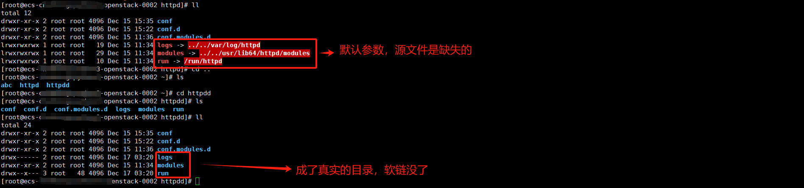
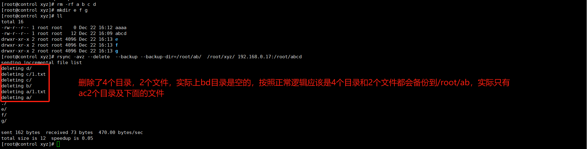

[toc]

# RSYNC命令

## 命令介绍

RSYNC（Remote Sync）是一个用于远程文件同步和备份的开源工具。它通过差异化传输算法，仅传输文件的变化部分，从而实现高效的文件同步和备份。以下是一些关键特点和用法介绍：

1. 增量传输：RSYNC使用一种增量传输算法，仅传输源文件和目标文件之间的差异部分，而不是传输整个文件。这极大地减少了传输的数据量，提高了传输速度。
2. 多种同步模式：RSYNC支持多种同步模式，包括本地同步、远程同步以及本地与远程之间的同步。它可以在本地文件系统内同步文件，也可以通过SSH等协议进行远程同步。
3. 增量备份：RSYNC可以用作增量备份工具，它可以按需备份源文件的变化部分，而不需要每次都备份整个文件。这使得备份过程更加高效，并节省了存储空间。
4. 安全传输：RSYNC可以通过SSH进行传输，确保数据在传输过程中的安全性和保密性。
5. 保留文件属性：RSYNC默认情况下会保留文件的属性和权限，包括时间戳、所有者和组等信息，确保在目标端文件与源文件保持一致。
6. 过滤功能：RSYNC支持通过过滤规则来选择性地同步或排除某些文件或目录。这使得用户可以根据自己的需求进行文件过滤和同步。

RSYNC是一个功能强大而灵活的工具，被广泛用于文件同步、备份和迁移等场景。它可以在不同操作系统上运行，并且具有丰富的命令选项和配置参数，以满足不同的需求。

## 命令参数

当使用RSYNC命令时，可以根据不同的需求使用不同的参数来控制其行为。以下是一些常用的RSYNC参数的解释：

- `-a`（归档模式）：该参数用于保持文件的所有属性，包括时间戳、权限、所有者等。它是一个常用的参数，用于在源和目标之间保持完全一致。
- `-v`（详细模式）：该参数用于显示详细的输出信息，包括传输的文件列表、文件大小和传输速度等。
- `-r`（递归模式）：该参数用于递归地同步目录和子目录，确保源和目标目录之间的所有文件都被同步。
- `-z`（压缩模式）：该参数用于对传输的数据进行压缩，以减少传输的数据量。这在网络传输较慢的情况下可以提高传输速度。
- `-P`（进度模式）：该参数用于显示传输的进度信息，包括已传输的文件数量和总体进度等。
- `-u`（更新模式）：该参数用于仅同步源文件中新增或更新的文件，而不处理目标文件中已存在且没有变化的文件。
- `--delete`（删除模式）：该参数用于在目标目录中删除与源目录中不同的文件。这对于保持目标目录与源目录完全一致很有用。
- `--exclude`（排除模式）：该参数用于指定要排除的文件或目录，以避免将其同步到目标目录中。
- `--bwlimit=速度`（带宽限制）：该参数用于限制传输速度，以防止RSYNC占用过多的带宽。

这只是一小部分常用的RSYNC参数，还有更多的参数可以根据具体需求进行使用。你可以通过输入 `man rsync` 命令来查看完整的RSYNC命令帮助文档，并了解更多参数和用法。

## 常见用法

在使用rsync命令时，可以通过不同的路径来指定源文件/目录和目标文件/目录。以下是一些常见的rsync方法路径的示例：

1. 本地文件同步：

   ```
   rsync /path/to/source /path/to/destination
   ```

   在本地文件系统内进行同步，其中`/path/to/source`是源文件/目录的路径，`/path/to/destination`是目标文件/目录的路径。

2. 远程文件同步（使用SSH）：

   ```
   rsync -e ssh user@remote:/path/to/source /path/to/destination
   ```

   通过SSH协议远程同步文件，其中`user`是远程服务器的用户名，`remote`是远程服务器的地址，`/path/to/source`是远程源文件/目录的路径，`/path/to/destination`是本地目标文件/目录的路径。

3. 本地与远程之间的文件同步（使用SSH）：

   ```
   rsync -e ssh /path/to/local/source user@remote:/path/to/destination
   ```

   在本地与远程服务器之间同步文件，其中`/path/to/local/source`是本地源文件/目录的路径，`user`是远程服务器的用户名，`remote`是远程服务器的地址，`/path/to/destination`是远程目标文件/目录的路径。

4. 同步文件夹：

   ```
   rsync -av /path/to/source/ /path/to/destination/
   ```

   在同步文件夹时，需要在源和目标路径末尾加上斜杠`/`，以确保将整个源文件夹同步到目标文件夹。

这些是一些常见的rsync方法路径示例，可以根据具体需求和场景来修改路径和参数。请确保在使用rsync命令时，正确指定源路径和目标路径，以避免意外的数据同步或覆盖。

***作者优化说：其实从3/4 我们可以看出来，谁在前面，谁就是源；谁在后面谁就是目标。***

##  特殊用法

以下部分在实际运维过程中比较有用的参数组合

1. 权限控制

   -a 走天下

   ```
   #特别注意，如果复制的时候是用的root命令，而源文件是apache用户，目标服务器必须要有对应的用户，否则会复制过去的文件会异常。
   -a 
   在rsync中，-a参数和-p、-o、-t、-g参数有一些区别。
   -a参数是归档模式，它等价于-rlptgoD参数的组合。归档模式会保持文件的所有属性，包括权限、所有者、所属组、时间戳等，并且会递归地复制子目录和链接。
   -p参数仅保持文件的权限。它会确保目标文件和源文件具有相同的权限，但不会保持其他属性，例如所有者、所属组和时间戳。
   -o参数仅保持文件的所有者。它会确保目标文件和源文件具有相同的所有者，但不会保持其他属性。
   -t参数仅保持文件的时间戳。它会确保目标文件和源文件具有相同的修改时间和访问时间，但不会保持其他属性。
   -g参数仅保持文件的所属组。它会确保目标文件和源文件具有相同的所属组，但不会保持其他属性。
   ```

2. ssh端口不一致

   ```
   -e 'ssh -p xxx'
   #在远程复制的过程中，如果本地和远程机器端口一致的情况下，可不使用这个参数，如果不一致才需要加上这个参数。
   #同理如果本地和远程账号不一样，账号也是可以省略的。
   ```

3. 软链保持

   ```
   -L
   #默认情况下，rsync在复制软连的时候会把软连关系复制过去，而不会复制内容本身，如果加上-L参数，则会把真实文件复制过去，但是这个会破坏软连，也就是不原来软连的文件或目录会变成真实的文件和目录。
   ```

   

4. "/" 问题

   ```
   rsync -a /etc/httpd 192.168.0.17:/root/httpddd
   #会把httpd目录本身及下面的内容复制到/root/httpddd/目录下，形成httpd目录
   
   rsync -a /etc/httpd/ 192.168.0.17:/root/httpddd
   #会把httpd目录下的内容复制到/root/httpddd/目录下
   
   rsync -a /etc/httpd 192.168.0.17:/root/httpddd/
   #会把httpd目录本身及下面的内容复制到/root/httpddd/目录下，形成httpd目录
   
   rsync -a /etc/httpd/ 192.168.0.17:/root/httpddd/
   #会把httpd目录下的内容复制到/root/httpddd/目录下
   ```

   总结下来就是，如果源不带"/", 则会复制目录 本身及内容，源带了"/",则是复制目录下的内容到目标目录下。

   如果目标目录不存在，则会创建对应的目录

5.  绝对一致的问题
   ```
   --delete
   #默认不加的情况下，比如源目录里面有 a,b,c 3个目录，如果目标复制里面有 1,2,3 3个目录，如果默认参数，复制源目录以后，目标目标会存在 a,b,c,1,2,3 共6个目录。
   #如果加了该参数，则会删除目标目录里面已经存在的 1,2,3 3个目录只保留源目录里面的a,b,c 3个目录，从而保证目标和源绝对一致。
   ```
   
      总结下就是不加，我只负责把我要传的内容传过去就行，加了就会保持绝对一致。
   
6. 增量问题
   ```
   #rsync默认就是增量同步，但是如果出现第一次同步源目录是 a,b,c 3个目录,同步到目标目录以后
   #第二次同步的内容是 a,b,d 3个目录，新创建了一个目录d，删除了一个目录c，为了保证两边目录的绝对一致，但是我希望删除的目录c可以保留在备份服务器上一个特定的地方。
   rsync -avz --delete  --backup --backup-dir=/root/ab/  /root/xyz/ 192.168.0.17:/root/abcd
   
   ```
   坑点：如果在/root/xyz/ 删除 a，b，c 都是空目录，他是不会在目标服务器文件移动到/root/ab目录的。
   
   


## RSYNC 服务进程

rsync默认采用的是ssh协议来通信，所以必须要知道ssh密码或者配置了免密通讯，但是ssh密码是一个比较敏感的东西，并不需要谁知道，所以rsync提供了一个类似daemon的方式来运行服务，而从避免泄露ssh密码。

***作者有话说：实际上目前mirrors就是采用的这个方法，对外提供服务（当然http也在），我们都可以通过rsync的方式去同步公网的源到本地。***当然有些源未对外开放873端口。

### 范例

#### 定义配置文件

```
#编辑配置文件
vi /etc/rsync.conf


uid = nobody
gid = nobody
use chroot = yes
pid file = /var/run/rsyncd.pid

[module1]                                   ##模块名字，根据需要定义，连接的时候需要用到
    path = /etc/nova/
    comment = Module 1                      #说明
    read only = yes                         ##作为只读，其他人就只能从这里拉数据，否则还可以往里面写数据
    list = yes                              #允许列表
    auth users = username1                  #用户名，连接的时候需要
    secrets file = /etc/rsyncd.secrets      ##如果在公网传输还需要加密码

[module2]
    path = /etc/httpd
    comment = Module 2
    read only = no
    list = yes
    auth users = username2
    secrets file = /etc/rsyncd.secrets
```

#### 密码配置

```
vi /etc/rsyncd.secrets
#格式如下，可以写多个

uers1:passwd
uers2:passwd
```


#### 启动

```
rsync --daemon
#默认就是后台启动，默认监听端口TCP 873端口，如果要把他做成systemctl 需要自己去编写服务文件。
```


### 连接方式

 ```
 rsync --password-file=/root/key   username1@192.168.0.17::module1/ /root/abc/
 #特别注意ip后面是2个冒号，后面名字是配置文件定义的模块名字，而不是路径。
 #密码文件自己在本机准备一个文件，把密码写进去，添加600权限
 #用户名也是配置文件定义的名字
 ```

