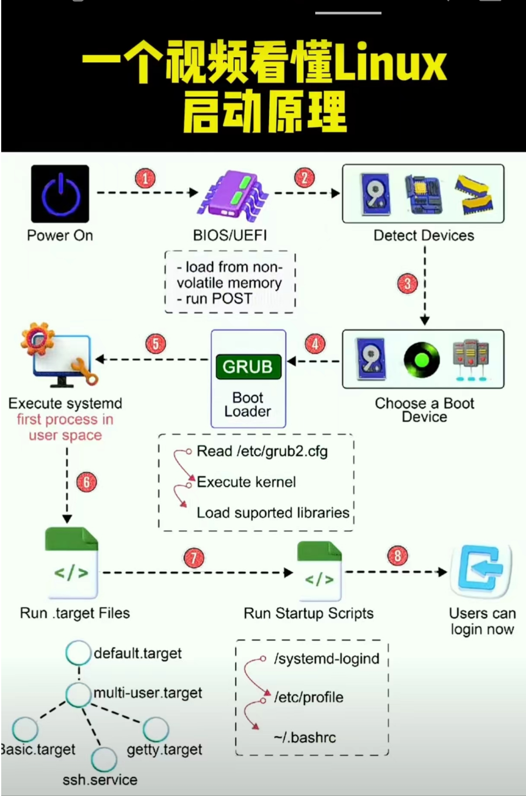

[toc]

# Systemctl

​	systemctl 是用于管理 systemd 系统和服务的命令行工具，而 systemd 是 Linux 发行版中的 init 系统。init 系统是 Linux 启动过程中的第一个进程，负责启动和管理其他系统进程和服务。

​	在传统的 init 系统中，通过运行脚本来启动和管理服务。而在 systemd 中，使用 systemctl 命令来管理服务。systemd 提供了更强大和灵活的服务管理功能，能够并行启动服务、管理服务依赖关系、提供更详细的状态信息等。

​	systemctl 命令可以用于启动、停止、重启和查看服务状态等操作。通过设置服务开机自启动，可以确保在系统启动时自动启动所需的服务。

​	因此，systemctl 和 Linux 启动过程密切相关，它是管理和控制 Linux 系统服务的一种方式。

​	本图片来源于互联网，其实systemctl就在这里的第6的位置，很多包括很多系统服务都是用这个方式来启动的。



## Systemctl实际应用

​	上面那些实际应用对我们来还比较遥远，在实际运维当中应用较多的就是把某个软件或者服务以systemctl方式启动或者不启动，比如一般初始化需要做的比如关闭防火墙，避免开启再次启动，或者我们的某个tomcat 需要来开机启动。

​	当然，在我们实际应用当中，通过yum安装的软件一遍都会自带这个服务，不需要额外编写，但是我们在实际运维当中，自有的应用如果想要实现同样的效果，则需要主机编写该文件。以下以一个tomcat为例。

### 1.创建文件

```
#创建一个xxx.service的文件，名字可根据应用来取，路径下面这个路径都可以，任选一个即可。
/etc/systemd/system/tomcat.service
/usr/lib/systemd/system/tomcat.service
```

### 2.编辑配置文件

```
[Unit]
Description=Tomcat Web Application Container
After=syslog.target network.target

[Service]
User=tomcat
Group=tomcat
Type=forking
Environment="JAVA_HOME=/usr/lib/jvm/java-8-openjdk-amd64"
Environment="CATALINA_PID=/opt/tomcat/temp/tomcat.pid"
Environment="CATALINA_HOME=/opt/tomcat"
Environment="CATALINA_BASE=/opt/tomcat"
ExecStart=/opt/tomcat/bin/startup.sh
ExecStop=/opt/tomcat/bin/shutdown.sh
Restart=on-failure

[Install]
WantedBy=multi-user.target

```

- After定义了前置依赖服务。
- User 和 Group 指定 Tomcat 进程运行的用户和组。
- Environment 指定 Tomcat 环境变量。
- ExecStart 指定启动 Tomcat 的命令。
- ExecStop 指定停止 Tomcat 的命令。
- Restart 指定在失败时重新启动服务(通过配置他，可以实现进程再次重启，确保不会因为意外挂掉而不会拉起）。
- 实际上这里的参数非常多，可根据实际情况进行调整。

### 3.配置使用

```
#启动
systemctl start tomcat
#开机启动
systemctl enable tomcat
#开启不启动
systemctl disable tomcat
```


###  4.经验

当某个服务启动失败，可以通过查看xxx.service 来确认启动命令，来手工前台启动，可以通过这个方法来确定具体的错误信息。

可以对该服务启动/停止的参数进行调整以满足自己的特殊要求。


