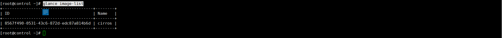
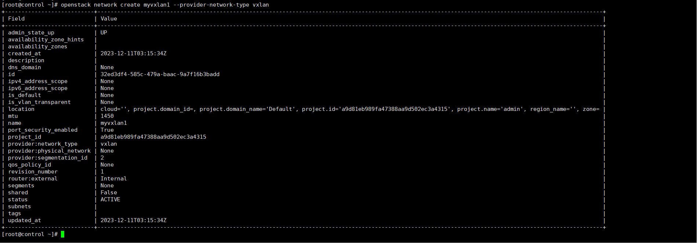
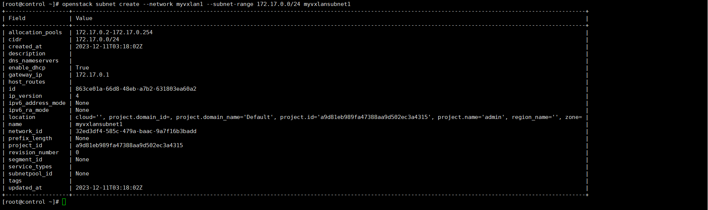
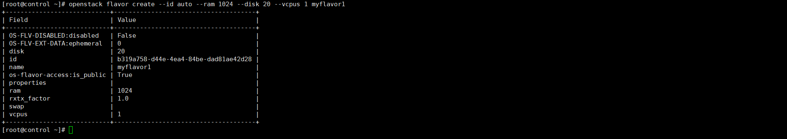
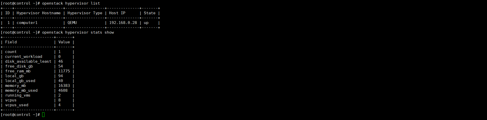
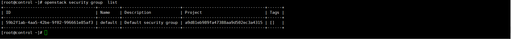
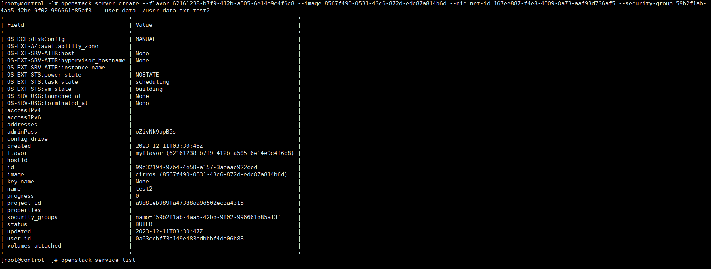
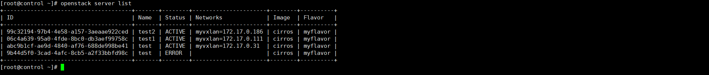
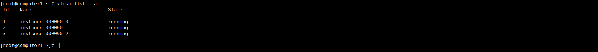

# 创建虚拟机

创建虚拟机主要要做以下准备工作，由于是初次部署，很多资源都是没有的，包括:镜像，网络，子网，规格，安全组，配置文件，加入cell

- 准备镜像

  参考安装openstack里面的方式上传到集群，供备用，查看镜像ID,创建虚拟机需要

  ```
  glance image-list
  ```

  

  

- 创建网络

  本环境是基于公有云的虚拟机来部署的，所以这里选择的是vxlan来定义的网络，具体如何定义neutron里面的内容。

  ```
  openstack network create myvxlan --provider-network-type vxlan
  ```

  

- 创建子网

   ```
   openstack subnet create --network myvxlan --subnet-range 172.17.0.0/24 myvxlansubnet
   ```

  

- 创建规格

  这里的规格就是在创建虚拟机的时候选择的型号（定义了，cpu，内存和磁盘）

  ```
  openstack flavor create --id auto --ram 2048 --disk 20 --vcpus 2 myflavor
  ```

  

- 计算节点加入cell

  ```
  su -s /bin/sh -c "nova-manage cell_v2 discover_hosts --verbose" nova
  ```

  未执行该命令之前，这个资源等于是未开放的，加入以后，这个资源才是可以用的

  ```
  #查看可用节点
  openstack hypervisor list
  #查看节点详细信息
  openstack hypervisor stats show
  ```

  

- 查看安全组

  由于这个默认就有，作为测试就没有单独创建

  ```
  openstack security group  list
  ```

  

 

- 准备配置文件

  实际上这个文件，并没有起到作用，因为没涉及到初始化程序

  ```
  #cloud-config
  password: 123456
  chpasswd: { expire: False }
  ssh_pwauth: True
  ```

- 创建虚拟机

  ``` 
  openstack server create --flavor 62161238-b7f9-412b-a505-6e14e9c4f6c8 --image 8567f490-0531-43c6-872d-edc87a814b6d --nic net-id=167ee887-f4e8-4009-8a73-aaf93d736af5 --security-group 59b2f1ab-4aa5-42be-9f02-996661e85af3  --user-data ./user-data.txt test2   
  ```

  

- 查看创建的虚拟机

  ```
  openstack server list
  ```

  

   进入系统以后，发现ip是没有自动配置到网卡上，目前暂不知道原因，但是手工配置ip到网卡以后，是可以通信的
  
