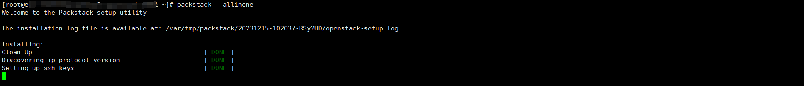

[toc]

# Openstack 最简单的安装方式-Packstack

## 1.Packstack 介绍

Packstack是一个用于快速部署OpenStack的工具。它是由Red Hat开发和维护的一个安装程序，旨在简化OpenStack的安装和配置过程。Packstack使用现有的软件包管理工具（如yum）来自动下载和安装OpenStack的各个组件和依赖项。

Packstack提供了一个基于命令行的交互式安装过程，它会引导用户完成必要的设置和配置选项。通过回答一些问题，用户可以指定网络设置、认证和访问控制、存储选项、计算节点和各种其他OpenStack组件的安装和配置。根据用户的选择，Packstack将生成一个基于这些回答的配置文件，并使用该文件自动安装和配置OpenStack。

Packstack的目标是方便用户快速搭建OpenStack环境，特别适用于实验、测试和开发环境。它提供了一种快速入门的方式，可以在较短的时间内启动和运行OpenStack，使用户能够快速体验和熟悉OpenStack的功能和特性。

需要注意的是，Packstack的安装过程是相对简化的，可能无法满足所有生产环境的要求和定制化需求。在生产环境中，通常需要更详细和精确的配置，并可能需要使用其他部署工具或手动操作来实现更高级的功能和集成。

参考文档:https://www.rdoproject.org/install/packstack/

***作者有话说：实际上这个等于就是我们通过yum安装Openstack，安装完成以后的维护也是和我们用yum安装方式一样，安装原理是基于Puppet（自动化3剑客之一，目前已经很少用了）还有国人写的书，前几年还和作者有个交集，哈哈。***

## 2.部署规划

| IP            | 配置              | 系统                     | 角色 |
| ------------- | ----------------- | ------------------------ | ---- |
| 192.168.0.207 | 8C16G,100G+单网卡 | centos7.6（update到7.9） | 控制 |
| 192.168.0.66  | 8C16G,100G+单网卡 | centos7.6（update到7.9） | 计算 |
| 192.168.0.111 | 8C16G,100G+单网卡 | centos7.6（update到7.9） | 计算 |


## 3.安装控制节点

### 3.1 更新系统

```
yum update
#由于准备的模板默认是关闭了防火墙和selinux的，这里就不在操作了。如果你的系统没有，则可以手工关闭。
#一般情况下update了系统，都建议重启下系统。
```

### 3.2 准备依赖

```
yum install -y https://rdoproject.org/repos/rdo-release.rpm
#这个源安装的版本只有T版本，如果是centos8，可以选择Y版本,3台机器都要执行。
yum install -y openstack-packstack
#安装部署工具，只有第一台部署机器需要执行。
mkdir /var/log/audit
#创建目录，是因为如果没有这个目录安装会失败，3台机器都需要执行。
yum install -y python2-qpid-proton leatherman
#这个包也需要手工安装，3台机器都需要执行，添加了源就可以执行。

yum downgrade -y leatherman
#如果未部署epel源，则不会触发该问题，如果部署了则会触发。
#这个是因为版本依赖的问题，需要使用旧版本，部署机先执行，部署报错的时候后面2台在分别执行。如果先执行，发现是没有这个包的。
#如果要一次成功的话，删除epel源就可以。
#leatherman最新版的在epel源里面，需要的版本在openstack的源，所以删除epel源就是没问题的。
```


### 3.3 安装

```
packstack --allinone
#默认安装单机版,可以根据提示查看安装日志。
#默认当前节点即是控制节点，又是计算节点。
packstack --gen-answer-file=~/packstack_answers.txt
#生成默认配置文件，然后根据自己需要对里面的信息进行修改，比如密码，比如某些组件不安装等
#本次计划了2个计算节点，并且控制节点不作为计算节点，所以要修改该配置文件
packstack --answer-file=~/packstack_answers.txt
#基于你修改的配置文件进行安装。


#这里最好提前规划好，需要安装的控制和计算节点，避免重复安装导致的集群不可用。
#计算节点也需要安装yum install -y python2-qpid-proton 和降级yum downgrade -y leatherman，如果没删除epel源，则会触发这个降级的问题。
```



```
[root@ecs-root ~]# packstack --allinone
Welcome to the Packstack setup utility

The installation log file is available at: /var/tmp/packstack/20231215-102929-q_9byW/openstack-setup.log

Installing:
Clean Up                                             [ DONE ]
Discovering ip protocol version                      [ DONE ]
Setting up ssh keys                                  [ DONE ]
Preparing servers                                    [ DONE ]
Pre installing Puppet and discovering hosts' details [ DONE ]
Preparing pre-install entries                        [ DONE ]
Setting up CACERT                                    [ DONE ]
Preparing AMQP entries                               [ DONE ]
Preparing MariaDB entries                            [ DONE ]
Fixing Keystone LDAP config parameters to be undef if empty[ DONE ]
Preparing Keystone entries                           [ DONE ]
Preparing Glance entries                             [ DONE ]
Checking if the Cinder server has a cinder-volumes vg[ DONE ]
Preparing Cinder entries                             [ DONE ]
Preparing Nova API entries                           [ DONE ]
Creating ssh keys for Nova migration                 [ DONE ]
Gathering ssh host keys for Nova migration           [ DONE ]
Preparing Nova Compute entries                       [ DONE ]
Preparing Nova Scheduler entries                     [ DONE ]
Preparing Nova VNC Proxy entries                     [ DONE ]
Preparing OpenStack Network-related Nova entries     [ DONE ]
Preparing Nova Common entries                        [ DONE ]
Preparing Neutron API entries                        [ DONE ]
Preparing Neutron L3 entries                         [ DONE ]
Preparing Neutron L2 Agent entries                   [ DONE ]
Preparing Neutron DHCP Agent entries                 [ DONE ]
Preparing Neutron Metering Agent entries             [ DONE ]
Checking if NetworkManager is enabled and running    [ DONE ]
Preparing OpenStack Client entries                   [ DONE ]
Preparing Horizon entries                            [ DONE ]
Preparing Swift builder entries                      [ DONE ]
Preparing Swift proxy entries                        [ DONE ]
Preparing Swift storage entries                      [ DONE ]
Preparing Gnocchi entries                            [ DONE ]
Preparing Redis entries                              [ DONE ]
Preparing Ceilometer entries                         [ DONE ]
Preparing Aodh entries                               [ DONE ]
Preparing Puppet manifests                           [ DONE ]
Copying Puppet modules and manifests                 [ DONE ]
Applying 192.168.0.11_controller.pp
192.168.0.11_controller.pp:                          [ DONE ]         
Applying 192.168.0.11_network.pp
192.168.0.11_network.pp:                             [ DONE ]      
Applying 192.168.0.11_compute.pp
192.168.0.11_compute.pp:                             [ DONE ]      
Applying Puppet manifests                            [ DONE ]
Finalizing                                           [ DONE ]

 **** Installation completed successfully ******

Additional information:
 * Parameter CONFIG_NEUTRON_L2_AGENT: You have chosen OVN Neutron backend. Note that this backend does not support the VPNaaS or FWaaS services. Geneve will be used as the encapsulation method for tenant networks
 * A new answerfile was created in: /root/packstack-answers-20231215-102929.txt
 * Time synchronization installation was skipped. Please note that unsynchronized time on server instances might be problem for some OpenStack components.
 * Warning: NetworkManager is active on 192.168.0.11. OpenStack networking currently does not work on systems that have the Network Manager service enabled.
 * File /root/keystonerc_admin has been created on OpenStack client host 192.168.0.11. To use the command line tools you need to source the file.
 * To access the OpenStack Dashboard browse to http://192.168.0.11/dashboard .
Please, find your login credentials stored in the keystonerc_admin in your home directory.
 * Because of the kernel update the host 192.168.0.11 requires reboot.
 * The installation log file is available at: /var/tmp/packstack/20231215-102929-q_9byW/openstack-setup.log
 * The generated manifests are available at: /var/tmp/packstack/20231215-102929-q_9byW/manifests

```

### 3.4 使用

```
#根据上面的提示可以登录deashboard
#当前目录下会生成2个文件 keystonerc_admin keystonerc_demo，就是用于管理员的环境变量
source xxx 可以对OpenStack进行管理
```


## 4.安装计算节点

### 4.1 修改配置文件

```
vi packstack_answers.txt

CONFIG_COMPUTE_HOSTS=计算ip
#默认这里会显示部署节点的ip，我这里是删除了源ip，把准备加入的节点写到这里。
```


### 4.2 安装

```
packstack --answer-file=~/packstack_answers.txt
#安装过程会出现错误，而且发现原始密钥了也出错了，环境变量文件也重新生成了，故推到重新来，计划是同时部署控制和计算，还要把计算和控制分开。
#本来安装这个就是为了快速安装部署，然后熟悉系统，所以就不单独进行该问题的排错。
```

