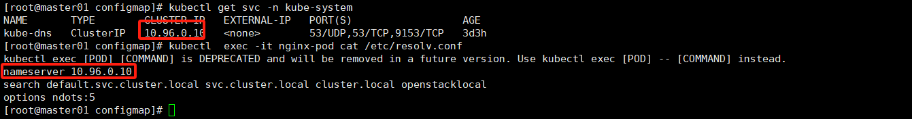
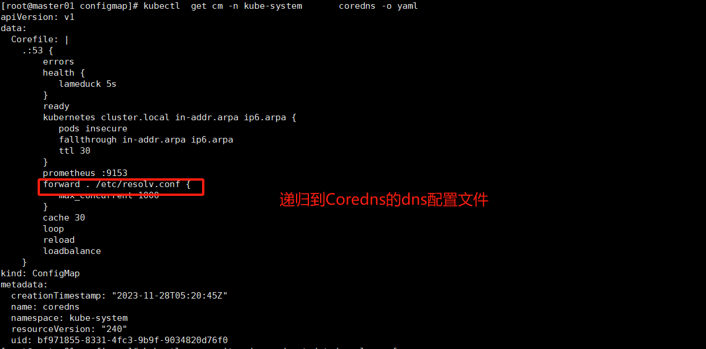
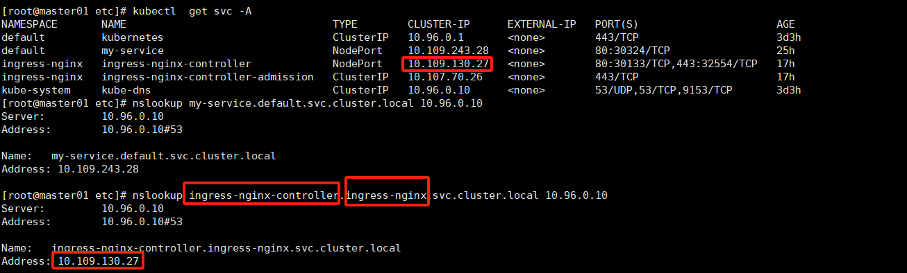

# Coredns

## 基本介绍

CoreDNS 是一个用于域名解析的开源软件。它是 Kubernetes 默认的 DNS 插件，并且也可以用作独立的 DNS 服务器。

以下是 CoreDNS 的一些主要特点和功能：

1. **灵活的插件架构**：CoreDNS 使用插件来实现各种功能，例如域名解析、缓存、负载均衡、反向代理等。这使得 CoreDNS 可以根据需求进行定制和扩展。
2. **支持多种后端数据源**：CoreDNS 可以从多种数据源获取域名解析信息，例如文件、etcd、Consul、Kubernetes API 等。这使得 CoreDNS 可以适应不同的部署环境和使用场景。
3. **高性能和高可用性**：CoreDNS 具有高性能和高可用性，可以处理大量的 DNS 查询请求，并且支持水平扩展和故障转移。
4. **简化的配置文件**：CoreDNS 使用简洁的配置文件语法，易于理解和维护。它还支持使用 YAML 配置文件，并且可以通过 API 进行动态配置更新。
5. **支持插件链**：CoreDNS 的插件可以按照特定的顺序链接起来，形成处理 DNS 查询的管道。这使得用户可以根据需求选择和配置所需的插件。

CoreDNS 在 Kubernetes 中扮演着重要的角色，为集群中的服务提供了域名解析功能。它可以解析 Kubernetes 中的服务和 Pod 的域名，实现内部服务之间的通信。同时，CoreDNS 也可以配置为将外部域名解析为集群中的服务，实现从集群内外的服务访问。

总的来说，CoreDNS 是一个灵活、高性能的域名解析服务器，提供了丰富的功能和可定制性。它在容器化环境中的部署和管理非常方便，并且与 Kubernetes 紧密集成，为容器化应用提供了可靠的域名解析服务。

## Pod解析流程

当 Pod 发起域名解析请求时，以下是 Pod 解析域名的流程：

1. **Pod 内部解析**：Pod 内部的应用程序或容器首先会尝试使用本地的 DNS 解析库（如 glibc）解析域名。它会检查 `/etc/resolv.conf` 文件，其中通常包含用于 DNS 解析的 DNS 服务器地址。
2. **CoreDNS 解析**：如果 Pod 内部的解析失败或未配置 DNS 服务器，解析请求会发送给集群中的 CoreDNS 服务器。Pod 会向集群的 DNS 服务 IP（通常是 `kube-dns` 或 `coredns` 的 Service IP）发送 DNS 请求。
3. **CoreDNS 插件链处理**：CoreDNS 收到 DNS 请求后，它会按照配置的顺序执行一系列的插件来处理请求。这些插件可以包括缓存、转发、负载均衡、自定义处理逻辑等。
4. **Kubernetes Service 解析**：如果请求的域名是一个 Kubernetes Service 的域名，CoreDNS 会将请求转发给 Kubernetes API Server 来获取该服务的 IP 地址。然后，CoreDNS 将 IP 地址返回给发起请求的 Pod。
5. **Service Endpoint 解析**：如果 Service 的 IP 地址是一个虚拟 IP（VIP），CoreDNS 会将请求转发给 Service Endpoint Controller。Endpoint Controller 会查询 Kubernetes API Server 获取 Service 相关的 Pod IP 地址，并将其返回给 CoreDNS。
6. **Pod IP 解析**：如果请求的域名是一个 Pod 的域名，CoreDNS 会直接将请求转发给 Pod 的 IP 地址。
7. **其他解析方式**：除了上述方式，CoreDNS 还支持其他类型的解析，如域名转发、配置文件解析等。这些解析方式可以根据 CoreDNS 的插件配置进行自定义。

这是 Pod 解析域名的典型流程，其中 CoreDNS 在 Kubernetes 中扮演着关键的角色，为 Pod 提供了域名解析服务。通过这种方式，Pod 可以通过域名访问其他服务或 Pod，实现了集群内部的通信。

作者有话说：简单来就是pod发起dns请求和普通服务器发起dns流程一样，先找`hosts`，然后向`/etc/resolv.conf`里面配置的dns进行请求（而这里默认配置的则是Coredns）参考下图，如果Coredns无法解析，则递归本机的`/etc/resolv.conf`,而这个文件是刚好通过Hostpath挂载到Pod对应的节点。

**作者有话说：普通容器的这个文件和coredns这个配置文件，都是docker创建的时候生成的，暂时不清楚他是怎么实现的逻辑不一样。**

**但是可以记住，这个域名解析流程就行，也可以通过控制Coredns的配置文件来修改dns的解析流程和路径。**

## 服务注册

#### 服务全称

在 Kubernetes 集群中，默认的域名后缀是 `.cluster.local`。这是由 Kubernetes 集群的 DNS 配置决定的。

在 Kubernetes 中，每个命名空间都有一个默认的域名后缀，该后缀是命名空间名称加上 `.svc.cluster.local`。例如，如果命名空间的名称是 "default"，那么默认的域名后缀将是 `.default.svc.cluster.local`。

通过这个默认域名后缀，可以在集群内部访问 Kubernetes Service，而不需要指定完整的域名。

例如，如果有一个名为 "ingress-nginx-controller" 的 Service，在ingress-nginx的命名空间中，可以通过

 `ingress-nginx-controller.ingress-nginx.svc.cluster.local` 这样的域名来访问该 Service。

#### 服务简写

虽然上面的名字具有通用行，但是太长了，能否有比较简单的方法，比如只用服务名字就可以了呢？