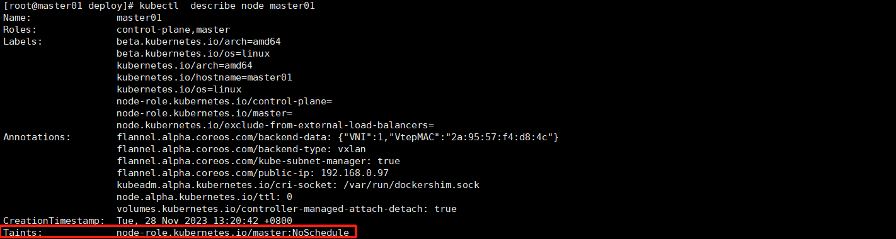

# Pod的调度

Pod 的调度是 Kubernetes 中将 Pod 放置在合适节点上运行的过程。调度器是 Kubernetes 控制平面的一部分，它负责根据调度算法和当前集群的状态选择最佳节点。以下是 Pod 调度的主要步骤和考虑因素：

1. **调度需求**：首先，定义你的 Pod 需要什么样的资源和条件。这可以通过资源请求、限制和 Pod 亲和性规则来指定。
2. **资源请求和限制**：在 Pod 的定义中，可以为每个容器指定 `resources.requests`（最小资源需求）和 `resources.limits`（资源使用上限）。调度器会确保 Pod 分配到的节点有足够的资源来满足其请求。
3. **标签和选择器**：通过标签（Labels）和选择器（Selectors）可以控制 Pod 应该调度到哪些节点上。节点亲和性（node affinity）和反亲和性（node anti-affinity）规则允许 Pods 被吸引或排斥于具有特定标签的节点。
4. **污点和容忍度**：节点上的污点（Taints）阻止某些 Pod 调度到这些节点上，除非这些 Pod 有匹配的容忍度（Tolerations）。
5. **守护进程集**：守护进程集（DaemonSet）是一种确保所有（或某些）节点运行 Pod 副本的方式，通常用于日志收集、监控代理等。
6. **Pod 亲和性和反亲和性**：Pod 可以通过 Pod 亲和性规则被调度到运行特定 Pod 的节点上，或者通过 Pod 反亲和性规则避免被调度到运行特定 Pod 的节点上。
7. **节点选择器**：通过节点选择器（nodeSelector），可以将 Pod 分配给具有特定标签的节点。

调度器在决定将 Pod 放置在何处时，遵循以下基本流程：

- **预选（Predicates）**：调度器筛选出符合 Pod 资源请求、节点选择器、容忍度等要求的节点。排除那些不满足基本前提条件的节点。
- **优选（Priorities）**：对于通过预选的节点，调度器会评分，优先考虑那些资源利用率最高、最能满足 Pod 亲和性/反亲和性规则的节点。
- **绑定（Binding）**：一旦选择了最佳节点，调度器会创建一个绑定操作，将 Pod 和选定的节点关联起来。

Pod 调度是一个复杂的过程，它涉及到多种不同的策略和算法。了解这些概念有助于优化 Pod 的调度策略，使得 Kubernetes 集群能够更高效、稳定地运行。

以下三种是比较常用，可以通过配置来实现的三种调度算法，所以单独拿来讲。

## 1.节点选择器

`nodeSelector` 是 Kubernetes 中用于将 Pods 调度到特定节点的最简单的 Pod 调度约束之一。通过为 Pod 指定 `nodeSelector`，您可以确保 Pod 只会被调度到那些标签与 `nodeSelector` 中指定的标签匹配的节点上。

您需要用标签明确标记节点，并在 Pod 的配置中指定 `nodeSelector`。以下是一个简单的例子：

### 标记节点

首先，给想要调度 Pod 的节点打上标签。例如，如果您想要将某些 Pods 只调度到具有特定硬件的节点上，您可以使用以下命令给节点打上标签：

```shell
kubectl label nodes <node-name> hardware-type=high-memory
```

这里 `<node-name>` 是节点的名称，`hardware-type=high-memory` 是您添加的标签。

### 使用 `nodeSelector`

接下来，在 Pod 配置文件中设置 `nodeSelector`：

```yaml
apiVersion: v1
kind: Pod
metadata:
  name: mypod
spec:
  containers:
  - name: mycontainer
    image: myimage
  nodeSelector:
    hardware-type: high-memory
```

在这个例子中，只有被标记为 `hardware-type=high-memory` 的节点才会被考虑用来调度 `mypod`。

当 Kubernetes 尝试调度 `mypod` 时，调度器会检查集群中的所有节点并找到符合 `nodeSelector` 条件的节点。如果没有任何节点匹配该选择器，Pod 将会处于未调度状态，直到有符合条件的节点可用。

需要注意的是，`nodeSelector` 仅提供了最简单的节点选择功能。对于更复杂的节点选择，您可能需要使用更先进的特性，如节点亲和性（Node Affinity）和节点反亲和性（Node Anti-Affinity），这些功能提供了更细粒度的控制和更多的选项来指定哪些节点是可接受的或不可接受的。

## 2.污点和容忍

污点（Taints）是 Kubernetes 中应用于节点的一种机制，用于阻止某些 Pods 不被调度到这些节点上，除非那些 Pods 明确表示可以容忍污点的存在。污点可以是临时性的或永久性的，主要用于控制节点应该接受哪些 Pods。

污点由三个部分组成：键（key）、值（value）和效果（effect）。键和值是由用户自定义的，它们用于标识污点，而效果则告诉调度器如何与有这个污点的节点互动。Kubernetes 支持以下几种污点效果：

1. `NoSchedule`：有这个污点的节点不会调度新的 Pods，除非这些 Pods 有匹配的容忍度（Toleration）。已经在节点上运行的 Pods 不会受到影响。
2. `PreferNoSchedule`：Kubernetes 将尽力避免将 Pods 调度到有这个污点的节点，但这不是强制性的。
3. `NoExecute`：不仅新 Pods 不会被调度到节点上，且已经在节点上运行的 Pods 如果不适配容忍度，将被驱逐（如果它们不匹配污点的容忍度）。

要给节点添加污点，可以使用 `kubectl taint` 命令，例如：

```shell
kubectl taint nodes node1 key1=value1:NoSchedule
```

删除污点命令

```
kubectl taint nodes node1 key1:NoSchedule-
#不需要知道污点效果也可以山风吹
kubectl taint nodes node1 key1-
```


这里 `node1` 是节点名称，`key1=value1` 是键-值对，`NoSchedule` 是污点的效果。

对应污点，Pods 需要有匹配的容忍度才能被调度到有污点的节点。容忍度被定义在 Pod 的规格中，允许 Pod 调度到带有特定污点的节点。使用容忍度可以实现更细粒度的控制，比如将某些 Pod 调度到专用硬件上或者与某些特定的服务一起运行的节点。

例如，一个 Pod 的定义可能包括以下容忍度：

```yaml
tolerations:
- key: "key1"
  operator: "Equal"
  value: "value1"
  effect: "NoSchedule"
```

这个容忍度表明该 Pod 可以被调度到具有 `key1=value1:NoSchedule` 污点的节点上。如果没有指定 `effect`，则默认情况下，这个容忍度适用于所有三种效果的污点。

使用污点和容忍度是 Kubernetes 中节点亲和性调度的高级特性，它们可以帮助集群管理员更好地控制和隔离工作负载。

**在master默认就有污点，默认情况下普通业务pod都无法调度到master上面。**



## 3.亲和性和反亲和性

在 Kubernetes 中，亲和性（Affinity）和反亲和性（Anti-affinity）是高级的调度特性，它们允许你设置规则，这些规则可以在调度 Pod 时，详细地控制 Pod 应该运行在哪些节点上。这些规则比传统的 `nodeSelector` 提供了更多的灵活性和控制能力。

亲和性和反亲和性具体分为两种类型：

1. 节点亲和性（Node Affinity）：允许你指定 Pod 应该运行在具有特定标签（Labels）的节点上。节点亲和性规则有两种类型：

   - 必需规则（requiredDuringSchedulingIgnoredDuringExecution）：Pod 必须满足这些规则才能被调度到特定节点。

   - 偏好规则（preferredDuringSchedulingIgnoredDuringExecution）：调度器会尽量满足这些规则，但如果不能满足，Pod 仍然可以被调度。

     ### 示例 1: 强制性 nodeAffinity

     在这个例子中我们定义了一个 Pod，它使用 nodeAffinity 规则来确保它只能在具有特定标签的节点上运行。这是一个硬性的约束，意味着如果没有满足条件的节点，Pod 将不会被调度。

     ```yaml
     apiVersion: v1
     kind: Pod
     metadata:
       name: with-required-node-affinity
     spec:
       affinity:
         nodeAffinity:
           requiredDuringSchedulingIgnoredDuringExecution:
             nodeSelectorTerms:
             - matchExpressions:
               - key: disktype
                 operator: In
                 values:
                 - ssd
       containers:
       - name: with-required-node-affinity
         image: nginx
     ```

     在上面的配置中，`nodeSelectorTerms` 定义了一个 `matchExpressions`，它要求节点必须有一个标签 `disktype` 的值为 `ssd`，Pod 才能在该节点上运行。

     ### 示例 2: 优选 nodeAffinity

     在这个例子中的配置演示了一个 Pod，它使用 nodeAffinity 的优选规则，指示调度器更倾向于在符合特定标签的节点上调度 Pod。这不是一个强制性的约束，如果没有满足条件的节点，Pod 仍然会被调度到其他可用节点上。

     ```yaml
     apiVersion: v1
     kind: Pod
     metadata:
       name: with-preferred-node-affinity
     spec:
       affinity:
         nodeAffinity:
           preferredDuringSchedulingIgnoredDuringExecution:
           - weight: 1
             preference:
               matchExpressions:
               - key: disktype
                 operator: In
                 values:
                 - ssd
       containers:
       - name: with-preferred-node-affinity
         image: nginx
     ```

     在上面的配置中，`weight` 是一个介于 1 到 100 的值，表示这个优先级规则的相对权重。`preference` 定义了一个 `matchExpressions` 条件，这里意味着调度器会尽量把 Pod 调度到有一个标签 `disktype` 的值为 `ssd` 的节点上，但如果这样的节点不可用，Pod 也可以调度到其他节点上。

     这两个例子展示了如何使用 Node 亲和性来影响 Kubernetes 中 Pod 的调度决策。通过 Node 亲和性，我们可以更好地控制 Pod 应该运行在哪些节点上，从而优化应用性能和资源利用率。

2. Pod 亲和性和反亲和性（Pod Affinity and Anti-affinity）：允许你指定 Pod 应该或不应该与具有特定标签的其他 Pod 运行在同一节点或拓扑域（如宿主机、机架、区域、数据中心等）上。Pod 亲和性和反亲和性同样包括必需规则和偏好规则。

下面是一个简单的 Pod 亲和性的例子：

```yaml
apiVersion: v1
kind: Pod
metadata:
  name: with-pod-affinity
spec:
  affinity:
    podAffinity:
      requiredDuringSchedulingIgnoredDuringExecution:
      - labelSelector:
          matchExpressions:
          - key: security
            operator: In
            values:
            - S1
        topologyKey: kubernetes.io/hostname
  containers:
  - name: with-pod-affinity
    image: nginx
```

在这个例子中，`requiredDuringSchedulingIgnoredDuringExecution` 表示 Pod 必须被调度到标签 `security` 的值为 `S1` 的其他 Pod 所在的节点上。

3. 这里是一个使用反亲和性的 Kubernetes Pod 配置示例。在这个例子中，我们将定义一个 Pod，它使用反亲和性规则确保它不会被调度到运行了具有相同标签 `app=web` 的其他 Pod 的同一个节点上。

   **简单点说，比如一个控制器定义了2副本，这2个副本将不允许调度到同一节点，从而可以避免宕机影响整个业务。**

   ```yaml
   apiVersion: v1
   kind: Pod
   metadata:
     name: with-pod-anti-affinity
   spec:
     affinity:
       podAntiAffinity:
         requiredDuringSchedulingIgnoredDuringExecution:
         - labelSelector:
             matchExpressions:
             - key: app
               operator: In
               values:
               - web
           topologyKey: kubernetes.io/hostname
     containers:
     - name: with-pod-anti-affinity
       image: nginx
   ```

   在这个配置中，`requiredDuringSchedulingIgnoredDuringExecution`意味着这个反亲和性规则在调度时必须被强制满足。`labelSelector`用于选择标签 `app` 的值为 `web` 的 Pod。`topologyKey` 为 `kubernetes.io/hostname` 表明 Pod 不能和满足选择条件的任何其他 Pod 在同一个节点上运行。

   反亲和性也可以设置为偏好（`preferredDuringSchedulingIgnoredDuringExecution`），这样即使无法满足规则，Pod 也可以被调度到同一个节点上，但调度器会尽量避免这种情况。

   还要注意，以上设置的权重和确切行为可能会根据你的 Kubernetes 集群版本和配置而有所不同，以及你是否使用了默认调度程序或自定义的调度程序。