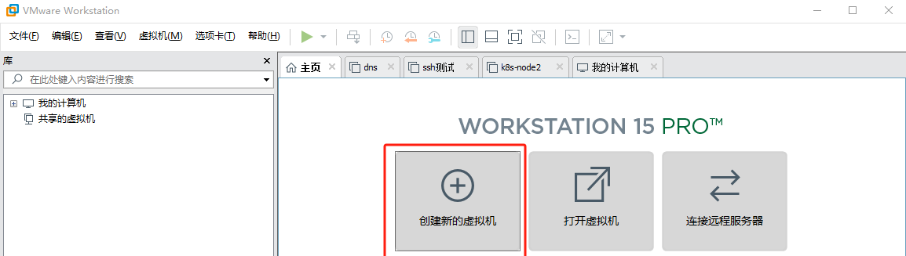
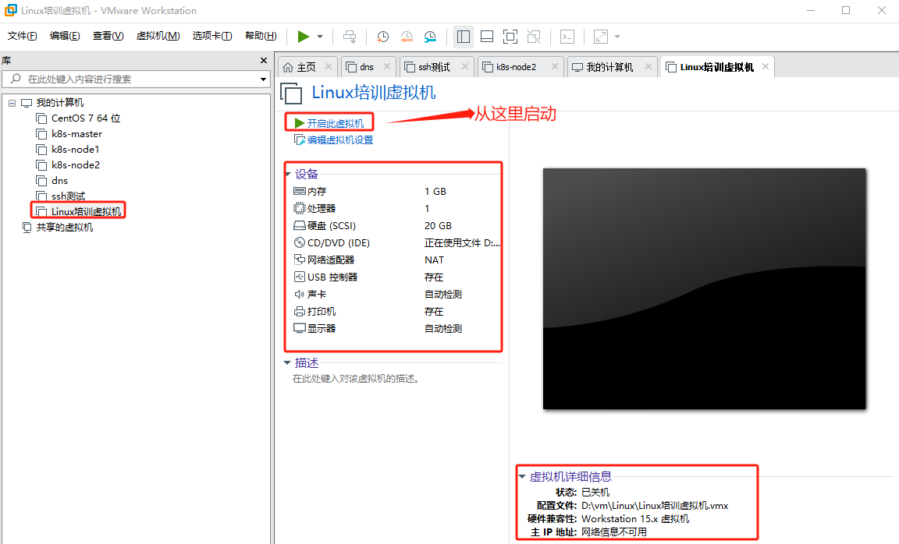
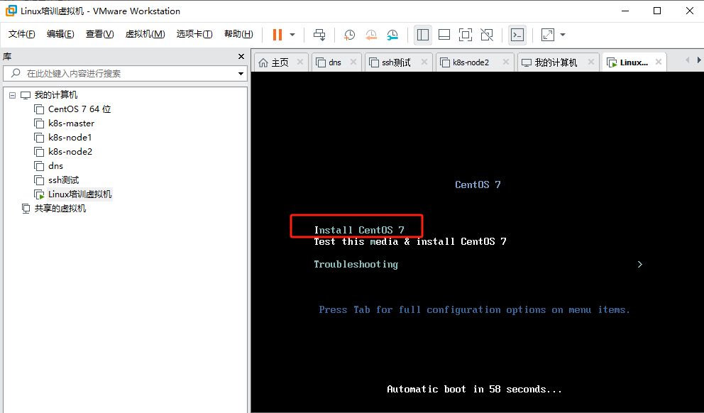
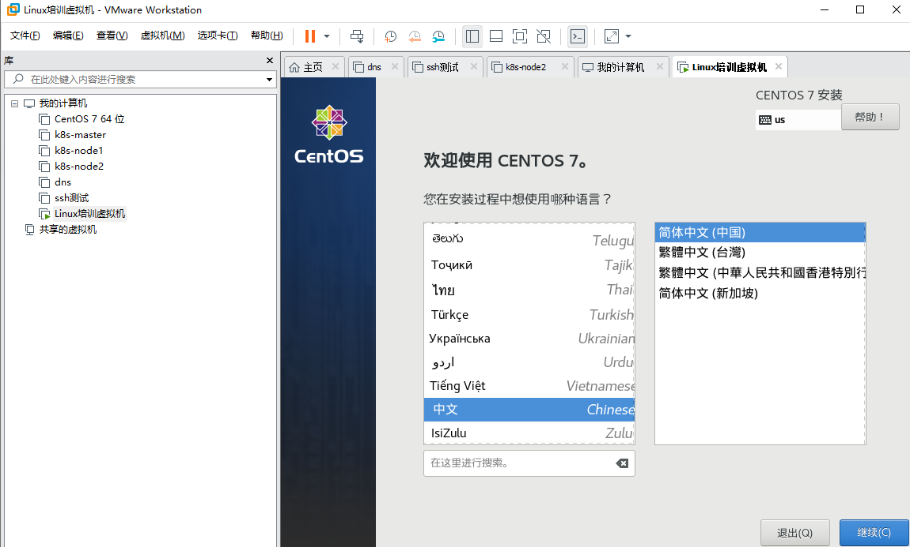
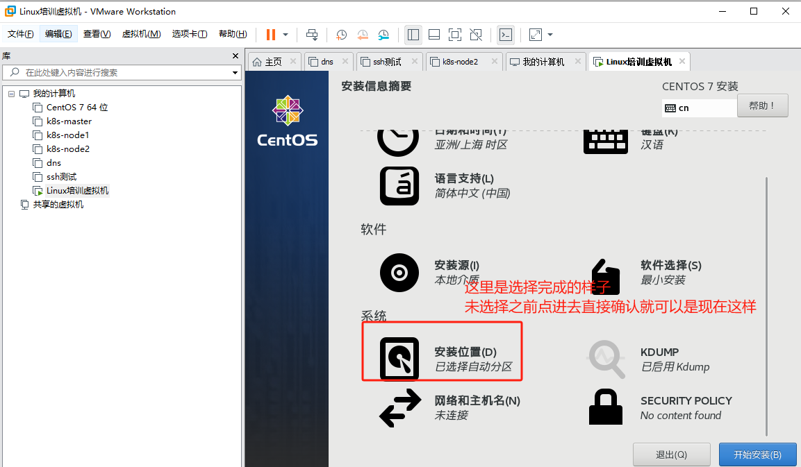
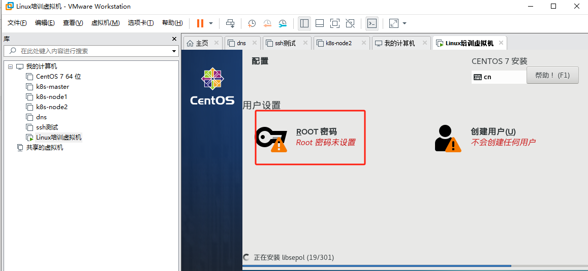
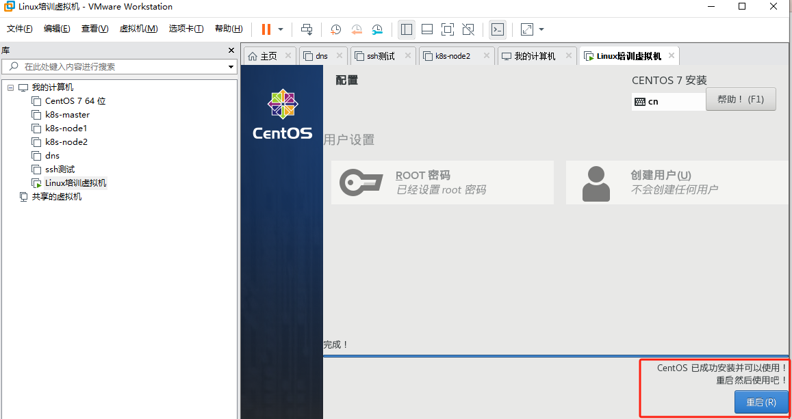
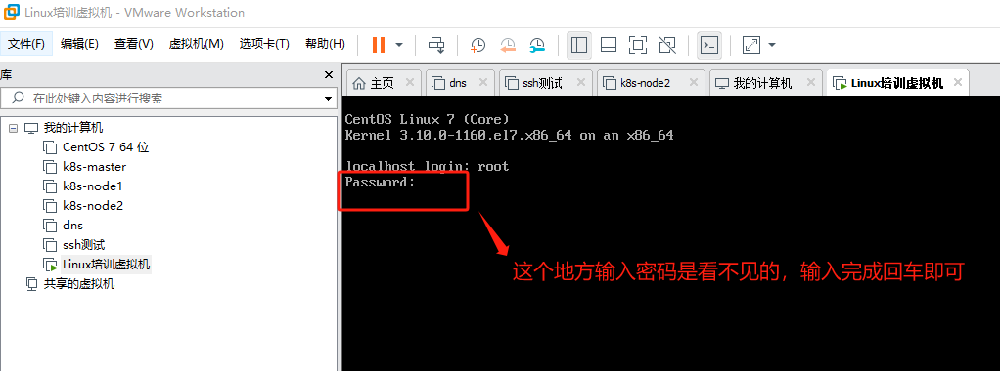

# Linux系统安装

Linux系统安装的过程可能会因不同的发行版和使用的软件有所区别，但一般来说，可遵循以下步骤：

1. 准备安装介质：首先需要下载一个Linux发行版的ISO文件，例如Ubuntu、Fedora或CentOS等。然后，将这个ISO文件烧录到USB闪存驱动器或DVD光盘，用作启动和安装介质。
2. 启动安装介质：将安装介质插入电脑，并重新启动电脑。在BIOS或UEFI设置中，将启动顺序设置为优先从安装介质启动。
3. 开始安装：电脑启动后，通常会出现一个菜单，选择“开始安装”或者“试用 Linux”。
4. 选择语言：选择你的首选语言。
5. 分区：在硬盘上为Linux系统分配空间。在大多数情况下，选择“自动分区”或者“使用整个磁盘”就足够了。如果你需要更精细的控制，或者需要设置多系统引导，你可能需要手动分区。
6. 设置用户信息：输入用户名、计算机名称以及密码。
7. 安装：点击“开始安装”或者“下一步”，安装程序将开始安装操作系统。这个过程可能会花费一段时间。在安装过程中，你可以阅读一些关于你的Linux发行版的信息。
8. 安装完成：安装完成后，将提示你移除安装介质，并重新启动计算机。重新启动后，你将可以启动并使用你的新Linux系统。

以上是一般的Linux安装过程，具体可能会根据不同的Linux发行版和硬件环境有所不同。在安装过程中请根据屏幕提示进行操作，如果遇到问题，不要犹豫寻求帮助。


## Centos安装

由于传统的安装都是基于物理机来的，作为培训教程，一般都是基于虚拟机来的，所以本次操作也是基于虚拟机而言，由于这里的对于虚拟机的介绍还没有开始，所以这里暂时不考虑软件选择的问题，直接以VMware Workstation Pro作为辅助工具，后期在介绍了虚拟机以后，**在补上一篇关于虚拟机选择的文档**。本文以目前国内最通用的centos7作为介绍。

  ### 1.准备安装介质

```
#官方源
http://isoredirect.centos.org/centos/7/isos/
#阿里源
https://mirrors.aliyun.com/centos/7/isos/x86_64/
#腾讯源
https://mirrors.cloud.tencent.com/centos/7/isos/x86_64/
```

关于源的选择，一般而言我们都选择最小的下载`CentOS-7-x86_64-Minimal-2009.iso`,但是本次演示并不是用的这个版本，而是以前下载的历史版本，这当中并没什么本质的区别。

### 2.创建虚拟机



后续的步骤根据提示完成，主要涉及类型选择，使用推荐配置；选择iso文件，根据你本地存放的位置选择即可；虚拟机的名称和路径（路径就是虚拟机文件存储位置）也根据实际实际情况选择即可；设定磁盘大小，如果只是为了测试，一般默认20G就可以了；文件存储方式一般我都选择存储单个文件；



### 3.安装系统

直接回车即可



#### 3.1 选择语言

一般而言用英文，但是初次使用方便可以选择中文，本次这里也选择中文。



#### 3.2 硬盘分区

一般而言，初学者这里也可以选择默认即可，这里未设置主机名字和配置网络。后面会单独说明，有兴趣也可以主机配置。

**注：新手建议这里还是设置把网卡配置上，因为这个通过控制台操作还是比较麻烦**



#### 3.3 设置root密码

root密码可以理解是超级管理员的密码，设置完成以后等待系统安装完成。



#### 3.4 安装完成，需要重启



#### 3.5 输入账号密码进入系统




到这里系统就算安装完成，但是由于没有配置网络，无法通过ssh连接，只能通过控制台（类似于显示器）进行操作。

**后期在补一个如何ssh连接服务器的文档**