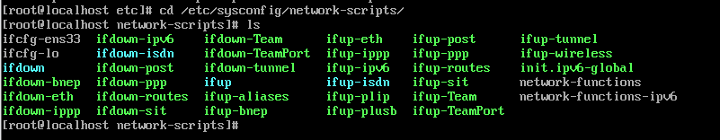
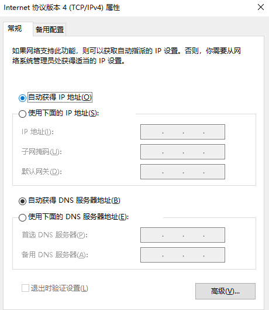
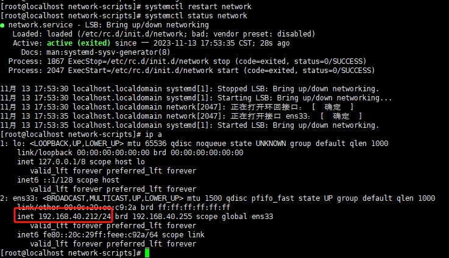

# Linux网络操作

本文档是对于没有配置网络的机器进行初始配置，如果在部署的时候选择了配置网络则可以临时忽略，本文档也会涉及到一些网络配置相关信息，如果要配置网络，需要先知道网卡的配置文件（在Linux里面一切皆文件，这也是Linux的思想之一）也会涉及到一些基础操作命令。

## 1.进入linux网卡配置文件的目录

```
cd /etc/sysconfig/network-scripts
#一般而言centos7的网卡名字都叫ifcfg-ensxxx
#对于有早期的it经验的人而言一般网卡名字都是ifcfg-eth0或者ifcfg-eth1
#名字是可以随便修改的，这个是看个人习惯，目前主流的云厂商一般而言网卡的名字都是ethx，主要方便记忆和习惯。
```



## 2.默认生成的网卡配置文件

```
TYPE=Ethernet
PROXY_METHOD=none
BROWSER_ONLY=no
BOOTPROTO=dhcp
DEFROUTE=yes
IPV4_FAILURE_FATAL=no
IPV6INIT=yes
IPV6_AUTOCONF=yes
IPV6_DEFROUTE=yes
IPV6_FAILURE_FATAL=no
IPV6_ADDR_GEN_MODE=stable-privacy
NAME=ens33
UUID=607b48a5-3828-419b-ba97-8672bec9225f
DEVICE=ens33
ONBOOT=no
```


## 3.一般手工配置的配置文件

部分参数可以进行删减,，下面是一个最简易的配置。

```
TYPE="Ethernet"
PROXY_METHOD="none"
BROWSER_ONLY="no"
BOOTPROTO="none"
DEFROUTE="yes"
IPV4_FAILURE_FATAL="no"
IPV6INIT="yes"
IPV6_AUTOCONF="yes"
IPV6_DEFROUTE="yes"
IPV6_FAILURE_FATAL="no"
IPV6_ADDR_GEN_MODE="stable-privacy"
NAME="ens33"
UUID="4385a0df-063d-42f7-a9f4-827ac1242248"
DEVICE="ens33"
ONBOOT="yes"
IPADDR="192.168.40.211"
PREFIX="24"
GATEWAY="192.168.40.1"
DNS1="61.139.2.69"
DNS2="223.5.5.5"
IPV6_PRIVACY="no"
```

```
DEVICE=eth0
TYPE=Ethernet
ONBOOT=yes
NM_CONTROLLED=no
BOOTPROTO=static
IPADDR=192.168.0.2
NETMASK=255.255.255.0
GATEWAY=192.168.0.1
DNS1=8.8.8.8
```

修改之前，如果对Linux不熟悉，可以捎带提下会用到的几个命令

vi 编辑文件，进入以后按i进入编辑模式，删除自带的所有配置，参考最简便的方式配置ip，ip和实际环境想对应。

编辑完成以后，按esc,在输入 wq 保存退出

## 4.配置文件解释

```
下面是一些常见的Linux网卡配置文件参数的解释：
DEVICE：网络设备的名称，如eth0、eth1等。
TYPE：网络设备的类型，一般为Ethernet。
ONBOOT：开机是否启动网络接口，一般设置为yes。
BOOTPROTO：接口获取IP的方式，一般有dhcp（动态获取），static（静态IP），none（无）等几种。
IPADDR：IP地址，如果BOOTPROTO为static，那么需要手动设定一个IP地址。
NETMASK：子网掩码，如果BOOTPROTO为static，那么需要手动设定一个子网掩码。
GATEWAY：默认网关，如果BOOTPROTO为static，那么需要手动设定一个默认网关。
HWADDR：MAC地址，一般不需要手动设置，系统会自动读取网卡的MAC地址。
IPV6INIT：是否启动IPv6协议，一般设置为yes或者no。
USERCTL：是否允许普通用户控制此设备，一般设置为yes或者no。
DNS1、DNS2：DNS服务器地址，可以设定一个或者两个，用于域名解析。
NM_CONTROLLED：是否由NetworkManager管理，设置为yes表示由NetworkManager管理，设置为no表示由network service管理。
这些参数都是可选的，不是每一个配置文件都需要所有的参数。具体使用那些参数取决于你的网络配置需求。
```

捎带提一下获取ip方式，静态就是等于手工配置ip，dhcp等于自动或者ip，参考win的图




## 5.重启网络服务

```
#重启服务
systemctl restart network
#检测服务状态
systemctl status network
#查看ip是否配置正常
ip a
```

## 

正常情况下这个时候就可以通过ssh连接到服务器了，因为ssh服务是会随着系统自动启动启动的。

[ssh连接方式可参考]: 

