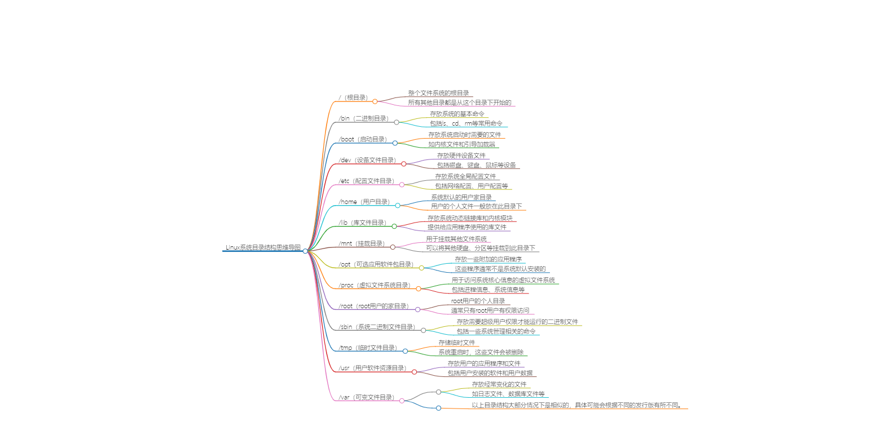

# Linux系统介绍

## Linux目录介绍

Linux系统的目录结构是一种树状结构，以下是一些主要的目录及其用途：

1. `/`：这是整个文件系统的根目录。所有其他目录都是从这个目录下开始的。
2. `/bin`：二进制目录，存放系统的基本命令，如ls、cd、rm等。
3. `/boot`：启动目录，存放系统启动时需要的文件，如内核文件和引导加载器。
4. `/dev`：设备文件目录，存放硬件设备文件。
5. `/etc`：配置文件目录，存放系统全局配置文件。
6. `/home`：用户目录，系统默认的用户家目录，用户的个人文件一般放在此目录下。
7. `/lib`：库文件目录，存放系统动态链接库和内核模块。
8. `/mnt`：挂载目录，用于挂载其他文件系统。
9. `/opt`：可选的应用软件包目录，一些附加的应用程序会放在这里。
10. `/proc`：虚拟文件系统目录，用于系统核心，例如进程和系统信息。
11. `/root`：root用户的家目录。
12. `/sbin`：系统二进制文件目录，存放需要超级用户权限才能运行的二进制文件。
13. `/tmp`：临时文件目录，存储临时文件，系统重启时，这些文件会被删除。
14. `/usr`：用户软件资源目录，存放用户的应用程序和文件。
15. `/var`：可变文件目录，存放经常变化的文件，如日志文件。

以上目录结构大部分情况下是相似的，具体可能会根据不同的发行版有所不同。

## Linux重启&关机

在Linux下，你可以使用以下命令来重启或关机：

**重启：**

- `sudo reboot` 这个命令会立即重启系统。
- `sudo shutdown -r now` 这个命令也会立即重启系统，其中`-r`指的是reboot。
- `sudo init 6` 这个命令会立即重启系统，其中6是runlevel，代表重启。
- `sudo systemctl reboot` 这个命令也会立即重启系统，它是Systemd的命令。

**关机：**

- `sudo halt` 这个命令会关闭系统但不断电。
- `sudo poweroff` 这个命令会关闭系统并断电。
- `sudo shutdown -h now` 这个命令会立即关闭系统，其中`-h`指的是halt。
- `sudo init 0` 这个命令会立即关闭系统，其中0是runlevel，代表关机。
- `sudo systemctl poweroff` 这个命令也会立即关闭系统，它是Systemd的命令。

如果你想在特定的时间关机或重启，你可以将`now`替换为具体的时间，例如`sudo shutdown -h 20:00`会在今天20:00关机。

**init 介绍：**

从上面的命令我们可以看到init不仅可以重启，还可以关机，都是通过不同的数字编号来的，哪是否还有其他编号，代表不通的意思呢？

Linux系统的初始化级别（init level）有以下几种：

- **0级别**： 关机状态，此时系统完全关闭。
- **1级别**： 单用户模式，也叫救援模式或者单人维护模式，只有超级用户root可以登录，用于系统维护。
- **2级别**： 多用户模式，但是不含NFS服务，这个级别不常用。
- **3级别**： 完全的多用户文本模式，包括了网络服务，用户可以登陆并进行操作，但是没有图形界面。
- **4级别**： 保留级别，空闲状态，没有定义任务，根据系统或用户需要自定义。
- **5级别**： 图形模式，图形化的多用户模式，有图形界面，用户登录后进入图形界面。
- **6级别**： 重启模式，此时系统会进行重启。

可以使用 `init` 命令更改运行级别，例如 `init 0` 会把系统更改为关机状态，`init 6` 会重启系统。在/etc/inittab文件中可以设置系统的默认运行级别。不过，现在很多Linux系统（如Ubuntu和CentOS 7及以上版本）已经使用Systemd来代替System V init，因此运行级别的概念已经被“目标”（target）所替代。
