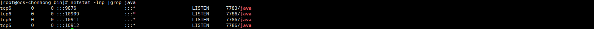

[toc]

# RocketMQ

RocketMQ 是一种高性能、高可靠性、分布式消息中间件系统，由阿里巴巴集团开发和维护。它提供了可靠的异步通信和消息驱动能力，使得分布式系统可以进行高效的解耦和扩展。

RocketMQ 可以被用于支持多种场景，包括但不限于以下几个方面：

1. 异步消息传递：RocketMQ 提供了高性能的消息传递机制，可以支持异步通信，实现消息的可靠传递，适用于企业级应用和互联网应用场景。
2. 顺序消息处理：RocketMQ 能够保证消息的有序性，在特定场景（如订单处理）中非常有用。
3. 分布式事务消息：RocketMQ 提供了分布式事务消息的支持，可以在分布式环境下保证消息的原子性，确保消息和业务数据的一致性。
4. 高可用性和容错性：RocketMQ 具备高可用性和容错性，可以支持多个节点的冗余备份，以及自动故障转移和负载均衡。
5. 流式处理：RocketMQ 可以作为流式处理的基础设施，支持实时数据传输和处理。

作为一款开源的消息中间件，RocketMQ 拥有丰富的社区资源和活跃的开发者社区，广泛应用于各个领域和规模的系统中。

## 1.部署

### 1.1 下载

```
https://rocketmq.apache.org/download/
#具体以现场选择版本为准
wget https://dist.apache.org/repos/dist/release/rocketmq/5.1.4/rocketmq-all-5.1.4-bin-release.zip
```

### 1.2 部署

#### 1.2.1 前置依赖

系统要求

1. 64位操作系统，推荐Linux/Unix/macOS

2. 64 位 JDK 1.8+

   ```
   yum -y install java-1.8.0-openjdk.x86_64 java-1.8.0-openjdk-devel
   #也可以手工安装oracle jdk
   #目前测试openjdk，是可以启动的，但是查看集群节点信息提示某个加密方式有问题，所以建议还是oracle jdk
   ```

#### 1.2.2 解压&启动
```
unzip rocketmq-all-5.1.4-bin-release.zip
cd rocketmq-all-5.1.4-bin-release/bin
sh play.sh
```

#### 1.2.3 检查启动结果
```
ps -ef |grep  -v grep |grep  "rocketmq\|namesrv\|mqbroker"
#正常情况下应该有6个进程
netstat -lnp|grep java
#如果在没其他java进程的情况下
```




## 2.基本概念

在RocketMQ中，有一些基本的概念需要了解：

1. Producer（生产者）：消息的发送方，负责将消息发送到Broker。
2. Consumer（消费者）：消息的接收方，负责从Broker订阅并消费消息。
3. Topic（主题）：消息的逻辑分类，类似于消息的主题或者标签。Producer将消息发送到指定的主题，Consumer从主题中订阅并消费消息。
4. Message（消息）：RocketMQ中的基本数据单元，包含了消息的内容和一些附加属性。
5. Broker（消息代理）：RocketMQ的核心组件之一，负责存储和转发消息。Broker接收Producer发送的消息，并将其持久化到磁盘，同时接收Consumer的订阅请求，将消息推送给Consumer。
6. NameServer（命名服务器）：RocketMQ的核心组件之一，负责管理Broker的元数据信息。Producer和Consumer通过与NameServer进行通信，获取Broker的地址和路由信息。
7. Message Queue（消息队列）：每个主题下可以有多个消息队列，用于并行存储和发送消息。Producer发送的消息会被划分到不同的队列中，Consumer根据自身的并行度从不同的队列订阅和消费消息。
8. Tag（标签）：消息的额外属性，可以用于更细粒度地对消息进行过滤和分类。
9. Group（消费组）：一组具有相同消费逻辑的Consumer的集合。同一个消费组中的Consumer共同消费一个主题下的消息，并且每条消息只会被消费组中的一个Consumer消费。

以上是RocketMQ的一些基本概念，了解这些概念将有助于您更好地理解和使用RocketMQ。

**当使用RocketMQ时，两个重要的组件是Broker和NameServer。这也是RocketMQ服务启动的2个进程，类似HDFS当中的DataNode和NameNode**

1. Broker（消息代理）：
   - Broker是RocketMQ的核心组件之一，负责接收、存储和转发消息。
   - 它包含一个或多个Topic，每个Topic可以有多个消息队列。
   - Broker接收Producer发送的消息，并将其持久化到磁盘，同时接收Consumer的订阅请求，将消息推送给Consumer。
   - Broker还负责处理消息的顺序、消息的拉取和推送等功能。
   - Broker可以配置为主备模式，以保证高可用性和容错性。
   - Broker集群由多个Broker实例组成，通过配置文件中的`brokerClusterName`和`brokerName`进行唯一标识和区分。
2. NameServer（命名服务器）：
   - NameServer是RocketMQ的核心组件之一，负责管理Broker的元数据信息。
   - 它充当了Broker的路由和发现中心。
   - Producer和Consumer通过与NameServer进行通信，获取Broker的地址和路由信息。
   - NameServer的主要功能是注册Broker、提供Broker的路由信息和负载均衡。
   - NameServer是一个轻量级的组件，可以部署多个实例以实现高可用性。
   - NameServer集群由多个NameServer实例组成，通过配置文件中的`namesrvAddr`进行唯一标识和区分。

Broker和NameServer是RocketMQ分布式消息系统的核心组件，它们协同工作以确保消息的可靠传输和高可用性。理解它们的工作原理和配置方式非常重要，以便正确配置和管理RocketMQ集群。

## 3.配置文件解释

当你启动RocketMQ时，你需要配置两个主要的文件：`broker.conf`和`namesrv.conf`。

1. `broker.conf`:
   - `brokerClusterName`: Broker集群的名称，用于标识一个Broker集群，可以自定义，需要保证唯一性。
   - `brokerName`: Broker的名称，用于标识一个具体的Broker实例，需要保证唯一性。
   - `brokerId`: Broker的唯一ID，需要保证在一个Broker集群中唯一。
   - `deleteWhen`: 消息存储文件的删除策略，可以按照时间和空间进行删除。
   - `fileReservedTime`: 消息存储文件的保留时间，超过此时间的文件将被删除。
   - `namesrvAddr`: NameServer的地址，用于Broker注册和与NameServer进行通信。
   - `listenPort`: Broker监听的端口号。
   - `flushDiskType`: 刷盘方式，可以选择异步刷盘或同步刷盘。
2. `namesrv.conf`:
   - `listenPort`: NameServer监听的端口号。
   - `kvConfigPath`: NameServer存储KV配置的文件路径。
   - `brokerExpiredTime`: Broker注册在NameServer上的过期时间，超过此时间未续约将被视为失效。
   - `brokerId`: 设置NameServer的唯一ID，需要保证在一个NameServer集群中唯一。
   - `defaultTopicQueueNums`: 默认的主题队列数量。
   - `autoCreateTopicEnable`: 是否允许自动创建主题。
   - `deleteWhen`: 消息存储文件的删除策略，可以按照时间和空间进行删除。
   - `fileReservedTime`: 消息存储文件的保留时间，超过此时间的文件将被删除。

以上是常用的一些配置项，你可以根据自己的需求进行定制化配置。在配置文件中，你还可以设置更多的参数，详情请参考RocketMQ官方文档

## 4.常用命令

以下是RocketMQ中常用的一些命令：

1. 启动NameServer：
   - `nohup sh mqnamesrv &` （Linux）
   - `start mqnamesrv` （Windows）
2. 启动Broker：
   - `nohup sh mqbroker -n <NameServer地址:端口> &` （Linux）
   - `start mqbroker -n <NameServer地址:端口>` （Windows）
3. 查看Broker状态：
   - `sh mqadmin brokerStatus -n <NameServer地址:端口>`
4. 创建Topic：
   - `sh mqadmin updateTopic -n <NameServer地址:端口> -c <Broker集群名称> -t <Topic名称>`
5. 查看Topic列表：
   - `sh mqadmin topicList -n <NameServer地址:端口>`
6. 查看Topic下的消息队列：
   - `sh mqadmin topicRoute -n <NameServer地址:端口> -t <Topic名称>`
7. 发送消息：
   - `sh mqadmin sendMessage -n <NameServer地址:端口> -t <Topic名称> -p <Producer组名> -k <消息键> -b <消息内容>`
8. 消费消息：
   - `sh mqadmin consumeMessage -n <NameServer地址:端口> -g <Consumer组名> -t <Topic名称>`
9. 查看消费者进度：
   - `sh mqadmin consumerProgress -n <NameServer地址:端口> -g <Consumer组名> -t <Topic名称>`
10. 查看消费者列表：
    - `sh mqadmin consumerList -n <NameServer地址:端口>`

这些命令是通过命令行工具`mqadmin`来执行的。在执行这些命令之前，请确保已经正确安装和配置了RocketMQ，并且已经启动了相应的NameServer和Broker。在命令中，需要替换`<NameServer地址:端口>`、`<Broker集群名称>`、`<Topic名称>`、`<Producer组名>`和`<Consumer组名>`等参数为实际的值。

## 最佳实践

这里

