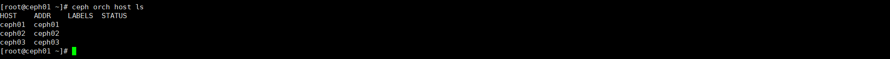
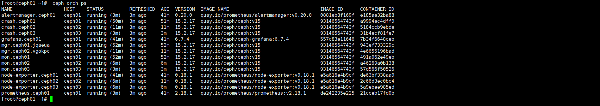
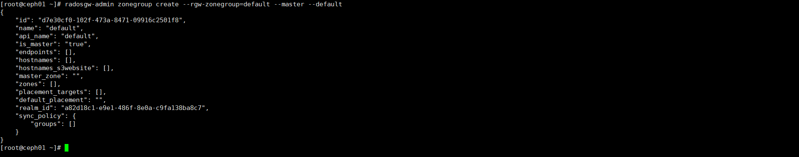

[toc]

# Ceph安装

本来用yum已经安装过一次，但是由于安装的M版本（发行时间是2018年）由于接入registry问题，所以使用cephadm部署一套最新版本（O版本）的ceph。 由于防火墙，和selinux在制作镜像的时候已经关闭，这里就不写到部署文档里面了。如果自己的环境未关闭，请关闭 **未完善**

另外由于本ceph是打算用于docker/k8s的镜像仓库的后端使用，所以会涉及到配置rgw的一些操作。

## 1.集群规划

| IP地址        | 配置                  | 角色                                                 |
| ------------- | --------------------- | ---------------------------------------------------- |
| 192.168.0.163 | 4C8G+100G*3 centos7.9 | cephadm，ceph-mon，ceph-mgr，ceph-osd，ceph-mds，rgw |
| 192.168.0.117 | 4C8G+100G*3 centos7.9 | ceph-mon，ceph-mgr，ceph-osd，ceph-mds，rgw          |
| 192.168.0.215 | 4C8G+100G*3 centos7.9 | ceph-mon，ceph-mgr，ceph-osd，ceph-mds，rgw          |

本镜像是基于centos7.6安装的，然后执行`yum update` 升级到的7.9。

## 2.准备工作

### 2.1 安装docker

#### 2.1.1 安装docker依赖

```
yum install -y yum-utils device-mapper-persistent-data lvm2
```

#### 2.1.2 准备docker的repo

```
yum-config-manager --add-repo https://download.docker.com/linux/centos/docker-ce.repo
```

#### 2.1.3 安装docker

```
#这里选择的版本是o版发布前的最后一个大版本
yum install -y docker-ce-19.03.15 docker-ce-cli-19.03.15 containerd.io
```

#### 2.1.4 启动docker

```
systemctl start docker
systemctl enable docker
```

### 2.2 安装python3

```
#
yum -y install epel-release
yum -y install python3 yum-utils
```

### 2.4 安装时间同步

```
#也可以使用chrony，看个人习惯，如果已经自带可忽略本步骤，ceph对时间非常敏感，所以要特别注意。
yum -y install ntp
systemctl start ntpd
systemctl enable ntpd
```

### 2.5 配置主机名

```
#hosts需要每个节点执行
echo "192.168.0.163 ceph01" >> /etc/hosts
echo "192.168.0.117 ceph02" >> /etc/hosts
echo "192.168.0.215 ceph03" >> /etc/hosts
#主机名每个节点执行对应的命令即可
hostnamectl set-hostname ceph01
hostnamectl set-hostname ceph02
hostnamectl set-hostname ceph03
```

### 2.6 配置免密

```
#生成密钥，持续回车,以ceph01为基础，设置免密所以该操作都在ceph节点操作
ssh-keygen
#分发密钥
ssh-copy-id ceph01
ssh-copy-id ceph02
ssh-copy-id ceph03
```

### 2.7 重启

```
reboot
```


## 3.部署

### 3.1 准备cephadm

```
#其实就是把这个添加ceph的源，然后把python放到PATH里面,最后安装一些ceph的命令，因为这个部署出来的集群都是容器，外面没有ceph命令，无法直接操作集群。
curl --silent --remote-name --location https://github.com/ceph/ceph/raw/octopus/src/cephadm/cephadm
chmod +x cephadm
./cephadm add-repo --release octopus
./cephadm install
#这个时候加入PATH,所以不用路径，可以直接执行。
cephadm install ceph-common
```

### 3.2 引导集群

```
#这里就是我们定义的本机ip
cephadm bootstrap --mon-ip 192.168.0.163
```


引导完成，这里可以看到已经有了dashboard地址账号密码，可以登录查看，当然这个时候集群是没搭建好的。


cpeh容器已经拉起来了，过一会还会拉起监控告警的容器


```
ceph-mgr ceph管理程序
ceph-monitor ceph监视器
ceph-crash 崩溃数据收集模块
prometheus prometheus监控组件
grafana 监控数据展示dashboard
alertmanager prometheus告警组件
node_exporter prometheus节点数据收集组件
#这里的容器都是主机网络模式，所以这里看不到网络映射。
```

容器正常启动可以查看集群状态，当然这会是没内容的。


#### 3.4 浏览器登陆

浏览器能打开，就是由于这里的容器已经拉起来mgr和mon。

如果需要可以登录，但是这个时候其实啥都没有，第一次登录会要求修改密码，登录以后大概就是这样的。


### 3.5 添加主机

#### 3.5.1 添加主机

```
ceph orch host add ceph02
ceph orch host add ceph03
```


这里有一个坑，前面我们已经做了免密，但是这个部署程序，要依赖另外的免密，需要在在做一次

```
ceph cephadm get-pub-key > ~/ceph.pub
ssh-copy-id -f -i ~/ceph.pub root@ceph02
ceph cephadm get-pub-key > ~/ceph.pub
ssh-copy-id -f -i ~/ceph.pub root@ceph03
```


#### 3.5.2 查看主机状态

这个阶段可能需要等待比较长的时间。

```
#查看集群状态，确保所有节点的都正常运行，3个节点的docker也都正常启动
#总共应该有3个crash，3个mon，2个mgr
#其他辅助容器，node-exporter每个节点都有，prometheus，alertmanager，grafana只在ceph01节点有。
#查看当前节点
ceph orch host ls
#查看集群是否扩展完成
ceph orch ps 
#查看集群ceph状态
ceph -s
```






### 3.6 添加osd节点

#### 3.6.1 添加osd

```
#根据自己的磁盘盘符和数量添加
#添加ceph01 3块盘
ceph orch daemon add osd ceph01:/dev/vdb
ceph orch daemon add osd ceph01:/dev/vdc
ceph orch daemon add osd ceph01:/dev/vdd
#添加ceph02 3块盘
ceph orch daemon add osd ceph02:/dev/vdb
ceph orch daemon add osd ceph02:/dev/vdc
ceph orch daemon add osd ceph02:/dev/vdd
#添加ceph03 3块盘
ceph orch daemon add osd ceph03:/dev/vdb
ceph orch daemon add osd ceph03:/dev/vdc
ceph orch daemon add osd ceph03:/dev/vdd
```


#### 3.6.2 检查集群状态

```
ceph -s
ceph orch ps
```


到这里cpeh集群就算部署完成了，后期就是涉及到使用了，比如部署RGW给作为对象存储使用，不熟CephFs作为文件系统（可以理解我们的NFS服务器使用）已经作为虚拟机的磁盘的块存储使用。

## 4.应用

### 4.1 对象存储

#### 4.1.1 创建领域

````
#创建一个名为 "rgw01" 的 Ceph RGW (RADOS Gateway) realm，并将其设置为默认的 realm。
radosgw-admin realm create --rgw-realm=rgw01 --default 
````


#### 4.1.2 创建区域

```
创建一个名为 "default" 的 Ceph RGW (RADOS Gateway) zonegroup，并将其设置为主 zonegroup 和默认 zonegroup。
radosgw-admin zonegroup create --rgw-zonegroup=default --master --default
```



#### 4.1.3 创建区域

```
#在名为 "default" 的 Ceph RGW (RADOS Gateway) zonegroup 中创建一个名为 "us-west-1" 的 zone，并将其设置为主 zone 和默认 zone。,取这个名字是为了Registry的Region字段识别用。
radosgw-admin zone create --rgw-zone group=default --rgw-zone=us-west-1 --master --default
```


#### 4.1.4 部署RGW

```
#使用 Ceph Orchestrator 在名为 "us-west-1" 的 RGW (RADOS Gateway) zone 中创建一个名为 "rgw01" 的 RGW 实例，并将其部署在 "ceph01"、"ceph02" 和 "ceph03" 这三个主机上。
ceph orch apply rgw rgw01 us-west-1 --placement="3 ceph01 ceph02 ceph03"
```


#### 4.1.5 检查RGW状态

```
ceph -s
ceph orch ps
#其实就是查看集群状态和容器是否正常
#通过这个命令，我们可以看到系统默认创建了部分自用pool池出来，这些pool可以等效于es的自带索引，用于存储自己的数据。
ceph osd pool ls
```


```
device_health_metrics：这个池用于存储 Ceph 存储设备的健康度指标信息。
.rgw.root：这个池是 RGW (RADOS Gateway) 的根池，存储了 RGW 的元数据和索引信息。
us-west-1.rgw.log：这个池用于存储 RGW 的日志信息。
us-west-1.rgw.control：这个池用于存储 RGW 的控制信息。
us-west-1.rgw.meta：这个池用于存储 RGW 的元数据。
```

#### 4.1.6 rgw应用-给Registry做后端存储

##### 4.1.6.1 创建用户

```
# RGW 用户的命令。通过这个命令，您将创建一个名为 "dockerimages"，显示名称为 "docker images" 的 RGW 用户。
radosgw-admin user create --uid=dockerimages --display-name="docker images"
```


##### 4.1.6.2 配置权限

```
#为用户 "dockerimages" 授予所有操作的权限。只测试功能，所以给的比较大。
#请注意，这是一个非常强大的权限，授予用户对 RGW 中所有存储桶和对象的完全控制
radosgw-admin caps add --uid=dockerimages --caps="buckets=*"
#稍微小一点的权限
radosgw-admin caps add --uid=dockerimages --caps="buckets=write"

```


##### 4.1.6.3 创建pool

```
ceph osd pool create us-west-1 32 32 replicated
```


##### 4.1.6.4 上传测试数据

```
#安装s3cmd
yum -y install s3cmd
#准备配置文件
vi /root/.s3cfg

[default]
access_key = xxxx
host_base = 192.168.0.163:80
host_bucket = 192.168.0.163:80
secret_key = xxxxxxx
use_https = False
website_endpoint = 192.168.0.163:80

#创建桶
s3cmd mb  s3://test123

#上传数据
s3cmd put cephadm  s3://test123

#列表数据
s3cmd ls  s3://test123
```


##### 4.1.6.5 应用到Registry

目前这个还是有问题，原因暂时未知,参考

[]: Kubernetes/IRegistry.md	"Registry仓库使用后端对象存储"


