# Ceph安装

[toc]

## 1.环境准备

本环境才用公有云安装，所以暂时不考虑入口的高可用问题，计划了4台机器，其中1台机器作为网关，3台机器作为存储后端。

存储3块盘，其中一个磁盘当成日志盘，另外2块当成数据盘。

日志盘是属于历史版本的功能，新版本已经不涉及日志盘了，当前2023年通过yum部署的版本是M,发布于2018年，最新版本是O版，发布于2020年。Ceph是按照英文字母排序来发布版本的。

部署顺序是先部署Ceph集群，以192.168.0.55为部署机

| IP地址        | 配置               | 角色     |
| ------------- | ------------------ | -------- |
| 192.168.0.235 | 4C8G+100G+单网卡   | rgw      |
| 192.168.0.55  | 4C8G+100G*3+单网卡 | osd，mon |
| 192.168.0.165 | 4C8G+100G*3+单网卡 | osd，mon |
| 192.168.0.154 | 4C8G+100G*3+单网卡 | osd，mon |

## 2.初始化

### 2.1 更新yum源

```
vi  /etc/yum.repos.d/ceph.repo 

[Ceph]
name=Ceph packages for $basearch
baseurl=http://download.ceph.com/rpm-mimic/el7/$basearch
enabled=1
gpgcheck=1
type=rpm-md
gpgkey=https://download.ceph.com/keys/release.asc
priority=1
[Ceph-noarch]
name=Ceph noarch packages
baseurl=http://download.ceph.com/rpm-mimic/el7/noarch
enabled=1
gpgcheck=1
type=rpm-md
gpgkey=https://download.ceph.com/keys/release.asc
priority=1
[ceph-source]
name=Ceph source packages
baseurl=http://download.ceph.com/rpm-mimic/el7/SRPMS
enabled=1
gpgcheck=1
type=rpm-md
gpgkey=https://download.ceph.com/keys/release.asc
priority=1
```

### 2.2 设置主机名

```
#设置3台主机的主机名
hostnamectl set-hostname ceph1
hostnamectl set-hostname ceph2
hostnamectl set-hostname ceph3
#设置3台主机的hosts
echo "192.168.0.55 ceph1" >> /etc/hosts
echo "192.168.0.165 ceph2" >> /etc/hosts
echo "192.168.0.154 ceph3" >> /etc/hosts
```


### 2.3 关闭selinux

```
setenforce 0
sed -i 's/SELINUX=.*/SELINUX=disabled/' /etc/selinux/config
```

### 2.4 关闭防火墙

```
systemctl stop firewalld.service
systemctl disable firewalld.service
```

### 2.5 配置免密

#### 2.5.1 创建一个普通用户

 ```
 useradd -d /home/ceph_user -m ceph_user 
 passwd ceph_user
 ```

#### 2.5.2 配置sudo

```
echo "ceph_user ALL = (root) NOPASSWD:ALL" | tee /etc/sudoers.d/ceph_user 
chmod 0440 /etc/sudoers.d/ceph_user
```

#### 2.5.3 以普通用户配置免密

##### 2.5.3.1 生成密钥

```
#此操作在第一台集群上执行即可
#切换用户
su ceph_user
#生成密钥，持续回车
ssh-keygen
```

##### 2.5.3.2 分发密钥

```
ssh-copy-id ceph_user@ceph1
ssh-copy-id ceph_user@ceph2
ssh-copy-id ceph_user@ceph3
```


### 2.6 设置ntp同步

**作者有话说：ceph对时间很敏感，如果时间节点之前时间不一致，则会出现集群异常，所以必须确保ceph内部时间准确，具体以现场为环境为准。**

```
yum -y install ntp
systemctl start ntpd
systemctl enable ntpd
#在centos通公网的情况下，直接启动就是可以的
```

#### 2.7 重启服务器

```
reboot
```

## 3.部署ceph

### 3.1 安装基本软件

**作者有话说：选择版本的时候也尽量选择比较新的版本，尽量减少环境依赖带来的部署问题**

```
yum clean all && yum makecache
#centos7.6 由于底层系统软件版本太低，所以这里升级到了7.9
yum update -y
yum install epel-release -y
#安装基本软件
yum -y install ceph ceph-deploy
```

### 3.2 创建集群

```
su ceph_user
mkdir ceph-cluster 
cd ceph-cluster
ceph-deploy new ceph1 ceph2 ceph3
```

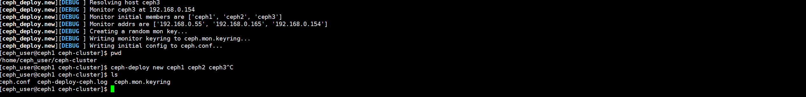

```
#如果安装出现错误，可以通过该命令清理重来
ceph-deploy purge ceph1 ceph2 ceph3
ceph-deploy purgedata ceph1 ceph2 ceph3
ceph-deploy forgetkeys
```

### 3.3 编辑配置文件

```
vi ceph.conf 添加下面的内容

# 公网网络 
public network = 192.168.0.0/24 
# 容忍更多的时钟误差
mon clock drift allowed = 2 
mon clock drift warn backoff = 30 
# 允许删除pool 
mon_allow_pool_delete = true
[mgr]
# 开启WEB仪表盘 mgr modules = dashboard
```

### 3.4 安装集群

```
ceph-deploy install ceph1 ceph2 ceph3
```

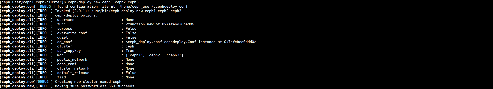

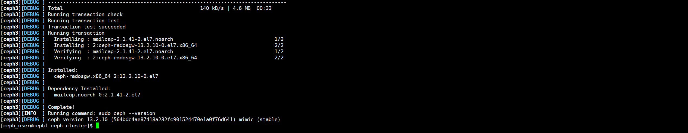

### 3.5 初始monitor信息

```
ceph-deploy --overwrite-conf mon create-initial
```

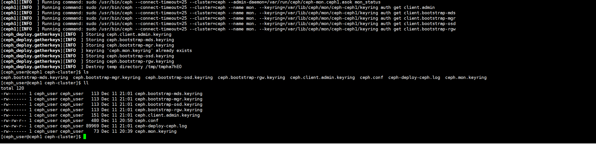

### 3.6 同步管理信息

```
ceph-deploy admin ceph1 ceph2 ceph3
```

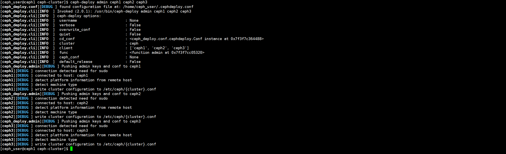

### 3.7 安装mgr

```
ceph-deploy mgr create ceph1 ceph2 ceph3
```

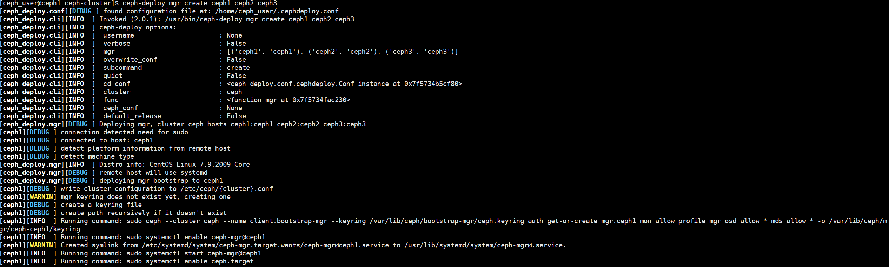

### 3.8 安装osd

```
#按照规划，每个节点2个osd，不过这里好像没用到日志盘
ceph-deploy osd create --data /dev/vdc ceph1
ceph-deploy osd create --data /dev/vdd ceph1
ceph-deploy osd create --data /dev/vdc ceph2
ceph-deploy osd create --data /dev/vdd ceph2
ceph-deploy osd create --data /dev/vdc ceph3
ceph-deploy osd create --data /dev/vdd ceph3
```

### 3.9 生成证书文件

```
切换到root账号下操作
#每生成一次，需要删除当前目录下的*.keyring文件
ceph-deploy gatherkeys ceph1
ceph-deploy gatherkeys ceph2
ceph-deploy gatherkeys ceph3
```

### 3.10 ceph集群检查

```
ceph -s
ceph osd tree
```

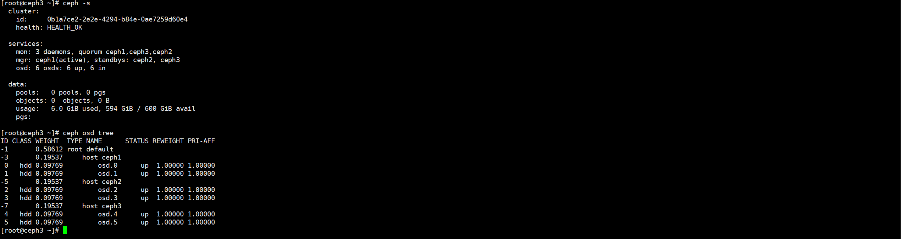

到这里，整个集群就算安装完成，但是目前这个时候还无法提供服务，而且ceph可提供的服务包括块存储，对象存储，文件存储，也没有配置。

## 4.部署dashboard

### 4.1 开启dashboard模块

```
ceph mgr module enable dashboard
```

### 4.2 生成签名

```bash
ceph dashboard create-self-signed-cert
```

### 4.3 创建目录

```
mkdir mgr-dashboard
cd mgr-dashboard
```

### 4.4 生成密钥对

```
openssl req -new -nodes -x509 -subj "/O=IT/CN=ceph-mgr-dashboard" -days 3650 -keyout dashboard.key -out dashboard.crt -extensions v3_ca
```

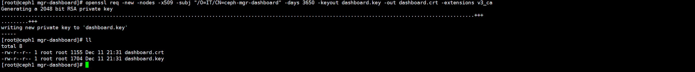

### 4.5 启动dashboard

```
ceph mgr module enable dashboard
```

```
ceph config set mgr mgr/dashboard/server_addr 192.168.0.55
ceph config set mgr mgr/dashboard/server_port 18843
```

### 4.6 设置管理员

```
ceph dashboard set-login-credentials admin admin
```

### 4.7 访问

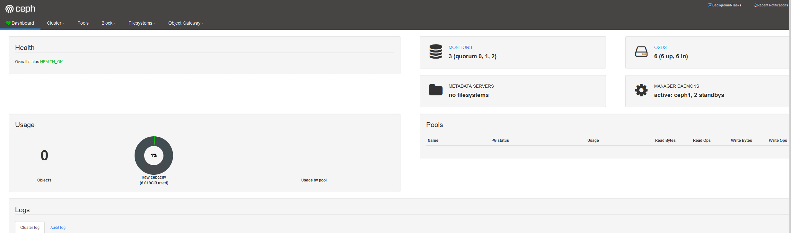

## 5. 配置rgw网关

### 5.1 部署rgw网关

原本计划是一台单独的网关，目前配置失败，所以沿用第一台部署机器作为部署的rgw网关的机器，第一台rgw网关集群做为nginx入口。

有些操作会失败，所有这里记录的部分步骤可能是无用的，仅供参考。

```
#添加配置文件 vi ceph.conf 末尾

[client.radosgw.gateway]
keyring = /etc/ceph/ceph.bootstrap-rgw.keyring
rgw dns name = 114.114.114.114
#执行安装
ceph-deploy  --overwrite-conf rgw create ceph1
```

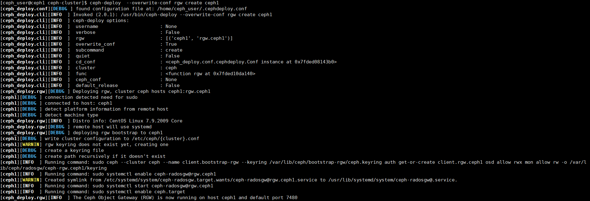

### 5.2启动rgw网关

```
systemctl start ceph-radosgw@rgw.ceph1
```

### 5.3 创建存储池

```
ceph osd pool create default.rgw.buckets.data 6 3
#后面6和3是pg数量和pgp数量，一般p数量是osd2倍，pgp是pg的一半
```

### 5.4 创建账号

对象存储涉及到桶，桶和账号有关系

```
radosgw-admin user create --uid=myuser --display-name="My User"
```

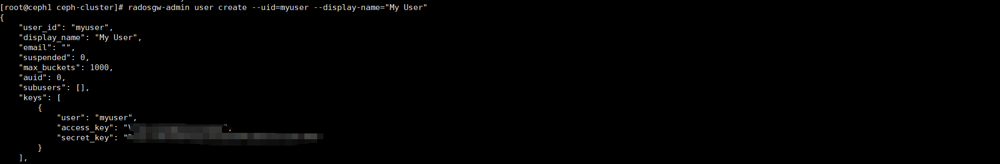

### 5.5 为桶添加权限

```
radosgw-admin caps add --uid=myuser --caps="buckets=*"
```

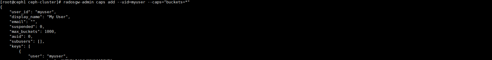

### 5.6 创建桶

由于没找到rgw接口创建桶，所以安装s3cmd来创建

```
#安装s3cmd
yum -y install s3cmd
#配置s3cmd,根据提示输入下面的内容，最后成功以后会生存文件/root/.s3cfg
s3cmd --configure
```

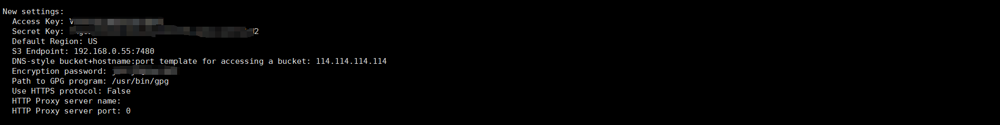

```
#创建一个桶，来作为docker仓库的后端存储
s3cmd mb s3://<bucket_name>
```

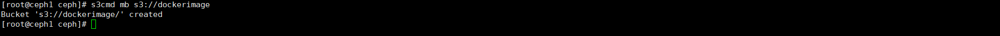

### 5.7 测试上传文件

```
 s3cmd put abcd s3://dockerimage/test/
 s3cmd lss3://dockerimage/test/
```

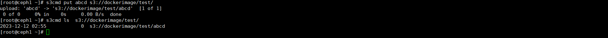
