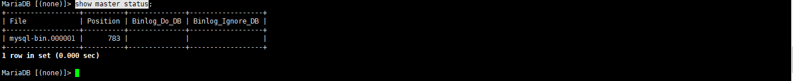

# 主从配置

无论是Mysql 还是 Mariadb 在配置主从上都是一样的，所以这里我们以Mariadb为作为实际操作范例

## 准备工作

需要准备2台安装完成的数据库机器

## 配置

### Master

```
#编辑配置文件，在mysqld下面新增下面的内容
vi /etc/my.cnf.d/mariadb-server.cnf

[mysqld]
server-id=1                                                #定义数据库的id，全局唯一,只要加入主从都需要配置
log_bin=mysql-bin                                          #启用binglog日志

#重启数据库
systemctl restart mariadb 
```

```
#配置主从账号

grant  replication slave  on  *.* to 'replica'@'192.168.0.0/24'   identified  by  'passwd';
flush privileges;
```

```
#查询master节点信息，从启动需要
show master status
```



### Slave

```
#编辑配置文件，在mysqld下面新增下面的内容
vi /etc/my.cnf.d/mariadb-server.cnf

[mysqld]
server-id=2                                                #定义数据库的id，全局唯一,只要加入主从都需要配置
log_bin=mysql-bin                                          #启用binglog日志

#重启数据库
systemctl restart mariadb 
```

```
#链接到master，这里会用到master的ip，刚才配置的主从账号密码，及主节点的binglog信息
change master to master_host='192.168.0.161',master_user='replica',master_password='passwd',master_log_file='master-bin.000001',master_log_pos=783;
```

```
#启动主从
start slave;
```

 ```
 #检查主从状态
 show slave status\G;
 
 #以下2个进程都需要是：Yes 才是正常的。
 Slave_IO_Running: Yes
 Slave_SQL_Running: Yes
 ```


