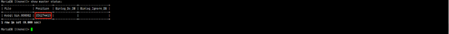
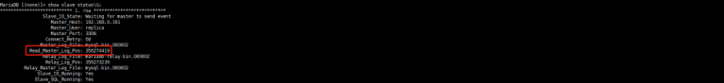
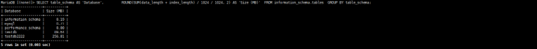
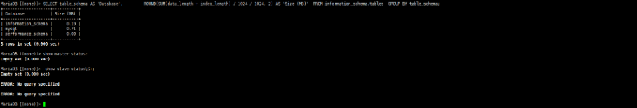
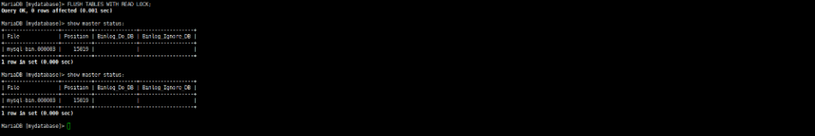
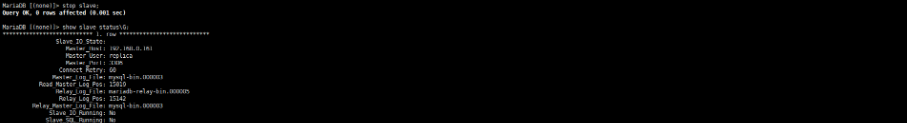
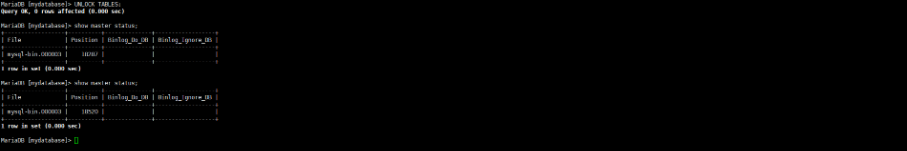
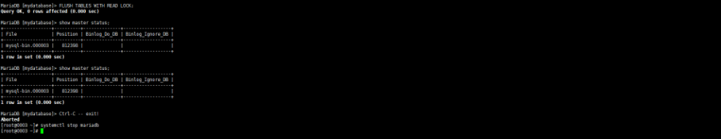
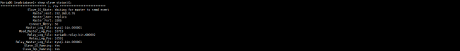

[toc]

# 主从迁移

## 背景

​	客户是使用2台虚拟机搭建的主从环境，应用通过vip链接，vip的后端是主，如果异常，无法修复主则把从切换为主，然后修改vip的后端rs。客户的需求是先进行地域切换，然后再迁移到PAAS的数据库上面，所以必须先做数据的虚拟机迁移。而且数据比较大，无法直接使用mysqldump操作备份还原，只能以主从方式完成切换。

​	迁移计划：

​              1.     找一个业务低峰时间，锁主库表，记录当前主从状态

​              2.     停slave

​              3.     取消主库锁表

​              4.     mysqldump备份从库数据（这个地方应该也可以直接复制文件，如果mysqldump在也很难完成备份的情况下）

​              5.     备份完成以后启动slave

​              6.     把备份还原到另外2个mysql实例里面

​              7.     这2个mysql实例加入主从集群，组成一主三从集群


​	     这个时候已经做了准备工作，等待业务配合切换。


​              8.     停master主从检查主从状态

​              9.     把后面加入的2个从节点其中一个停止slave，并配置主节点

​             10.     另外一个从节点也停止slave，并加入新的主节点，在启动主从服务

## 准备测试环境

​	实际环境虽然都是内网，但是真实环境可能会走公网，请注意区分。

| 服务ip地址    | 切换前   | 正常运行中 | 切换后   |
| ------------- | -------- | ---------- | -------- |
| 192.168.0.161 | 源master | 源master   | 空       |
| 192.168.0.186 | 源slave  | 源slave    | 空       |
| 192.168.0.76  | 空       | 源slave    | 新master |
| 192.168.0.129 | 空       | 源slave    | 新slave  |

### 原始集群

​	主+从的架构，导入一定量的数据。并且还使用一个脚本持续向主库写入数据，用于模拟正常的生产环境。并需要确保主从状态的一致性。

```
#查询主节点信息
show master status;
#查询从节点信息
show slave status\G;
#查询当前所有库的大小
SELECT table_schema AS 'Database',         ROUND(SUM(data_length + index_length) / 1024 / 1024, 2) AS 'Size (MB)'  FROM information_schema.tables  GROUP BY table_schema;
```







### 目标集群

​	规划主+从的架构，目前还是单机状态，无数据，需要确保数据库版本配置和源库保持一致。



## 迁移方案

### 锁表

​	登录mysql主库，锁表，记录当前主从状态。

```
#锁表。
FLUSH TABLES WITH READ LOCK;

#记录当前主从状态。
SHOW MASTER STATUS;
```



### 停Slave

```
#登录mysql从库，先检查主从状态，状态正常才停止slave进程。
STOP SLAVE;
```



### 取消锁表

```
#登录mysql主库，取消锁表。
UNLOCK TABLES;
```



### 备份从库

```
#使用mysqldump 备份从数据。
mysqldump -u your_username -p your_password --all-databases > backup.sql
```

### 恢复从库

```
#登录mysql从库，恢复slave进程,注意检查注从状态是否恢复正常。
#如果恢复正常，则还原了原来的主从状态。

START SLAVE;
```

### 还原数据

​	**一定要先还原数据，在开启主从。**

```
#到2台新mysql还原数据，这里需要注意，由于备份是所有数据库，包括了系统库，还原以后源库的账号密码也会覆盖目标库（重启服务才生效）
mysql -u your_username -p your_password < ./backup.sql
```

### 新mysql加入主从集群

```
#2台机器开启binglog，注意id不要冲突，重启mariadb
#2台机器分别加入集群组成1组3从，这里注意填写主节点的锁表以后记录的主从状态。
change master to master_host='192.168.0.161',master_user='replica',master_password='passwd',master_log_file='mysql-bin.000003',master_log_pos=15019;
flush privileges;
#启动slave，并且确保主从状态正常。
START SLAVE;
```

### 业务切换准备完毕，这个是就需要进行主从切换。

### 停止源主节点

```
#锁表，停业务，记录主从状态，确保所有从节点主从同步完成，停mariadb服务。
```



### 停slave

```
#2台目标slave停止slave，把76作为新的master，避免有业务写入数据。
#76操作创建主从账号
grant  replication slave  on  *.* to 'replica'@'192.168.0.%'   identified  by  'passwd';
flush privileges;


#76检查主从集群状态
show master status;

```

### 目标slave加入目标master

```
#129作为从节点加入76的主节点，注意替换76的主从状态信息。
#启动以后注意检查状态。
change master to master_host='192.168.0.76',master_user='replica',master_password='passwd',master_log_file='mysql-bin.000001',master_log_pos=677;

start slave;
show slave status\G;

```



## 总结

​	这样我们就完成了原主从到目标主从的迁移，源主服务已经停止，原从服务我们这里没操作，实际上他也是主从同步是不可用状态。其中有几个注意事项：

​               1.     目标集群开始需要单机，不需要建立主从。

​              2.     目标集群需要先导入数据，后启动binglog。

​              3.     4台节点的的server-id千万不要冲突。

​              4.     注意不要有脏数据写入从节点，尤其是新master节点。

​              5.     实际的ip地址，密码，账号请根据实际情况替换。

​              6.     binglog的记录的名字，地址，记录点也请根据实际情况替换。
