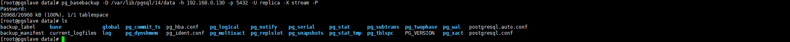
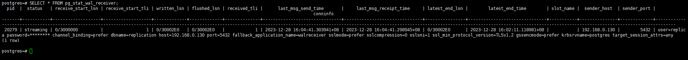

[toc]

# PG 主从

## 机器准备

| IP地址        | 系统               | 角色   |
| ------------- | ------------------ | ------ |
| 192.168.0.130 | centos 7.9  + pg14 | Master |
| 192.168.0.160 | centos 7.9  + pg14 | Slave  |

## 环境初始化

```
#1.关闭防火墙
#2.关闭selinux
#3.时间同步
#4.修改主机名，如果有要求
命令就不具体写了，如果是自己可以控制机器，这些可以做到模板里面。
```

## 安装PG

```
#1.配置yum源
yum install -y https://download.postgresql.org/pub/repos/yum/reporpms/EL-7-x86_64/pgdg-redhat-repo-latest.noarch.rpm

#2.安装pg
yum install -y postgresql14-server

#3.数据库初始化，从库不用初始化
/usr/pgsql-14/bin/postgresql-14-setup initdb
```


## 配置主从

### Master 配置

```
#创建pg备份账号，需要先用psql进入控制台。
CREATE ROLE replica  login replication encrypted password 'replica';
#创建了一个角色：replica 并设置了登录和复制权限，密码是：replica

#编辑配置文件
vi /var/lib/pgsql/14/data/postgresql.conf

listen_addresses = '*'   #默认是localhost，改成监听本机所有网卡，然后把注释取消。
wal_level = replica      #默认就是这个配置，删除注释即可

#编辑配置文件，添加这样一行
vi /var/lib/pgsql/14/data/pg_hba.conf

host    replication       replica        192.168.0.160/32        md5      #配置上面定义的用户名

#启动pg
systemctl enable postgresql-14
systemctl start postgresql-14  
```


### Slave 配置

```
#初次备份，不需要初始化，如果已经初始化可先删除数据目录，再停止服务在来一次
pg_basebackup -D /var/lib/pgsql/14/data -h 10.0.0.2 -p 5432 -U replica -X stream -P
#-X stream：指定备份方法为流复制方式。这意味着备份将使用流复制协议从主节点复制数据。其他都比较好理解
```



```
#修改配置文件，注意替换成自己的ip账号和密码。
vi /var/lib/pgsql/14/data/postgresql.conf
primary_conninfo = 'host=192.168.0.130 port=5432 user=replica password=replica'
recovery_target_timeline = 'latest'
```

```
#新增配置文件
vi /var/lib/pgsql/14/data/standby.signal
standby_mode = on
```

```
#启动pg
systemctl enable postgresql-14
systemctl start postgresql-14  
```


## 主从检查

```
#Master执行
select application_name, state, sync_priority, sync_state from pg_stat_replication;
select pid,state,client_addr,sync_priority,sync_state from pg_stat_replication;
```


```
#Slave执行
SELECT * FROM pg_stat_wal_receiver;
```


