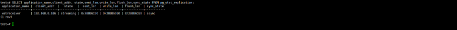
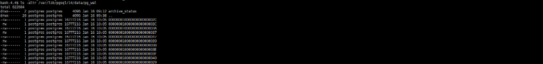

[toc]

# 主从迁移

## 1.背景

​	把一套数据量很大的pg集群在不影响业务的情况下迁移到另外一套集群，要求是不能操作主库，可以操作从库。

​	测试计划

​            1.     备份从库

​            2.     配置主库

​            3.     恢复从库

​            4.     建立一主三从的pg集群


业务正常运行，等待切换。


​            5.     停止源主库

​            6.     把新加入的从库停止从库，配置主从账号

​            7.     把新加入的从库停止从库，加入另外一个主库

## 2.测试环境

​	实际环境虽然都是内网，但是实际可能会走公网，因为他们是跨账号跨地域的。但是测试环境全部是使用内网，请注意区分。

| 服务ip地址    | 切换前   | 正常运行中 | 切换后   |
| ------------- | -------- | ---------- | -------- |
| 192.168.0.161 | 源master | 源master   | 空       |
| 192.168.0.186 | 源slave  | 源slave    | 空       |
| 192.168.0.76  | 空       | 源slave    | 新master |
| 192.168.0.129 | 空       | 源slave    | 新slave  |

### 2.1 原始集群

​	主+从的架构，导入一定量的数据。并且还使用一个脚本持续向主库写入数据，用于模拟正常的生产环境。并需要确保主从状态的一致性。

```
#主节点查看主从状态，多次测试下面的lsn持续变化代表有数据写入。
SELECT application_name,client_addr, state,sent_lsn,write_lsn,flush_lsn,sync_state FROM pg_stat_replication;
```



### 2.2 目标集群

​	只要完成了pg的安装及可，不需要初始化，甚至都不用启动。

## 3.迁移方案

​	迁移之前需要先确定当前wal日志的位置，确保导入备份到从节点的时候，还能从wal回放出来备份到导入这个时间当中数据。

​	比如备份的完成时间是15点，而我们导入备份的时间是20点，我们必须确保主节点的wal日志必须早于15点之前的，这样才能确保我们导入数据以后，还能回放出来中间这段时间的数据，确保主从的数据是完全一致的。

​	如果使用流式备份，则备份完成的时候，就是数据备份的时间点。流式备份，也不需要还原步骤，可直接启动。时间误差会进一步缩小到可以忽略不计。

```
#查询当前节点的wal最早时间，并确认对应的文件是存在的。
select * from pg_ls_waldir() order by modification asc;

#具体目录以现场为准
ls -altr /var/lib/pgsql/14/data/pg_wal

```




### 3.1 备份从库

```
#在新加入的2个pg节点执行备份数据到本地注意替换现场ip（这里用的是从库的ip），端口，账号，密码和路径。
#个人理解这个操作就是把从节点的的数据目录复制过来。
pg_basebackup -D /var/lib/pgsql/14/data -h 192.168.0.186 -p 5432 -U replica -X stream -P
```

### 3.2 配置主库

```
#编辑配置文件，添加这样一行,参考原始数据进行添加，主要替换ip。（本次测试环境由于是都是内网，并且是放通是网段，所以这个操作并没有实际做）现场这个操作是无法深略的。
vi /var/lib/pgsql/14/data/pg_hba.conf

host replication  replica     192.168.0.79/32        md5  

#添加以后，重启pg，具体命令以现场为准
systemctl restart postgresql-14

```

### 3.3  从库加入主库

```
#检查配置文件，注意替换成实际的主库ip，账号和密码。（由于是备份，并且是都是同一个内网，这里应该是不做任何修改基于是可用的）。实际环境以现场为准。
vi /var/lib/pgsql/14/data/postgresql.conf
primary_conninfo = 'host=192.168.0.161 port=5432 user=replica password=replica'
recovery_target_timeline = 'latest'

vi /var/lib/pgsql/14/data/standby.signal
standby_mode = on
```

### 3.4 启动从库

```
systemctl start postgresql-14
```

### 3.5 检查主从状态

```
#在主库检查从库是否加入成功，是否跟上主库的数据。
SELECT application_name,client_addr, state,sent_lsn,write_lsn,flush_lsn,sync_state FROM pg_stat_replication;
```


​	这个是就是一主三从的集群架构，主从数据也是同步的。我们需要做的就是合适的时间，进行主从切换。

### 3.6 停止源主库

​	由于pg并没有类似mysql那种全局锁，所以无法直接数据库只读，所以只有在业务低谷的时候进行选择停止服务。

```
#检查主从状态，发现并没有写请求，一般而言这些lsn没有变化代表没有写入，可多次执行。
SELECT application_name,client_addr, state,sent_lsn,write_lsn,flush_lsn,sync_state FROM pg_stat_replication;

#然后停止服务
systemctl stop postgresql-14
```

### 3.7 目标从库变主库

```
#删除加入主库的配置文件，具体以现场配置为准，并且检查监听端口和日志配置。
vi /var/lib/pgsql/14/data/postgresql.conf

primary_conninfo = 'host=192.168.0.161 port=5432 user=replica password=replica'
recovery_target_timeline = 'latest'

rm -rf /var/lib/pgsql/14/data/standby.signal

#检查配置文件是否满足作为主节点的要求，可以参考源主节点配置
vi /var/lib/pgsql/14/data/pg_hba.conf
host    replication     replica         192.168.0.0/24          scram-sha-256

#检查是否存在主从账号，如果不存在需要创建,正常集群是有的。
select * from pg_user;

#创建主从账号
CREATE ROLE replica  login replication encrypted password 'replica';

#检查pg状态是否正常，预期返回是"f"
SELECT pg_is_in_recovery();

#检查日志格式,预期返回是replica	
cat /var/lib/pgsql/14/data/postgresql.conf|grep wal_level

#检查监听地址是否满足，语气返回是'*',或者本机ip地址。
cat /var/lib/pgsql/14/data/postgresql.conf|grep listen_addresses


#重启服务
systemctl restart postgresql-14.service

```

### 3.8 目标从库加入目标主库

```
#修改主节点的ip地址，以实际为准，参考源集群的从节点。
vi /var/lib/pgsql/14/data/postgresql.conf

primary_conninfo = 'host=192.168.0.79 port=5432 user=replica password=replica'
recovery_target_timeline = 'latest'

#重启服务
 systemctl restart postgresql-14

```

### 3.9 检查主从状态

```
SELECT application_name,client_addr, state,sent_lsn,write_lsn,flush_lsn,sync_state FROM pg_stat_replication;
```


## 4.总结

​            1.     由于pg使用postges账号启动，根据个人习惯不同，相关的命令会在root用户和pg用户来回切换，一定要注意目录权限问题。

​            2.     目标集群2台集群在加入主从的时候时候不要初始化，不要启动，如果原始集群定义修改了部分才参数，备份从库的时候注意修改这些参数。

​            3.     部分命令是sql命令需要在登录psql以后执行。