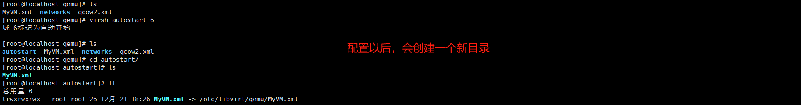

# 日常运维

## 常用命令

以下是一些常用的KVM命令：

1. 创建虚拟机：

```
virt-install --name <虚拟机名称> --ram <内存大小> --vcpus <虚拟CPU数量> --disk path=<磁盘路径>,size=<磁盘大小> --cdrom <ISO文件路径> --network network=default --graphics vnc --noautoconsole
```

2. 启动虚拟机：

```
virsh start <虚拟机名称>
```

3. 关闭虚拟机：

```
virsh shutdown <虚拟机名称>
```

4. 强制关闭虚拟机：

```
virsh destroy <虚拟机名称>
```

5. 重启虚拟机：

```
virsh reboot <虚拟机名称>
```

6. 列出所有虚拟机：

```
virsh list --all
```

7. 查看虚拟机的详细信息：

```
virsh dominfo <虚拟机名称>
```

8. 进入虚拟机的控制台：

```
virsh console <虚拟机名称>
```

9. 查看虚拟机的日志：

```
virsh domlog <虚拟机名称>
```

10. 删除虚拟机：

```
virsh undefine <虚拟机名称>
```
请注意，这将从libvirt中移除虚拟机定义，但不会删除关联的磁盘文件。如果您想同时删除关联的磁盘文件，请使用--remove-all-storage选项：

```
virsh undefine --remove-all-storage <虚拟机名称>
```
11. 基于启动xml文件启动虚拟机

```
virsh define <虚拟机配置文件路径>
```

这些命令只是KVM命令的一小部分，您可以根据您的具体需求进行进一步探索和学习。

实际上对于虚拟机的操作不管用名称，用前面的id也是可以的。

## 运维经验

- 系统崩溃，无法进入系统

方法1：找一个正常的机器，通过修改xml的方式，把这个磁盘挂在正常的机器上面进行处理

方法2：nbd，可以实现把虚拟机的磁盘当中一个磁盘挂在到宿主机的目录上


-  忘记密码/ssh异常，无法进入系统


通过vnc进入系统或者通过vnc进入单用户模式完成问题修复。


- 开机自启动

virsh autostart <虚拟机的名称>

配置文件以后



注:如果虚拟机数量多，或者超售多，可能会严重卡顿（全部都启动）

- vnc安全

vnc开启以后，如果你通过vnc进入了系统又没有退出，下一个人进来就可以直接操作服务器。所以在暴露vnc的时候需要确保安全，可以从下面3个方面来做。

1.非必要不开放vnc端口。

2.如果开放要配置密码。

3.通过vnc操作以后，要及时退出服务器。


- 善用克隆

可以创建一个你自己定义好的虚拟机模板，比如配置好了，ntp，yum，防火墙，selinux等一系列的配置，甚至可以预装你需要的软件或者服务，然后以后创建虚拟机都基于这个模板，使用克隆的方式。

```
#单磁盘
virt-clone --original <原始虚拟机名称> --name <新虚拟机名称> --file <新虚拟机磁盘路径>
#多磁盘
virt-clone --original <原始虚拟机名称> --name <新虚拟机名称> --file <新虚拟机磁盘1路径> --file <新虚拟机磁盘2路径> ...
```

注：这个克隆，会复制里面的ip信息，如果是静态ip，克隆以后还需要手工配置ip地址。


- 虚拟机迁移

虚拟机的迁移实际就是配置文件和磁盘文件，把这两项迁移过去以后使用`define`重新定义就可以了。当然这里只的都是属于冷迁移，在其他云的热迁要复杂得多，但是大概的逻辑就是

1.复制文件和文件（如果是云盘相对简单）在新的宿主机创建一个新的虚拟机

2.然后复制内存里面的热数据

3.暂停旧的，恢复新的，切换网络，删除旧的。

如果中间步骤超时或者失败就进行回滚。

