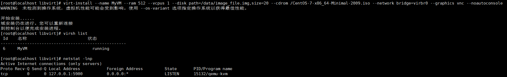

# 创建虚拟机

## 1.镜像

镜像文件（Image File）是一种用于存储操作系统、应用程序和数据的文件。在虚拟化环境中，镜像文件通常用于创建虚拟机的磁盘。在KVM虚拟化中，两种常见的镜像格式是img和qcow2。

1. IMG（raw）格式：
   - IMG是一种原始磁盘镜像格式，它是一种简单的二进制数据文件。它不提供任何压缩或快照功能，只是将虚拟机的磁盘数据直接写入到文件中。
   - IMG格式的镜像文件相对较简单，通常具有较好的性能。但是，它没有提供动态分配磁盘空间的功能，因此镜像文件的大小是固定的，即使虚拟机中只使用了部分磁盘空间，镜像文件的大小也不会改变。
2. QCOW2（QEMU Copy-On-Write 2）格式：
   - QCOW2是一种高级的磁盘镜像格式，它提供了更多的功能和灵活性。与IMG格式相比，QCOW2格式提供了动态分配磁盘空间、压缩、快照和增量备份等功能。
   - QCOW2格式的镜像文件可以根据实际使用情况动态分配磁盘空间，只使用实际需要的空间。这样可以减少空间占用，并方便进行快照和备份操作。
   - 另外，QCOW2格式还支持对磁盘镜像文件进行压缩，以减小文件大小，并提供更好的性能。

总的来说，IMG格式是一种较为简单的磁盘镜像格式，适用于简单的虚拟化场景。而QCOW2格式是一种高级的磁盘镜像格式，提供了更多的功能和灵活性，适用于更复杂的虚拟化需求。
``` 
#kvm支持多种文件格式，这2种比较常见，简单来说就是img创建多大，磁盘占用就会多大，性能较好，qcow2无论创建多大，使用了多少，占用多少。市面上的公有云/私有云基本都是qcow2格式。
qemu-img create -f raw /path/to/image_file.img 20G
qemu-img create -f qcow /path/to/image_file.qcow2 20G
```

## 2.创建

```
virt-install --name MyVM --ram 512 --vcpus 1 --disk path=/data/image_file.img,size=50 --cdrom /CentOS-7-x86_64-Minimal-2009.iso --network bridge=virbr0 --graphics vnc --noautoconsole
```

您提供的命令是使用virt-install创建一个名为"MyVM"的KVM虚拟机，具有以下配置：

内存（RAM）：512MB
虚拟CPU核心数：1
磁盘：使用路径/data/image_file.img创建一个大小为20GB的磁盘镜像文件
光驱：使用路径/CentOS-7-x86_64-Minimal-2009.iso作为安装介质
网络：连接到名为virbr0的虚拟网络桥接(这里就看填写默认的virbr0网桥还是我们手工定义的网桥，就觉得了虚拟机的ip地址)
图形界面：使用VNC作为图形显示接口 （开启vnc默认是从5900开始监听，但是这个要注意安全）
不自动打开控制台

当然这里实际参数会非常的多，后期大家可以根据需要来添加或者修改




## 3.安装

### 3.1 iso安装

由于这个需要安装系统，所有安装系统就有2个方式

1.通用vnc，但是这个监听在127.0.0.1 所以如果要修改监听地址以后，才可以安装（参考日常运维里面文档）

vnc实际上等效于虚拟机的显示器，所有公有云和私有云都里面的登录都是用这个协议。

2.通过控制台`virsh console 6` 或者 `virsh consloe MyVM` 通过名字和ID都可以

这个是通过文字版本安装系统，需要对系统比较精通的人才能正常安装。


### 3.2 qcow2安装

这个qcow2文件并非我们创建的空qcow2的文件，而是包含了整个文件系统的操作系统（这个是红帽官方做好了的），公有云/私有云的创建虚拟机实际都是这个方式。以后对这个系统的写入也是写入到这个文件里面，这个文件定义的大小是8g，实际内容才800m。

```
virt-install --name qcow2 --ram 512 --vcpus 1 --disk path=/CentOS-7-x86_64-GenericCloud-1907.qcow2,format=qcow2 --network bridge=br0 --graphics vnc --os-type centos --os-variant centos --virt-type kvm
```


## 4.xml解析
```

<domain type='kvm'>
  <name>MyVM</name>
  <uuid>c47e19d5-b25c-4581-8a95-fcb1cb02fd04</uuid>
  <memory unit='KiB'>524288</memory>
  <currentMemory unit='KiB'>524288</currentMemory>
  <vcpu placement='static'>1</vcpu>
  ##这里上面注意定义资源大小，名字等信息，是创建的时候输入的参数，可修改
  <os>
    <type arch='x86_64' machine='pc-i440fx-rhel7.0.0'>hvm</type>
    <boot dev='hd'/>
  </os>
  <features>
    <acpi/>
    <apic/>
  </features>
  <cpu mode='custom' match='exact' check='partial'>
    <model fallback='allow'>Broadwell-noTSX-IBRS</model>
    <feature policy='require' name='md-clear'/>
    <feature policy='require' name='spec-ctrl'/>
    <feature policy='require' name='ssbd'/>
  </cpu>
  <clock offset='utc'>
    <timer name='rtc' tickpolicy='catchup'/>
    <timer name='pit' tickpolicy='delay'/>
    <timer name='hpet' present='no'/>
  </clock>
  ##这上面的信息是系统自动生成的，一般不要去修改
  <on_poweroff>destroy</on_poweroff>
  <on_reboot>restart</on_reboot>
  <on_crash>destroy</on_crash>
  ##这里定义了虚拟机某些行为会触发的动作
  <pm>
    <suspend-to-mem enabled='no'/>
    <suspend-to-disk enabled='no'/>
  </pm>
  ##定义了对于虚拟机的挂起状态的开关
  <devices>
    <emulator>/usr/libexec/qemu-kvm</emulator>
    <disk type='file' device='disk'>
      <driver name='qemu' type='raw'/>
      <source file='/data/image_file.img'/>
      <target dev='hda' bus='ide'/>
      <address type='drive' controller='0' bus='0' target='0' unit='0'/>
    </disk>
    <disk type='file' device='cdrom'>
      <driver name='qemu' type='raw'/>
      <target dev='hdb' bus='ide'/>
      <readonly/>
      <address type='drive' controller='0' bus='0' target='0' unit='1'/>
    </disk>
    ##上面部分内容定义了磁盘内容，包括光盘ios和系统盘所对于的img，如果还有多块磁盘，则这里也会显示，也可以通过这里添加磁盘定义，来实现添加磁盘的功能。
    <controller type='usb' index='0' model='ich9-ehci1'>
      <address type='pci' domain='0x0000' bus='0x00' slot='0x04' function='0x7'/>
    </controller>
    <controller type='usb' index='0' model='ich9-uhci1'>
      <master startport='0'/>
      <address type='pci' domain='0x0000' bus='0x00' slot='0x04' function='0x0' multifunction='on'/>
    </controller>
    <controller type='usb' index='0' model='ich9-uhci2'>
      <master startport='2'/>
      <address type='pci' domain='0x0000' bus='0x00' slot='0x04' function='0x1'/>
    </controller>
    <controller type='usb' index='0' model='ich9-uhci3'>
      <master startport='4'/>
      <address type='pci' domain='0x0000' bus='0x00' slot='0x04' function='0x2'/>
    </controller>
    <controller type='pci' index='0' model='pci-root'/>
    <controller type='ide' index='0'>
      <address type='pci' domain='0x0000' bus='0x00' slot='0x01' function='0x1'/>
    </controller>
    ##定义了一些插入设备的操作，一般不需要修改
    <interface type='bridge'>
      <mac address='52:54:00:8c:ed:f9'/>
      <source bridge='virbr0'/>
      <model type='rtl8139'/>
      <address type='pci' domain='0x0000' bus='0x00' slot='0x03' function='0x0'/>
    </interface>
    ##定义了网卡配置，如果修改网络连接，可以在这里重新调整，比如修改mac，修改桥接网卡。
    <serial type='pty'>
      <target type='isa-serial' port='0'>
        <model name='isa-serial'/>
      </target>
    </serial>
    <console type='pty'>
      <target type='serial' port='0'/>
    </console>
    #定义了终端的一些操作说明
    <input type='mouse' bus='ps2'/>
    <input type='keyboard' bus='ps2'/>
    <graphics type='vnc' port='-1' autoport='yes'>
      <listen type='address'/>
    </graphics>
    <video>
      <model type='cirrus' vram='16384' heads='1' primary='yes'/>
      <address type='pci' domain='0x0000' bus='0x00' slot='0x02' function='0x0'/>
    </video>
    <memballoon model='virtio'>
      <address type='pci' domain='0x0000' bus='0x00' slot='0x05' function='0x0'/>
    </memballoon>
    ##定义了声音鼠标等外设配置，一般不需要修改
  </devices>
</domain>

```

总结下来其实我们可以通过修改xml文件的主要是涉及的就是配置，包括，名字，cpu，内存，磁盘，网络。
