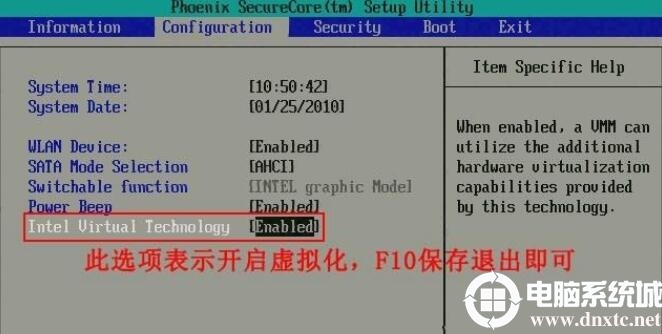
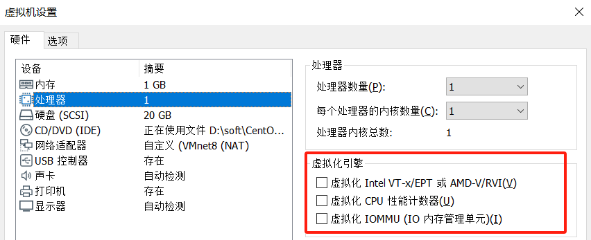

[toc]

# KVM安装

## 1.安装之前
KVM（Kernel-based Virtual Machine）是一个开源的虚拟化解决方案，它将Linux内核转变为一个虚拟化的hypervisor，允许在同一台物理服务器上运行多个虚拟机。KVM对硬件的要求如下：

1. 虚拟化扩展支持：为了能够使用KVM进行硬件虚拟化，CPU需要支持虚拟化扩展，例如Intel的VT（Virtualization Technology）或AMD的AMD-V。这些扩展提供了在虚拟环境中运行虚拟机所需的硬件支持。
2. 内存：KVM对内存的要求主要取决于虚拟机的数量和大小。每个虚拟机都需要分配一定数量的内存，因此需要足够的物理内存来支持所有虚拟机的同时运行。
3. 存储：KVM虚拟机可以使用各种存储类型，包括本地磁盘、网络存储（如NFS、iSCSI）和分布式存储（如Ceph）。硬件对存储的要求取决于所选择的存储类型和虚拟机的I/O需求。
4. 网络接口：KVM虚拟机需要网络连接来进行通信。硬件对网络接口的要求包括支持的网络类型（如以太网）、带宽和网络延迟等。
5. GPU支持（可选）：如果需要在KVM虚拟机中运行图形密集型工作负载（如游戏、图形设计等），则需要支持GPU虚拟化的硬件。这些硬件通常包括专用的GPU加速卡和相关的驱动软件。
6. 其他设备支持：根据具体的需求，可能还需要硬件支持其他设备，如USB控制器、声卡、摄像头等。

需要注意的是，这些硬件要求是相对的，具体的要求可能会根据使用情况和配置而有所不同。建议在部署KVM之前，仔细查阅KVM官方文档并参考硬件供应商的建议，以确保满足所需的硬件要求。


***其实最重要的一点，就是要求CPU支持虚拟化技术***，目前主流的CPU都是支持的，如果是作为本地服务器需要在bios里面开启该功能。由于本地是使用虚拟机在套壳所以就不在这里赘述了，从网上找个图片仅供参考。



以上是对于硬件的要求，对于系统的要求，早期的centos7刚出来的时候，centos6就不支持yum安装，当时要使用kvm还必须使用centos7的系统，当然目前基本上是没这个问题。

## 2.安装

### 2.1 系统准备

本次测试采用的centos7.9的系统，机器来源是本地虚拟机，如果是用Workstation操作还需要打开这个才能支持创虚拟机。



### 2.2 初始化

关闭selinux，关闭防火墙

### 2.3 安装软件


```
yum install -y qemu-kvm libvirt virt-install virt-manager
```

### 2.4 启动服务

 ```
 systemctl start libvirtd
 systemctl enable libvirtd
 ```

`libvirtd`是一个后台服务进程，它是由libvirt开发的一种虚拟化管理工具，用于管理和控制各种虚拟化技术，包括KVM、QEMU、Xen等。

主要作用如下：

1. 虚拟机管理：`libvirtd`提供了一个统一的接口，用于创建、启动、停止、暂停、恢复和删除虚拟机。它可以管理多种不同的虚拟机类型，如KVM虚拟机、QEMU虚拟机和Xen虚拟机等。
2. 资源管理：`libvirtd`可以管理宿主机上的物理资源，如CPU、内存和存储等。它可以分配和监控这些资源，以确保虚拟机能够获得适当的计算资源和存储空间。
3. 网络管理：`libvirtd`可以管理虚拟机的网络连接，包括虚拟网卡和网络桥接等。它可以配置虚拟机的网络参数，安全策略和端口转发等。
4. 安全管理：`libvirtd`提供了对虚拟机进行访问控制和权限管理的功能。它可以限制用户对虚拟机的访问权限，以及控制虚拟机之间的通信和资源共享。

总之，`libvirtd`是一个重要的虚拟化管理工具，它提供了统一的接口和管理功能，可以简化和集中管理多个虚拟化平台上的虚拟机和资源。

### 2.5 配置网络

 在`libvirtd` 启动以后，会默认创建一个网络出来，192.168.122.0/24，如果想要修改，需要修改/etc/libvirt/qemu/networks/default.xml，这个网络简单来说就是创建的虚拟机可以使用这个网络，通过nat的方式到互联网，作为体验功能是可以的，这个网络可以等效于一个路由器，创建的虚拟机就等于接入在这个路由器下的电脑。

在测试环境，可能会使用网桥，等于一个交换机，创建的虚拟机和物理机器使用通一个2层网络的ip地址。

#### 2.5.1 安装软件

```
yum install bridge-utils  
```

#### 2.5.2 配置源网卡

```
#具体网卡名字以现场未准
cd /etc/sysconfig/network-scripts/
mv ifcfg-ens33  bak
```

```
vi ifcfg-ens33
#编辑网卡名字，填入下入内容，BRIDGE是桥的名字DEVICE 其实就是网卡的名字

DEVICE=ens33
BOOTPROTO=none
ONBOOT=yes
BRIDGE=br0
```

```
vi ifcfg-br0
#编辑桥网卡配置文件

DEVICE=br0
TYPE=Bridge
BOOTPROTO=static
IPADDR=192.168.40.105      # 设置您希望为网桥分配的静态IP地址
NETMASK=255.255.255.0     # 设置子网掩码
GATEWAY=192.168.40.1       # 设置网关IP地址
DNS1=114.114.114.114             # 设置首选DNS服务器的IP地址
ONBOOT=yes
DELAY=0
```

```
#重启网络服务
systemctl restart network
```


这里要注意2个点：

第一原网卡配置文件指定的桥要和桥网卡名字要一致，比如这里的"br0",当然名字可以自取。

第二就是如果配置错误，可能会是网络中断，尤其机器不在身边的时候。提供一个解决思路，放一个任务计划，等待10分钟以后执行，删除新创建的文件，还原源网卡配置文件，重启网络服务。

